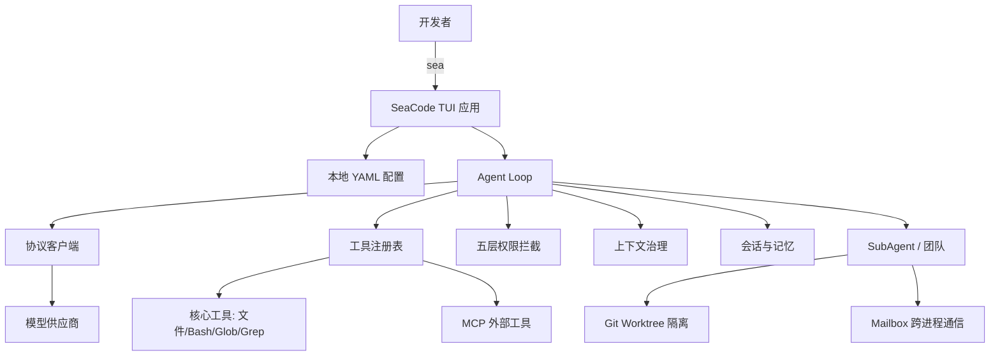

# SeaCode

> 本地终端 AI 编程 Agent：从一句提示词到可观察结果，全程可控、可恢复、可协作。

[](./LICENSE)
[](https://www.python.org/)
[](https://github.com/seaFall98/SeaCode/actions/workflows/ci.yml)

SeaCode 是一个跑在你自己机器上的 AI 编程 Agent。它不托管代码、不上传会话、不替你做决定——你提供模型与项目目录，它在一个终端界面里完成多轮对话、工具调用、文件修改与任务协调，每一步都可观察、可中断、可回滚。

## 它适合谁

- 想用本地配置切换多家模型供应商（Anthropic、OpenAI、任意 OpenAI 兼容端点），而不是被锁死在某一家 SDK 里；
- 希望对 Agent 的每一次 Bash 命令、文件写入、工具调用都有明确的权限审批与可审计的事件流；
- 需要让多个 Agent 在隔离的 Git 工作区里并行改代码，而不是在一个对话里串行排队；
- 重视会话持久化与跨会话记忆——任务被打断后能恢复，过往经验能被复用。

## 核心特性

| 能力 | 说明 |
| --- | --- |
| **多供应商对话** | Anthropic Messages 与 OpenAI Responses / Chat Completions 两条协议路径，本地 YAML 配置 Provider，流式输出归一化为统一事件。 |
| **工具系统** | 内置 `ReadFile` / `WriteFile` / `EditFile` / `Bash` / `Glob` / `Grep` / `Diff` 等核心工具，统一 `Tool` 抽象与注册表，按权限模式动态启用。 |
| **Agent Loop** | 自主多轮工具调用直到任务完成，多种停止条件（最大迭代、连续未知工具、用户取消、token 上限），事件流实时呈现。 |
| **五层权限拦截** | 危险命令正则检测 → 路径沙箱 → 三级规则引擎（用户/项目/本地）→ 四种权限模式（DEFAULT/ACCEPT_EDITS/PLAN/BYPASS）→ 人在回路审批，任一层 deny 即终止。 |
| **MCP 工具生态** | 通过 Model Context Protocol 接入 stdio 子进程与 HTTP 外部工具，按需搜索加载，单服务器失败不阻断主流程。 |
| **上下文治理** | 大工具结果落盘只留摘要，token 逼近窗口时自动压缩旧轮次，对话链 `tool_use`/`tool_result` 配对一致性校验保证 API 协议不报错。 |
| **会话与记忆** | JSONL 会话持久化与恢复，跨会话自动记忆抽取与召回，`SEACODE.md` / `SEACODE.local.md` 项目与用户级指令优先级注入。 |
| **Slash 命令框架** | 内置 `/clear` `/compact` `/help` `/memory` `/permission` `/plan` `/review` `/rewind` `/status` `/tasks` `/trace` `/worktree` 等命令，可扩展注册。 |
| **Skill 技能包** | Markdown + YAML 定义的可复用技能包，两级加载（项目级覆盖用户级），inline 注入与 fork 隔离两种执行模式，支持热加载。 |
| **生命周期 Hook** | 事件驱动的钩子引擎，支持条件表达式、`command` / `prompt` / `http` / `agent` 四类动作，`pre_tool_use` 可拦截拒绝。 |
| **SubAgent 与任务管理** | 主 Agent 委派子任务给独立子 Agent，后台任务追踪与通知，调用链路 trace 记录便于排查。 |
| **Git Worktree 隔离** | 每个子任务一个独立 Git Worktree，文件操作互不干扰，会话级持久化与变更保护，文件历史快照支持 `/rewind` 回滚。 |
| **团队协调** | Lead 长期协调多 teammate 团队，tmux / iTerm2 / in-process 三后端 spawn，Mailbox 跨进程通信，Coordinator 模式让 Lead 专注调度不下场。 |

## 快速开始

### 1. 安装

SeaCode 使用 [`uv`](https://docs.astral.sh/uv/) 管理 Python 环境与依赖。从源码可编辑安装：

```bash
git clone https://github.com/seaFall98/SeaCode.git
cd SeaCode
uv tool install --editable .
```

安装后 `sea` 命令全局可用，直接使用工作区源码，代码变更无需重装。

### 2. 配置 Provider

在任意项目目录创建 `.seacode/config.yaml`（或用户级 `~/.seacode/config.yaml`），填入你的模型供应商：

```yaml
providers:
  - name: primary
    protocol: openai-compat       # 也可用 anthropic / openai
    model: your-model-name
    base_url: https://api.example.com
    api_key: your-api-key
    thinking: false
```

三种 `protocol` 取值对应三条连接路径：

| protocol | 适用 | 说明 |
| --- | --- | --- |
| `anthropic` | Anthropic Messages API | 官方 SDK 原生协议。 |
| `openai` | OpenAI Responses API | OpenAI 官方协议家族。 |
| `openai-compat` | 任意 OpenAI 兼容端点 | DeepSeek、Moonshot、本地 vLLM 等走 Chat Completions 的兼容服务。 |

> DeepSeek 等兼容端点不是硬编码默认 Provider，只是 `openai-compat` 协议的一个可选真实端点——把 `base_url` 换成 `https://api.deepseek.com` 即可。

### 3. 启动

在你的项目目录运行：

```bash
sea
```

进入终端 TUI，输入自然语言开始任务。`/help` 查看所有命令，`/permission` 切换权限模式，`/status` 查看当前会话状态。

### 配置层级

SeaCode 按以下顺序读取配置，后层完整替换前层的 Provider 列表：

```
~/.seacode/config.yaml              # 用户级默认
└── <cwd>/.seacode/config.yaml      # 项目级共享
    └── <cwd>/.seacode/config.local.yaml   # 项目级本地（不提交 Git）
```

真实 `api_key` 可直接写入 `.seacode/config.local.yaml`，该文件应被 `.gitignore` 忽略。仓库仅跟踪无密钥的 [config.yaml.example](./.seacode/config.yaml.example)。

## 运行时概览



### 模块结构

```
seacode/
├── agent.py              # Agent Loop 与主调度
├── app.py                # Textual TUI 应用与状态机
├── client.py             # 多协议 LLM 客户端
├── config.py             # YAML 配置发现与合并
├── conversation.py       # 对话历史与一致性校验
├── prompts.py            # 系统提示词流水线
├── tools/                # 工具系统（核心工具 + Agent/Team 工具）
├── permissions/          # 五层权限拦截
├── sandbox/              # OS 级沙箱（macOS seatbelt / Linux bubblewrap）
├── context/              # 上下文预算与压缩
├── memory/               # 会话持久化与跨会话记忆
├── commands/             # Slash 命令框架
├── skills/               # Skill 技能包加载与执行
├── hooks/                # 生命周期 Hook 引擎
├── mcp/                  # MCP 外部工具连接
├── agents/               # SubAgent 定义与任务管理
├── worktree/             # Git Worktree 隔离工作区
├── filehistory/          # 文件编辑历史与快照回滚
└── teams/                # 多 Agent 团队协调
```

## 文档

- **[中文文档](./docs-zh/README.md)** — 产品需求、设计说明、使用手册、工程路线图
- **[English docs](./docs-en/README.md)** — PRD, Design, Manual, roadmap

核心文档（中英对应）：

| 中文 | English |
| --- | --- |
| [产品需求](./docs-zh/PRD-SeaCode.md) | [PRD](./docs-en/PRD-SeaCode.md) |
| [设计说明](./docs-zh/Design-SeaCode.md) | [Design](./docs-en/Design-SeaCode.md) |
| [使用手册](./docs-zh/Manual-SeaCode.md) | [Manual](./docs-en/Manual-SeaCode.md) |
| [工程路线图](./docs-zh/project_roadmap.md) | [Roadmap](./docs-en/project_roadmap.md) |

## 技术栈

- **Python 3.12+**，[`uv`](https://docs.astral.sh/uv/) 管理环境与依赖
- **Textual + Rich** — 终端 TUI 框架与富文本渲染
- **anthropic / openai** — 两家族协议 SDK
- **mcp** — Model Context Protocol 工具生态
- **pytest / ruff / mypy** — 测试、lint、类型检查

## 质量门禁

```bash
uv sync
uv run ruff check seacode tests
uv run mypy seacode
uv run pytest tests/ -v
```

GitHub Actions 在每个 PR 与 main 变更上执行上述检查，CI 全绿是合并的硬性要求。

## 贡献

欢迎通过 Issue 反馈问题与需求，通过 Pull Request 提交改进。提交前请确保：

1. `ruff` / `mypy` / `pytest` 全部通过；
2. 新增能力有对应测试覆盖；
3. 公开代码与文档不包含任何真实 API key 或本地敏感配置。

## 路线图

v1 已交付 14 步路线的完整能力（多供应商对话 → 工具系统 → Agent Loop → 提示词流水线 → 权限系统 → MCP 工具 → 上下文治理 → 会话记忆 → 命令框架 → Skill 包 → Hook 引擎 → SubAgent → Worktree 隔离 → 团队协调）。后续演进方向见 [工程路线图](./docs-zh/project_roadmap.md)。

## 许可证

[MIT License](./LICENSE) · Copyright (c) 2026 seaFall98
