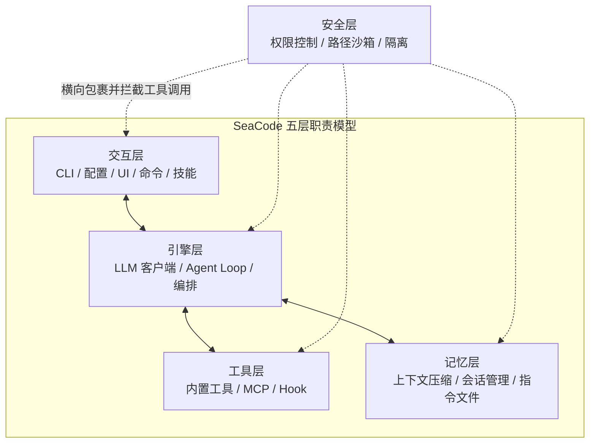
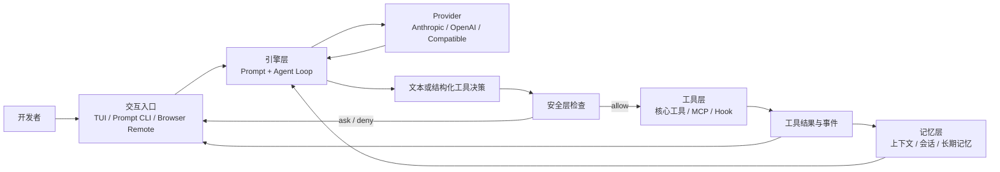

# SeaCode

> 本地终端 AI 编程 Agent：让模型负责判断，让运行时负责安全、可观察、可恢复地执行。

[](./LICENSE)
[](https://www.python.org/)
[](https://github.com/seaFall98/SeaCode/actions/workflows/ci.yml)

SeaCode 运行在开发者自己的机器和项目目录中。它把模型接入真实代码，让 Agent 能够理解项目、调用工具、修改文件、运行验证、管理长任务并协调多个执行者；权限、上下文、会话、工作区和事件状态由本地运行时负责。

SeaCode 关注的是完整工程闭环，而不是一次回答：用户提交意图，模型提出下一步行动，运行时检查边界并执行，结果回到上下文，用户可以观察、干预、恢复并继续工作。

## 适合谁

- 想在本地配置中切换 Anthropic、OpenAI 和 OpenAI-compatible 模型端点的开发者；
- 希望看到每一次文件读写、命令、工具调用和权限决策的工程团队；
- 需要会话恢复、长期记忆、上下文治理和可回滚工作区的使用者；
- 需要让多个 Agent 在隔离 Git Worktree 中并行工作并保持协作状态的维护者。

## 整体架构概览

SeaCode 按五类职责组织：**交互、引擎、工具、记忆、安全**。这是边界模型，不是五个平行目录，也不是固定调用链。安全层横向包裹其它层，并在工具执行前拦截副作用。



| 层 | 读者应关注的核心问题 |
| --- | --- |
| 交互层 | 用户如何提交任务、查看状态、审批、取消和直接控制运行时。 |
| 引擎层 | 模型如何被连接，Agent Loop 如何推进，子任务如何编排。 |
| 工具层 | Agent 能做什么，内置工具、MCP 和 Hook 如何接入。 |
| 记忆层 | 长任务如何管理上下文，进程重启后如何恢复会话和项目约定。 |
| 安全层 | 命令、路径、权限和并行工作区如何在副作用发生前受到约束。 |

## 运行时概览



一个回合的关键不变式是：模型不会直接触碰项目；所有副作用都通过工具契约和安全层；结果以事件和结构化消息回到引擎；交互入口只呈现并控制状态。

## 模块结构

```text
seacode/
├── __main__.py       # CLI 入口、配置加载和启动
├── app.py            # Textual TUI、输入和屏幕状态
├── client.py         # 多协议 Provider 客户端
├── config.py         # YAML 配置发现与校验
├── conversation.py   # 逻辑消息历史
├── prompts.py        # System Prompt 组合
├── agent.py          # Agent Loop、工具回合和事件
├── commands/         # Slash Command 注册、解析和执行
├── skills/           # Skill 加载与执行
├── tools/            # 核心工具与注册表
├── mcp/              # MCP 客户端与工具包装
├── hooks/            # 生命周期 Hook
├── context/          # 上下文预算与压缩
├── memory/           # 会话、指令与长期记忆
├── agents/           # SubAgent 与任务管理
├── teams/            # Agent Teams 协作
├── permissions/      # 权限模式、规则和危险命令检查
├── sandbox/          # OS 沙箱适配
├── worktree/         # Git 工作区隔离
└── filehistory/      # 编辑快照与 rewind
```

目录是长期职责的实现归属；五层架构是更高层的边界解释。一个模块可以被多个层使用，但一个行为应有清晰的主要拥有者。完整模块关系、接口和 14 步设计见 [Design-SeaCode.md](./docs-zh/Design-SeaCode.md)。

## V1 核心能力

| # | 能力 | 产品价值 |
| --- | --- | --- |
| 01 | 多 Provider 对话 | 显式选择协议和模型，统一流式输出、用量和错误恢复。 |
| 02 | 工具系统 | 用结构化 Schema 读取项目、修改文件、执行命令和搜索内容。 |
| 03 | Agent Loop | 根据真实工具结果连续推进任务，并在明确条件下停止。 |
| 04 | 权限与沙箱 | 在副作用前约束危险命令、路径和权限，支持人工确认。 |
| 05 | MCP 工具生态 | 连接 stdio 和 Streamable HTTP 外部工具，并隔离连接故障。 |
| 06 | 上下文治理 | 通过大结果落盘、预算和压缩支撑长任务。 |
| 07 | 会话与记忆 | 保存会话、项目指令和长期经验，支持恢复和召回。 |
| 08 | Slash Command | 不消耗模型回合，直接控制会话、权限、压缩和工作区。 |
| 09 | Skill 技能包 | 把可复用工程流程作为项目级或用户级包加载。 |
| 10 | 生命周期 Hook | 在关键事件上执行条件化命令、提示词、HTTP 或 Agent 动作。 |
| 11 | SubAgent 与任务 | 用独立上下文委派、追踪、取消和验证子任务。 |
| 12 | Git Worktree 隔离 | 为并行任务保护目录、分支、未提交变更和回滚快照。 |
| 13 | Agent Teams | 用 Lead、teammate、任务板和 Mailbox 组织长期协作。 |

## 快速开始

### 安装

SeaCode 使用 Python 3.12+ 和 [`uv`](https://docs.astral.sh/uv/)：

```bash
git clone https://github.com/seaFall98/SeaCode.git
cd SeaCode
uv tool install --editable .
uv tool update-shell
```

也可以只在仓库环境中运行：

```bash
uv sync
uv run sea
```

### 配置 Provider

在项目目录创建 `.seacode/config.local.yaml`，或使用用户级 `~/.seacode/config.yaml`：

```yaml
providers:
  - name: primary
    protocol: openai-compat
    model: your-model-name
    base_url: https://api.example.com
    api_key: replace-with-your-key
    thinking: false
```

支持三条明确协议路径：

| `protocol` | 请求路径 |
| --- | --- |
| `anthropic` | Anthropic Messages |
| `openai` | OpenAI Responses |
| `openai-compat` | OpenAI-compatible Chat Completions |

配置按 `~/.seacode/config.yaml`、`<cwd>/.seacode/config.yaml`、`<cwd>/.seacode/config.local.yaml` 顺序读取；真实密钥只放在未跟踪配置中。仓库提供无密钥的 [config.yaml.example](./.seacode/config.yaml.example)。

### 启动

```bash
sea
```

在 TUI 中输入任务，`Enter` 提交，`Shift+Enter` 换行。常用入口：

| 入口 | 用法 | 适合场景 |
| --- | --- | --- |
| TUI | `sea` | 交互式开发、审批、长任务和协作。 |
| Prompt CLI | `sea -p "检查测试入口"` | 脚本化任务和一次性诊断。 |
| Browser Remote | `sea --remote` | 在受信任网络中观察和控制本地 Agent。 |

Prompt CLI 支持 `--mode` 和 `--output-format text|json|stream-json`。Browser Remote 默认监听 `0.0.0.0:18888`，不应直接暴露到公网。

## 文档

- [中文文档](./docs-zh/README.md)：产品需求、系统设计、使用手册和工程路线图。
- [English documentation](./docs-en/README.md)：English mirror of the public documentation set.

| 中文 | English |
| --- | --- |
| [产品需求](./docs-zh/PRD-SeaCode.md) | [PRD](./docs-en/PRD-SeaCode.md) |
| [系统设计](./docs-zh/Design-SeaCode.md) | [Design](./docs-en/Design-SeaCode.md) |
| [使用手册](./docs-zh/Manual-SeaCode.md) | [Manual](./docs-en/Manual-SeaCode.md) |
| [工程路线图](./docs-zh/project_roadmap.md) | [Roadmap](./docs-en/project_roadmap.md) |

## 技术栈

- **Python 3.12+**：运行时和类型系统基础；
- **uv**：环境、依赖和可编辑安装；
- **Textual + Rich**：终端 TUI 和富文本呈现；
- **anthropic / openai**：Anthropic 与 OpenAI 协议家族客户端；
- **mcp**：Model Context Protocol 工具生态；
- **pytest / Ruff / mypy**：测试、静态检查和类型检查；
- **WebSocket + embedded web content**：Browser Remote 事件与控制入口。

## 质量门禁

```bash
uv sync
uv run ruff check seacode tests
uv run mypy
uv run pytest tests/ -v
```

GitHub Actions 在 Pull Request 和 `main` 相关变更上执行质量检查。真实 Provider 请求只用于本地 smoke，不进入自动化测试或公开日志。

## 贡献

欢迎通过 Issue 反馈问题和需求，通过 Pull Request 提交改进。提交前请确保：

1. 新增或修改行为有对应测试；
2. `ruff`、`mypy` 和 `pytest` 通过；
3. 文档、配置示例和公开文案与实际行为一致；
4. 不提交真实 API key、本地会话、记忆、日志或其它敏感数据；
5. 变更说明只描述 SeaCode 的产品行为、设计和验证结果。

## 路线图

14 步路线从多 Provider 对话开始，依次建立工具、Agent Loop、提示词、权限、MCP、上下文、会话、命令、Skill、Hook、SubAgent、Worktree 和 Agent Teams。实现顺序与依赖关系见 [工程路线图](./docs-zh/project_roadmap.md)，每一步的设计蓝图见 [Design-SeaCode.md](./docs-zh/Design-SeaCode.md)。

## 许可证

[MIT License](./LICENSE) · Copyright (c) 2026 seaFall98
