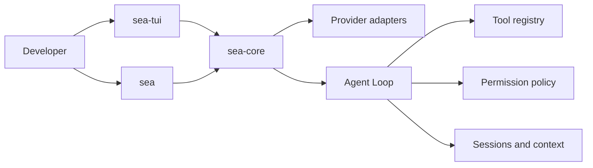

# SeaCode

SeaCode is a local AI coding agent runtime for software development work. It combines model streaming, project tools, permission controls, context governance, and recoverable sessions in a terminal-first workflow.

## What It Does

- Connects to model Providers through a unified streaming interface.
- Reads, edits, and verifies project files through structured tools.
- Runs an event-driven Agent Loop with cancellation and safe stopping conditions.
- Makes writes and commands visible through permission modes and workspace boundaries.
- Preserves long-running work with context governance, sessions, and memory.
- Supports reusable commands, Skills, Hooks, subagents, Git workspaces, and team coordination.

## Architecture



## Technology

- Python 3.12+
- `uv`
- Textual and Rich for the terminal interface
- `pytest`, Ruff, and mypy for verification

## Quick Start

The standard runtime entry point is `sea`:

```bash
uv sync
uv run sea
```

Configuration and troubleshooting are documented in the [Manual](./docs-en/Manual-SeaCode.md). The engineering roadmap contains 14 ordered milestones for the complete runtime.

## Documentation

- [English documentation](./docs-en/README.md)
- [中文文档](./docs-zh/README.md)
- [Product requirements](./docs-en/PRD-SeaCode.md)
- [Design](./docs-en/Design-SeaCode.md)
- [Engineering roadmap](./docs-en/project_roadmap.md)

## License

SeaCode is released under the [MIT License](./LICENSE).
