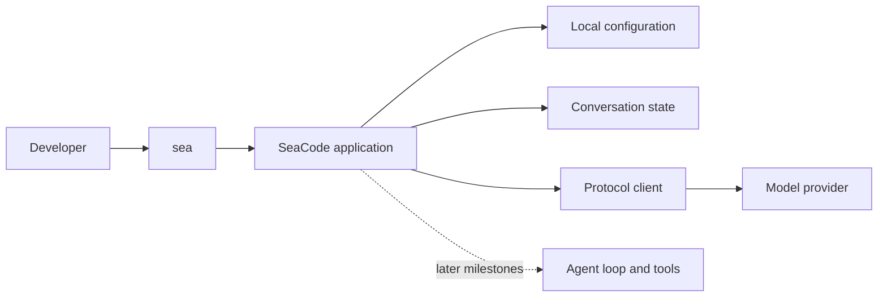

# SeaCode

SeaCode is a local, terminal-first AI coding agent for developers who want a controllable path from a prompt to an observable result.

> Status: v1 is under active development. The public documents describe the stable v1 product and runtime contract; feature availability follows the [engineering roadmap](./docs-en/project_roadmap.md).

## Product Direction

SeaCode starts with a focused conversation workflow and grows into a complete local coding agent:

- Select a model profile from local YAML configuration.
- Stream multi-turn conversations in a compact terminal interface.
- Keep a failed request recoverable without losing the conversation.
- Add project tools, permission checks, context management, sessions, commands, skills, hooks, isolated workspaces, and team coordination in ordered milestones.

## Runtime Shape

The runtime is a Python package named `seacode`; `sea` is its terminal entry point. It uses Python 3.12+, `uv`, Textual, Rich, pytest, Ruff, and mypy.

## Documentation

- [English documentation](./docs-en/README.md)
- [中文文档](./docs-zh/README.md)
- [Product requirements](./docs-en/PRD-SeaCode.md)
- [Design](./docs-en/Design-SeaCode.md)
- [Manual](./docs-en/Manual-SeaCode.md)
- [Engineering roadmap](./docs-en/project_roadmap.md)

## License

SeaCode is released under the [MIT License](./LICENSE).
