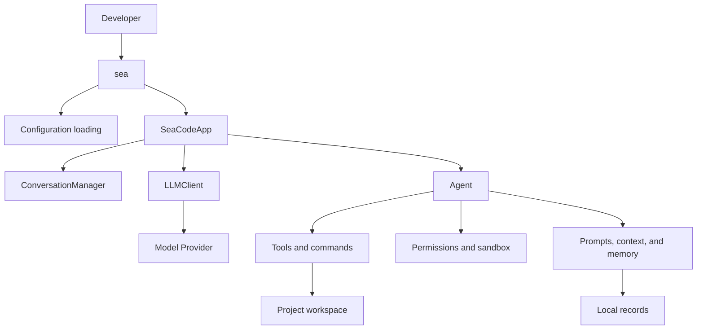
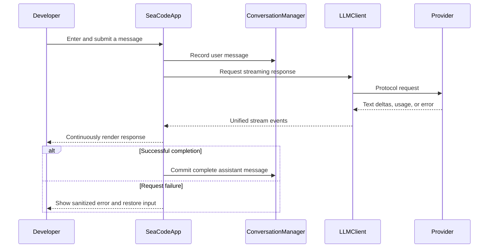

# SeaCode - Design Document

## 1. Design Scope

SeaCode is a terminal AI coding assistant that runs on the developer's machine. v1 uses one Python process: `sea` starts the application, loads configuration, and enters the Textual interface. Capabilities are added to one explicit module tree as the roadmap progresses.

This document records the stable v1 module ownership and behavior boundaries. It does not describe the TUI, CLI, or runtime as separate daemons, and it does not substitute a preselected layering framework for concrete code responsibilities.

## 2. Runtime Model



Milestone 01 enables only configuration, conversation, clients, and the TUI. Tools, the Agent Loop, permissions, persistence, and collaboration enter the established modules in later milestones; unfinished capabilities must not appear in the startup path or interface.

## 3. Module Layout

```text
SeaCode/
├── .seacode/
│   └── config.yaml.example
├── seacode/
│   ├── __init__.py
│   ├── __main__.py
│   ├── agent.py
│   ├── app.py
│   ├── askuser_dialog.py
│   ├── client.py
│   ├── config.py
│   ├── conversation.py
│   ├── driver.py
│   ├── permission_dialog.py
│   ├── plan_dialog.py
│   ├── prompts.py
│   ├── remote.py
│   ├── serialization.py
│   ├── session_dialog.py
│   ├── styles.tcss
│   ├── teammate_tree.py
│   ├── validator.py
│   ├── web_content.py
│   ├── agents/
│   ├── commands/
│   ├── context/
│   ├── filehistory/
│   ├── hooks/
│   ├── mcp/
│   ├── memory/
│   ├── permissions/
│   ├── sandbox/
│   ├── skills/
│   ├── teams/
│   ├── tools/
│   └── worktree/
├── tests/
├── pyproject.toml
├── uv.lock
└── .github/workflows/
```

| Module | Responsibility |
| --- | --- |
| `__main__.py` | Command entry point, configuration loading, and application startup. |
| `app.py` | Textual interface, input, conversation rendering, selectors, and screen state. |
| `client.py` | Model protocols, streaming requests, unified events, usage, and error classification. |
| `config.py` | Discovery, parsing, and validation of user, project, and local YAML configuration. |
| `conversation.py` | Logical message history before protocol serialization. |
| `agent.py` | Model turns, tool calls, stopping conditions, and Agent events. |
| `tools/` | Built-in tools, registry, argument validation, and execution entry points. |
| `permissions/`, `sandbox/` | Permission modes, rules, dangerous commands, and path boundaries. |
| `context/`, `memory/`, `filehistory/` | System prompts, context governance, session memory, and file state. |
| `commands/`, `skills/`, `hooks/` | Local commands, Markdown capability packages, and lifecycle extensions. |
| `agents/`, `teams/`, `worktree/` | Subtasks, team coordination, and isolated Git workspaces. |

The layout defines long-term ownership; it does not imply that every file exists in every release. New capabilities first enter these established modules. Moving responsibility requires evidence that the existing boundary cannot carry the intended behavior.

## 4. Core Flows

### 4.1 Conversation Turn



Errors and partial text may remain in the screen record, but they never become a complete assistant message for the next model request. One application instance has at most one active turn. It rejects duplicate submissions while streaming and restores input after completion.

### 4.2 Tool Turn

Later Agent Loop milestones identify tool calls in a model response, request permission, execute approved tools, and feed structured results back to the model. Tool calls and results use stable identifiers. Cancellation, denial, and failure finish a call with an explainable result instead of removing the interface's recovery path.

## 5. Providers And Configuration

SeaCode supports two protocol families through three explicit paths:

| `protocol` | Protocol path | Use |
| --- | --- | --- |
| `anthropic` | Messages API | Native or compatible Anthropic endpoints. |
| `openai` | Responses API | Native OpenAI endpoints. |
| `openai-compat` | Chat Completions API | Endpoints explicitly compatible with that format. |

Configuration is loaded in this order:

1. `~/.seacode/config.yaml`
2. `<project>/.seacode/config.yaml`
3. `<project>/.seacode/config.local.yaml`

Later layers can replace the earlier Provider list. A profile uses `name`, `protocol`, `model`, `base_url`, `api_key`, and optional `thinking`. Real keys live only in untracked local configuration and never appear in the interface, logs, test data, or conversation body.

## 6. TUI Constraints

- Conversation is the primary surface; each status fact has one stable display location.
- `Enter` submits and `Shift+Enter` inserts a newline; multiline editing does not depend on a Send button.
- Streaming appends raw text first and applies Markdown after completion to avoid constant reflow.
- Configuration errors are reported as sanitized startup messages; request errors preserve the application and restore input.
- SeaCode uses its own name, copy, visual style, and original American Shorthair tabby mark. Brand assets must not displace the conversation area or change the interaction path.

## 7. Safety And Failure Boundaries

| Scenario | Behavior |
| --- | --- |
| Missing or invalid configuration | Startup fails with a repairable error that contains no credentials. |
| Provider authentication, rate-limit, network, or protocol error | Classified into an understandable interface event; the session remains usable. |
| Tool arguments, execution, or permission failure | Produces a structured result for the Agent instead of crashing the process. |
| Context or storage error | Handled with the recovery rule introduced by the relevant milestone and kept observable. |
| Workspace with uncommitted changes | Cleanup preserves the workspace and changes by default. |

## 8. Design Principles

- Preserve observable user behavior before pursuing local optimization.
- Keep module ownership clear without adding layers for their own sake.
- Give configuration, protocols, conversation, interface, and side effects explicit homes.
- Treat tests and recovery behavior as part of every new capability.
- Make platform and Provider differences explainable, verifiable, and safely degradable.
