# SeaCode - System Design

## Reading Position

Design is the technical through-line of SeaCode's four core documents. It repeats the main user paths from the PRD and the names of the 14 Roadmap steps, then explains why the capabilities fit together, which modules carry them, how state moves, where failure is contained, and how the result is verified. The PRD emphasizes product value and user commitments, the Manual emphasizes actual operation, and the Roadmap emphasizes delivery order and dependencies. They share facts and vocabulary; they are not isolated content boxes.

Implementation should follow the module boundaries, state transitions, interface contracts, failure behavior, and acceptance invariants defined here. This document describes SeaCode's runtime design. The source tree does not need to mirror every conceptual layer one-for-one. The five layers express responsibility boundaries; the 14 steps show how capabilities are placed into those boundaries over time.

## 1. Five-Layer Responsibility Architecture

SeaCode has five layers: **Interaction, Engine, Tools, Memory, and Security**. They are not a linear pipeline. Interaction receives intent and presents state, Engine advances model decisions, Tools provide structured capabilities, Memory maintains continuity, and Security wraps the other layers and intercepts side effects.

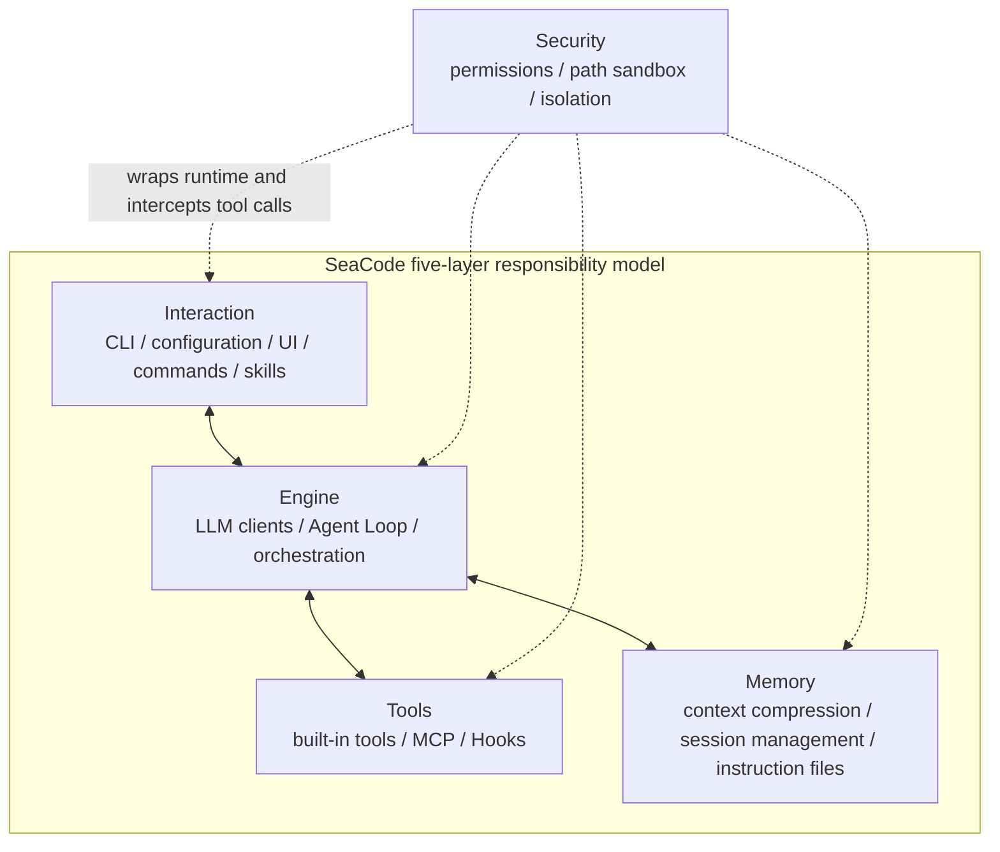

| Layer | Responsibility | Does not own |
| --- | --- | --- |
| Interaction | CLI, configuration, TUI, Browser Remote, Slash Commands, Skill entry points, and user-visible state | It does not decide the model's next action or execute side effects directly. |
| Engine | Provider requests, prompt composition, Agent Loop, SubAgent, and Teams orchestration | It does not access files, Shell, or network around the Tool contract. |
| Tools | Core tools, MCP tools, Hook actions, and structured results | It does not decide whether a tool has permission to run. |
| Memory | Message history, context budgets, sessions, instructions, long-term memory, and recovery | It does not present a compressed summary as unverified original fact. |
| Security | Dangerous commands, paths, rules, permission modes, HITL, and isolated workspaces | It does not change business results; it decides whether a side effect may happen. |

Security can contain several defense stages, but those stages are implementation mechanisms inside the Security layer, not another overall architecture model.

## 2. Runtime Model

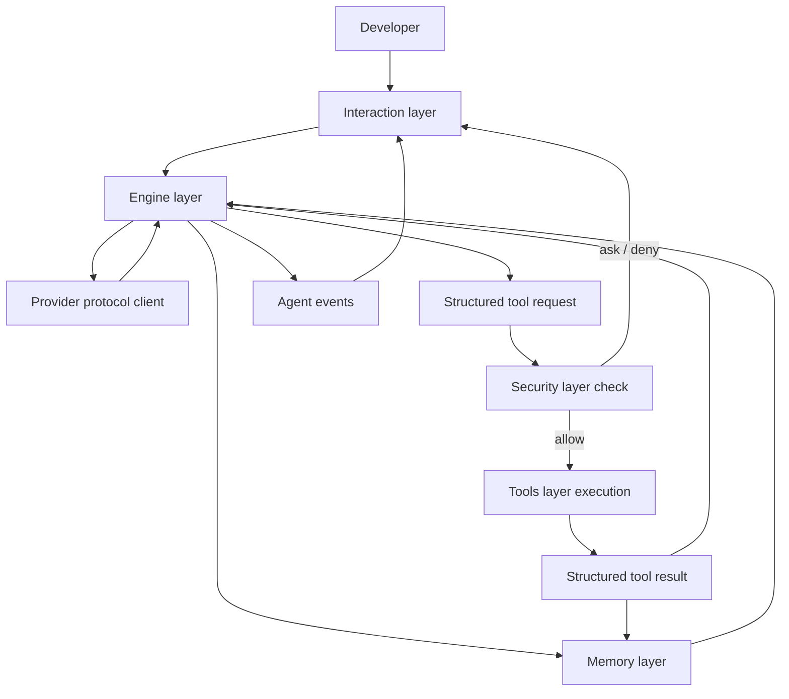

A turn must preserve four invariants:

1. The model can request only registered tools; it never receives direct host capabilities.
2. Every tool call passes through Security before execution; `deny` does not execute and `ask` waits for a user decision.
3. Tool results are fed back by call ID and request order without breaking the Provider message structure.
4. An incomplete stream, failed action, or cancelled turn cannot be reported as successful completion.

## 3. Shared Technical Contracts

### 3.1 Provider contract

The configured `protocol` explicitly selects the request path:

| Value | Adapter path |
| --- | --- |
| `anthropic` | Anthropic Messages |
| `openai` | OpenAI Responses |
| `openai-compat` | OpenAI-compatible Chat Completions |

`ProviderConfig` stores `name`, `protocol`, `model`, `base_url`, `api_key`, and optional context, output, and thinking parameters. `client.py` normalizes streaming deltas, tool calls, usage, retries, and errors from the three wire paths into runtime events. Upper layers do not branch on URL or vendor name.

### 3.2 Tool contract

Each tool enters `ToolRegistry` through one `Tool` abstraction:

| Field | Purpose |
| --- | --- |
| `name` | Stable name recognized by the Provider and Agent. |
| `description` | Boundary information used by the model to decide when to use the tool. |
| `params_model` | Pydantic parameter model that generates protocol Schema and validates input. |
| `category` | Classification used by permission modes, audit, and filtering. |
| `is_concurrency_safe` | Marks whether the tool may run with read-only tools in the same group. |
| `execute()` | Async execution entry point returning `ToolResult`. |

Tool exceptions, permission denials, and external service errors become structured `ToolResult` values. The Agent decides what to do next instead of letting an exception destroy the session.

### 3.3 Event contract

| Event | Producer | Fact consumed by the runtime |
| --- | --- | --- |
| `StreamText`, `ThinkingText` | Provider / Agent | Text and thinking deltas. |
| `ToolUseEvent` | Agent | Tool name, call ID, parameters, and start time. |
| `ToolResultEvent` | Tool / Agent | Output, error flag, duration, and call ID. |
| `PermissionRequest` | Security / Agent | Tool, reason, risk, and the pending response Future. |
| `RetryEvent`, `ErrorEvent` | Client / Agent | Recoverable retry or final failure reason. |
| `UsageEvent` | Client / Context | Input, output, and context-window usage. |
| `TurnComplete`, `LoopComplete` | Agent | Turn or full loop completion and stop reason. |
| `CompactNotification` | Context | Compaction trigger, boundary, and recovery hint. |
| `MCPConnectEvent`, `HookEvent` | MCP / Hook | External connection and extension action state. |

Interaction depends on this event contract rather than a Provider SDK, tool implementation, or storage format.

### 3.4 Persistence contract

Persistent objects fall into four groups: current session JSONL, session metadata, project/user instructions and long-term memory, and file-edit snapshots. Each object must distinguish current facts, derived summaries, and references that can be read again. Recovery preserves verifiable original records first; an unreadable line may be skipped with a recorded reason.

## 4. Module Ownership And Dependency Direction

```text
seacode/
├── __main__.py       # CLI entry
├── app.py            # TUI and interaction state machine
├── client.py         # Provider protocol adapters
├── config.py         # Configuration discovery and merge
├── conversation.py   # Logical conversation history
├── prompts.py        # System Prompt pipeline
├── agent.py          # Agent Loop and events
├── commands/         # Slash Commands
├── skills/           # Skill loading and execution
├── tools/            # Tool abstraction, registry, and core tools
├── mcp/              # MCP lifecycle and tool wrappers
├── hooks/            # Hook events, conditions, and executors
├── context/          # Budget, spill, and compaction
├── memory/           # Sessions, instructions, recall, and auto-memory
├── agents/           # SubAgent definitions, tasks, and Trace
├── teams/            # Teams, Mailbox, task board, and spawn backends
├── permissions/      # Permission modes, dangerous commands, rules
├── sandbox/          # macOS/Linux OS sandbox adapters
├── worktree/         # Git Worktree lifecycle
└── filehistory/      # File snapshots and rewind
```

The dependency direction is: Interaction calls Engine; Engine requests Tools and Memory; Security wraps tool execution; Tools and Memory return events or structured state. `commands/`, `skills/`, and `remote.py` are Interaction entry points, but they cannot bypass the Engine, Tools, or Security contracts.

## 5. Shared Turn Flow

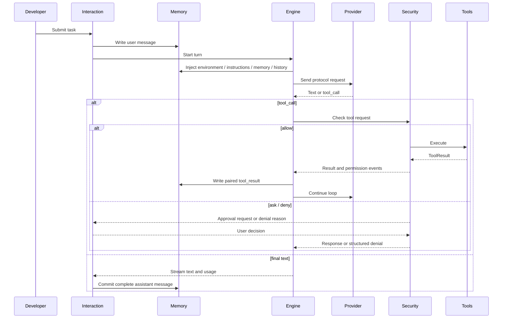

## 6. Detailed Design Of The Fourteen Steps

### 6.1 Step 01: Multi-Provider Conversation

**Design goal**: Establish a reliable `user input -> streaming model response -> continuable session` loop before adding tool feedback and the Agent Loop.

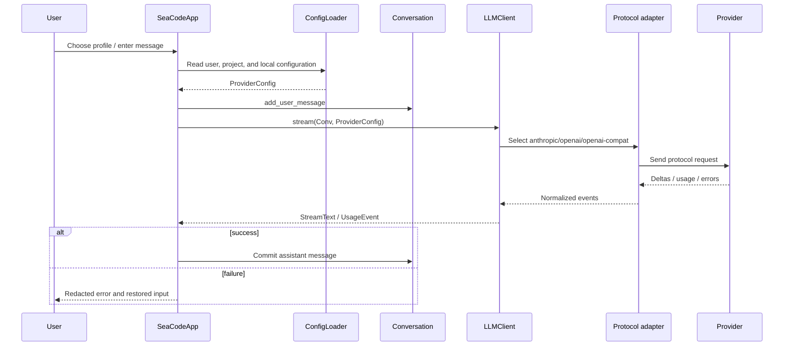

**Module design**: `config.py` discovers, parses, and validates configuration; `client.py` owns protocol differences, stream events, and error classification; `conversation.py` stores logical messages without leaking an SDK message type into the UI; `app.py` selects profiles, renders events, and controls input state.

**Key invariants**: The `protocol` field explicitly chooses the wire path. An incomplete or cancelled assistant message is not added to logical history. One TUI instance has at most one active turn. Keys do not enter events, logs, or message bodies.

**Acceptance design**: Verify request shapes and streaming events for all three protocol paths. Cover failure before the first byte, mid-stream disconnect, invalid responses, and multi-turn recovery. Verify `Enter`/`Shift+Enter`, duplicate-submit prevention, and input restoration after errors.

### 6.2 Step 02: Tool System

**Design goal**: Constrain model capabilities to tools with Schema, permission categories, and structured results instead of unauditable command text.

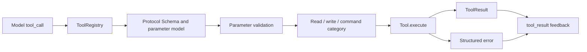

**Module design**: Core tools cover `ReadFile`, `WriteFile`, `EditFile`, `Bash`, `Glob`, and `Grep`. The registry owns name lookup, protocol Schema, enabled sets, and concurrency groups. File editing requires reading and comparing current content so an external change is not silently overwritten.

**Concurrency boundary**: Only tools marked `is_concurrency_safe` with no write dependency may share a read-only group. File writes, edits, and Shell always run independently. A tool failure returns `is_error=True` instead of escaping into the UI.

**Acceptance design**: Verify parameter errors, path errors, timeouts, and normal results for each tool. Verify call-ID pairing, read-only concurrency, serialized writes, stale-file rejection, result truncation, and Anthropic/OpenAI Schema generation.

### 6.3 Step 03: Agent Loop

**Design goal**: Extend a single tool turn into a durable task loop so the model can continue, correct, or finish based on real results.

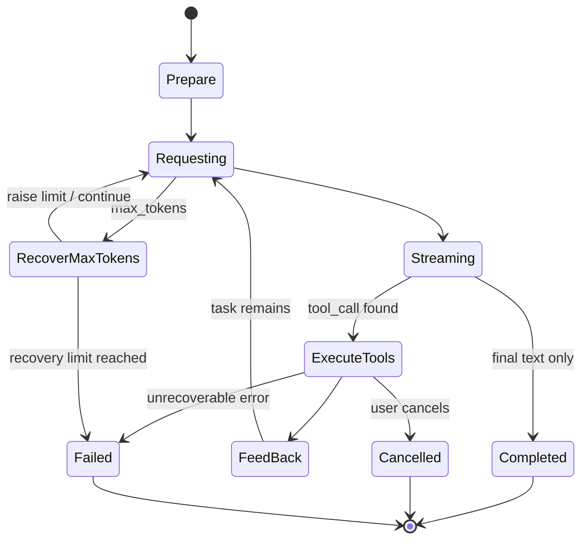

**Module design**: `Agent.run()` exposes the loop as an async event stream. Each round injects environment, instructions, memory, and Hooks. After model streaming ends, tool calls go through the registry and Security, and results return by call ID. Stop reasons include natural completion, maximum steps, repeated unknown tools, completed Plan, user cancellation, and unrecoverable error.

**Recovery strategy**: A `max_tokens` response receives a bounded limit increase and continuation. Unknown tools are protected by a consecutive-attempt limit. Tool errors are fed back as results. Cancellation sets an event and prevents the next request. Completion commits only closed messages.

**Acceptance design**: Verify two or more real tool rounds. Cover multiple parallel read-only calls, correction after a tool error, unknown tools, cancellation races, token recovery, and natural completion. Event order must be consumable by TUI, Prompt CLI, and Browser Remote.

### 6.4 Step 04: System Prompt Pipeline

**Design goal**: Assemble stable rules, dynamic environment facts, and mode reminders separately so every request knows the project and runtime boundaries without spreading UI logic through the Agent.

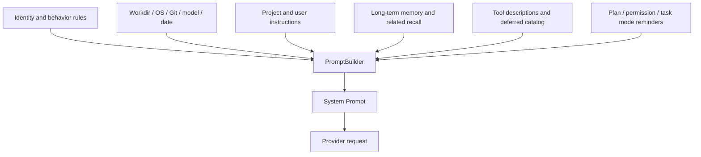

**Module design**: `PromptSection` describes a name, priority, and content source. `detect_environment()` produces workdir, platform, Shell, Git branch, and related facts. `build_system_prompt()` assembles sections but does not execute tools. Stable and per-round dynamic sections remain separate so they can be tested and re-injected after compaction.

**Boundary**: A Prompt can state rules but cannot replace permission checks. Project instructions may influence model preference but cannot grant an unregistered tool or bypass Security. Plan Mode reminders must match the actual Security mode.

**Acceptance design**: Fixed inputs produce a stable section order. OS, Git state, Provider, permission mode, and Skill combinations produce explainable differences. After compaction, environment and instructions appear again. Keys, sensitive absolute paths, and private runtime details are not inserted into the Prompt.

### 6.5 Step 05: Permissions And Sandbox

**Design goal**: Separate what the model wants to do from what the system permits, applying a defense-in-depth decision before every side effect.

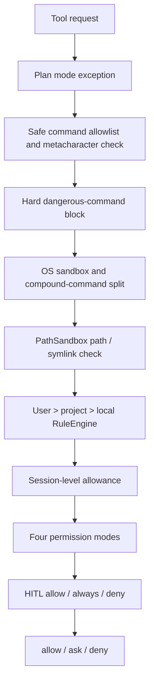

**Module design**: `PermissionChecker` is the single pre-execution entry. `DangerousCommandDetector` owns non-bypassable dangerous patterns. `PathSandbox` resolves symlinks and protects paths outside the project and sensitive configuration. `RuleEngine` reads the three rule levels. `PermissionMode` chooses default ask/allow behavior. The UI uses `PermissionRequest` for human confirmation.

**Platform strategy**: Application-level permission checks apply on every platform. macOS uses Seatbelt and Linux uses bubblewrap. Windows falls back to application checks when an equivalent OS sandbox is unavailable; the fallback is not described as kernel isolation.

**Acceptance design**: Verify dangerous commands are hard-denied in every mode. Cover symlink escape, non-existent ancestor resolution, rule priority, session allowance, Plan Mode, and all three HITL responses. A denial becomes a structured ToolResult so the process and session continue.

### 6.6 Step 06: MCP Tool Connections

**Design goal**: Bring external tools into the Tools layer as pluggable capabilities while isolating connection, discovery, and lifecycle failures.

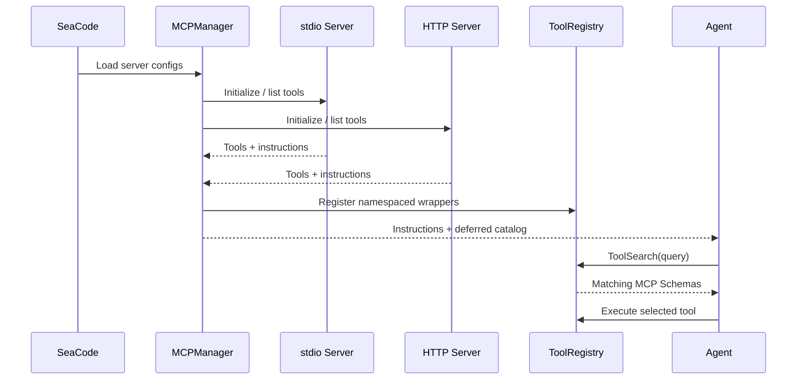

**Module design**: `MCPClient` owns one Server's stdio or Streamable HTTP connection, close, reconnect, and message conversion. `MCPManager` initializes servers independently and isolates failures. `MCPToolWrapper` registers the `mcp__server__tool` namespace. `ToolSearch` defers large Schemas.

**Boundary**: MCP and built-in tools share the Tool contract and still pass through Security. Server instructions are Prompt input only and cannot change permissions. A single Server failure produces connection events without stopping the main loop.

**Acceptance design**: Cover stdio, HTTP, initialization failure, tool-list failure, runtime disconnect, reconnect, same-name isolation, and deferred discovery. Verify MCP results return through the normal ToolResult path.

### 6.7 Step 07: Context Governance

**Design goal**: Control token cost and context quality so long tasks survive large tool output and compaction without breaking the message protocol.

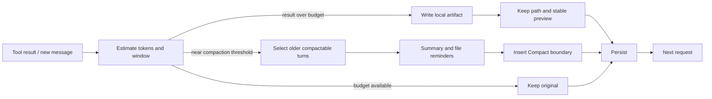

**Module design**: `ContextManager` maintains the window, output limit, result budget, and compaction threshold. After spill, a large result keeps a readable path. Compaction handles only old turns before a safe boundary and never splits `tool_use`/`tool_result`. Once complete, environment, instructions, memory, and the tool catalog are injected again.

**Circuit breaker**: Automatic compaction limits retries after failure or repeated triggers while preserving current history and a diagnostic notification. Manual `/compact` uses the same manager instead of a second implementation.

**Acceptance design**: Cover large text, binary/image summaries, consecutive tool results, window boundaries, compaction failure, cancellation, and recovery. Verify message pairing, readable file references, usage events, and notification order.

### 6.8 Step 08: Sessions And Memory

**Design goal**: Separate current work, stable project rules, and cross-session experience by lifecycle so restart, switching, and damaged records degrade safely.

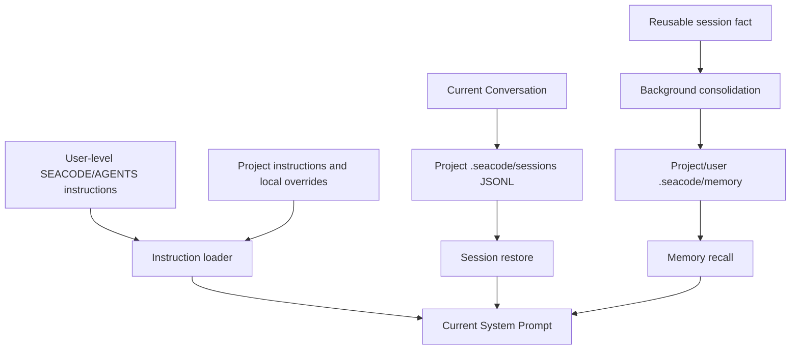

**Module design**: `SessionManager` creates, lists, restores, and deletes sessions. JSONL lines can be read independently; metadata stores title, time, and summary. `load_instructions()` reads user, project-directory-chain, and local files and resolves `@include`. `MemoryManager` owns indexing, related recall, writes, and cleanup.

**State transitions**: `/clear` starts a new session and rebuilds FileHistory. `/session resume` replaces the current session and conversation history. Recovery rebuilds tool-call/result pairs and skips damaged lines. Long-term memory cannot override an explicit current user instruction.

**Acceptance design**: Cover creation, recovery, deletion, damaged JSONL, compaction boundaries, instruction priority, related-memory recall, background memory writes, and process restart. Verify switching sessions does not reuse old file snapshots or tool state.

### 6.9 Step 09: Slash Command Framework

**Design goal**: Provide a fast path for deterministic local controls without entering the Agent Loop, reducing unnecessary model calls and state ambiguity.

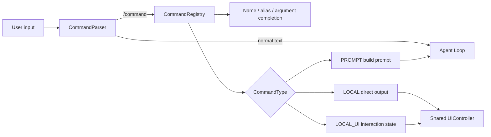

**Module design**: A command definition includes name, aliases, usage, description, execution type, and async handler. The registry loads built-in commands, dynamic Skill commands, and user commands. A handler depends on `CommandContext` and `UIController` rather than the entire TUI.

**Boundary**: Commands such as `/permission` and `/sandbox` may change runtime state but cannot directly execute a forbidden action. Prompt commands such as `/review` enter the Agent Loop and clearly consume a model turn. Local commands allowed during streaming must preserve state consistency.

**Acceptance design**: Verify case handling, aliases, unknown commands, completion, argument errors, user-command override rules, and Skill hot reload. Verify `/clear`, `/session`, and `/rewind` leave no old Agent or FileHistory state behind.

### 6.10 Step 10: Skill Packages

**Design goal**: Turn reusable engineering SOPs into discoverable, on-demand, isolated capability packages instead of growing more hard-coded commands.

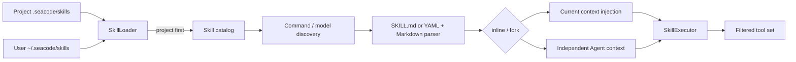

**Format and loading**: Support `SKILL.md` frontmatter or `skill.yaml` plus `prompt.md`. Metadata describes name, purpose, mode, context scope, and model override. Project content overrides a same-name user Skill. Parse failure preserves the previous cache and emits an observable error.

**Execution boundary**: `inline` shares the main session without exceeding current permissions. `fork` uses an independent context and returns structured text. `$ARGUMENTS` substitutes Skill arguments only; it is not arbitrary Prompt injection into tools. Declared Skill tools still pass through ToolRegistry and Security.

**Acceptance design**: Verify discovery, project override, arguments, context scopes, inline/fork, hot reload, installation failure, and cache fallback. Verify a Skill cannot call an unregistered tool or bypass the permission mode.

### 6.11 Step 11: Lifecycle Hooks

**Design goal**: Expose configurable automation at fixed lifecycle points so project rules, audits, and external notifications do not have to invade the Agent Loop.

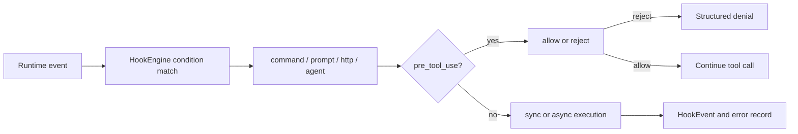

**Events and conditions**: Support session, turn, message, tool, startup, shutdown, compact, permission, and file-change events. Conditions support `==`, `!=`, regex matching, and `&&`/`||` combinations. `once` prevents repeated initialization actions.

**Failure semantics**: Configuration errors are reported at the loading boundary. A normal Hook action failure records an event and continues according to its configuration. `pre_tool_use` is the one synchronous path that can reject a tool; its reason must enter ToolResult.

**Acceptance design**: Cover condition matching, action parameter expansion, command exit codes, HTTP timeouts, Prompt/Agent actions, `once`, async execution, and pre-tool rejection. Verify Hooks cannot leak keys or block unrelated turns.

### 6.12 Step 12: SubAgents And Task Management

**Design goal**: Give complex work independent contexts, filtered tools, and traceable background execution instead of stacking every child message in the main session.

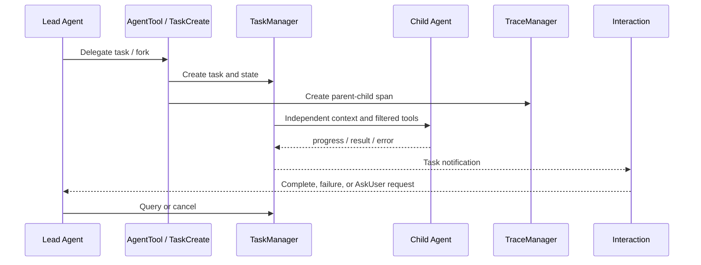

**Context and tools**: A child Agent owns an independent Conversation and System Prompt and may use a specified model and tools. Filtering removes Agent and conversation-control tools first, then applies definition-level allow/deny rules. MCP tools remain only when their external capability rules allow them. A fork may copy parent context but does not share mutable session objects.

**Task state**: At minimum, tasks distinguish `pending`, `running`, `completed`, `failed`, and `cancelled`. Results, errors, and duration persist in Trace. Cancellation propagates to the child and prevents duplicate feedback after completion.

**Acceptance design**: Verify foreground, background, fork, verification, AskUser, query, cancellation, unknown-tool, and child-failure paths. Verify parent-child Trace, notification order, tool filtering, and main-session recovery.

### 6.13 Step 13: Git Worktree Isolation

**Design goal**: Give parallel Agents independent filesystem workspaces while Git semantics and snapshots protect the user's existing work.

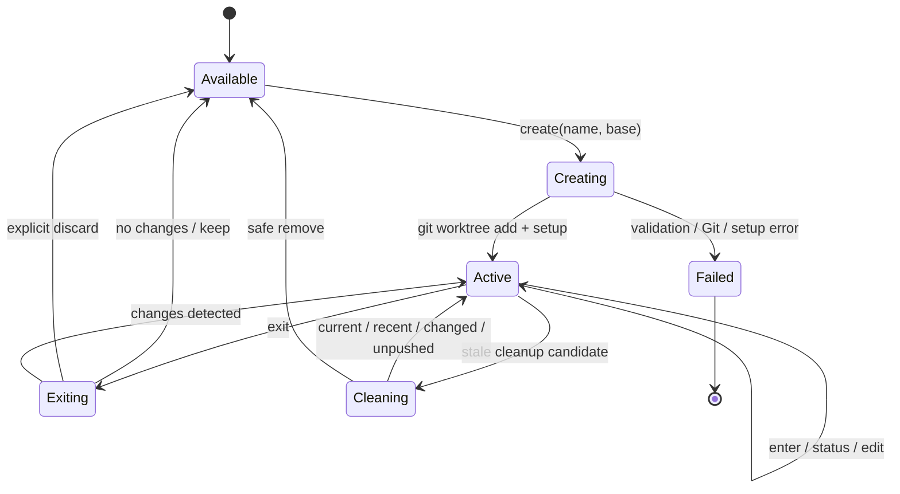

**Module design**: `WorktreeManager` owns create, enter, exit, cleanup, and restore. `setup.py` performs best-effort initialization of local configuration, Git hooks, ignored directories, and symlinks. `changes.py` fails closed for uncommitted changes, HEAD, unpushed commits, and damaged worktrees. `FileHistory` supplies snapshots for edits and `/rewind`.

**Security boundary**: Automatic cleanup touches only temporary names that pass every protection check. It does not remove the current session, recent worktrees, unreadable HEADs, changed worktrees, or worktrees with unpushed commits. Exit detection must tell the user what to do next.

**Acceptance design**: Cover name validation, creation failure, enter/exit recovery, initialization-failure fallback, uncommitted/unpushed protection, background cleanup filtering, concurrency locks, session recovery, and the three rewind scopes.

### 6.14 Step 14: Agent Teams

**Design goal**: Build durable members, shared tasks, and message channels on top of one-off SubAgent delegation so collaboration is persistent, observable, and recoverable.

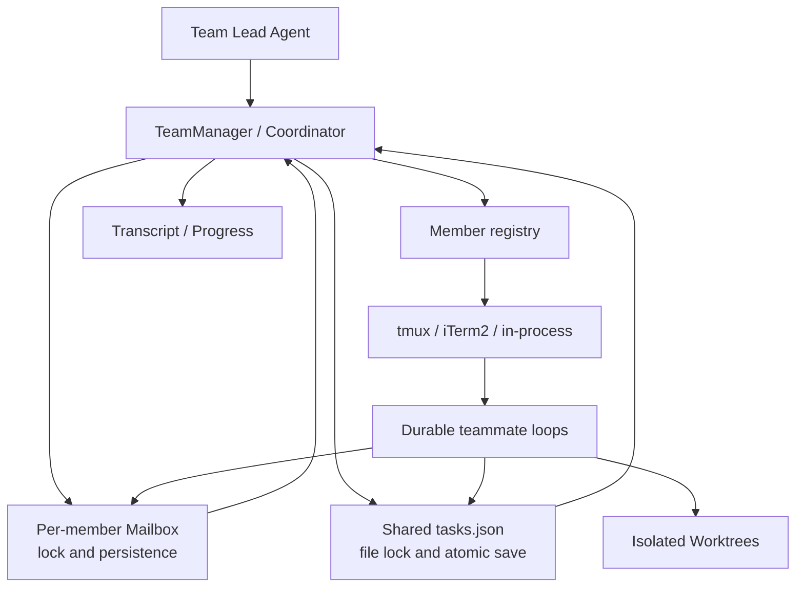

**State model**: `AgentTeam` stores team identity, Lead, members, and lifecycle. `TaskManager` handles shared-task claiming, dependencies, and state. `Mailbox` uses file locks and atomic writes for cross-process messages. Transcript and progress trees provide observable history for TUI and recovery.

**Member backends**: tmux and iTerm2 provide external windows. In-process is the stable fallback on Windows and non-interactive environments. Teammate loops consume their Mailbox, notify the Lead on completion or idle state, and distinguish user instructions, task notifications, progress, and system events.

**Coordinator Mode**: When enabled, the Lead keeps only tools needed for coordination, task queries, messages, and result synthesis; code operations are performed by teammates. This combines tool filtering and Prompt boundaries. It is not a new permission mode.

**Acceptance design**: Cover team creation, member registration, task claim/update, `SendMessage`, pause/wake, Lead Mailbox, all three spawn backends, Windows fallback, file-lock conflicts, teammate failure, and Coordinator tool reduction.

## 7. Cross-Step Failure Boundaries

| Failure | Unified handling |
| --- | --- |
| Provider authentication, rate limit, or disconnect | Emit a redacted error/retry event, preserve user input, and do not commit an incomplete assistant message. |
| Tool parameter or execution error | Return structured ToolResult so the Agent can correct course. |
| Permission denial or user cancellation | End the current call, feed back the reason, and keep the session and UI usable. |
| One MCP Server failure | Isolate that Server's lifecycle and tools while the main loop continues. |
| Context compaction failure | Break repeated attempts while preserving original history and a diagnostic notification. |
| Damaged session record | Skip damaged lines and recover readable content with call/result pairing. |
| Worktree has changes | Protect cleanup and exit by default; discarding requires an explicit choice. |
| SubAgent or teammate failure | Send the parent task a failure state and reason; never report failure as completion. |

## 8. Implementation And Acceptance Principles

- Implement the modules and state contract for each step before using the Roadmap dependency to enter the next step.
- Preserve shared event, ToolResult, Conversation, and permission contracts; local improvements cannot change established user paths silently.
- Tests cover normal results, denial, cancellation, exception, recovery, and concurrency boundaries rather than only the happy path.
- Public docs describe SeaCode's product, design, and operating contracts without recording one-off development history or outside learning materials.
