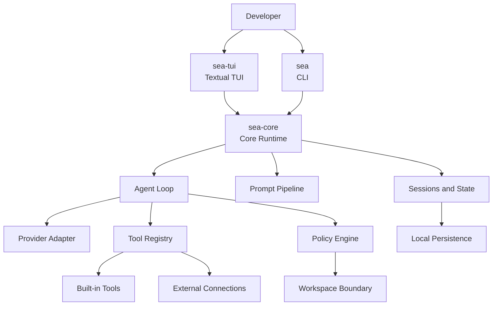
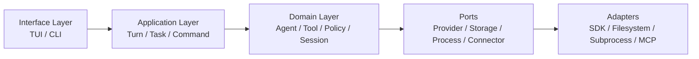
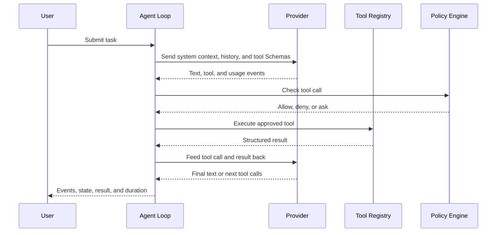
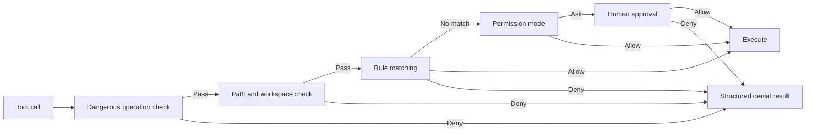

# SeaCode - Design Document

## 1. Design Goals

SeaCode keeps model inference, tool side effects, user interface, and persistent state behind clear boundaries. The runtime should explain why a tool was executed, how its result shaped the next turn, and what recovery path remains after a failure.

## 2. System Architecture



### 2.1 Component Responsibilities

| Component | Owns | Does not own |
| --- | --- | --- |
| `sea-core` | Lifecycle, Agent Loop, events, state coordination, and runtime assembly. | Terminal layout details. |
| `sea-tui` | Input, streaming output, tool rows, permission dialogs, status, and scrollback. | Provider request construction or unchecked tool execution. |
| `sea` | Startup, diagnostics, scripts, and non-interactive entry points. | Long-lived session state. |
| Provider Adapter | Converts model protocols into unified messages and events. | Tool permission or workspace policy. |
| Tool Registry | Registers tools, exports Schemas, resolves names, and exposes execution entry points. | Deciding whether a tool may run. |
| Policy Engine | Dangerous commands, paths, rules, modes, and human approval. | Running tools directly. |
| Session Store | Appended records, recovery state, compaction boundaries, and runtime metadata. | Interpreting the user's task. |

## 3. Layers And Dependencies



Dependencies flow from interface to application and domain layers, then reach external systems through ports. The domain layer does not directly depend on terminal widgets, model SDKs, or operating-system-specific APIs.

### 3.1 Target Layout

```text
SeaCode/
├── src/seacode/
│   ├── agent/          # Agent Loop, events, task state
│   ├── providers/      # Model protocol adapters
│   ├── tools/          # Tool abstraction, registry, built-ins
│   ├── policy/         # Permissions, rules, path protection
│   ├── context/        # Prompts, result governance, compaction
│   ├── sessions/       # Sessions and memory
│   ├── extensions/     # Commands, skills, hooks
│   ├── worktree/       # Git workspaces
│   ├── teams/          # Subtasks and coordination
│   ├── tui/            # Textual interface
│   └── cli/            # sea command entry point
├── tests/
├── pyproject.toml
└── .github/workflows/
```

## 4. Core Models

### 4.1 One Agent Turn

A turn contains user input, model events, tool calls, and a final result. Every tool call carries a stable identifier and every result references that identifier so retries, cancellation, recovery, and inspection can preserve pairing.



### 4.2 Event Model

The interface consumes events without knowing how many provider requests the loop needed. Events cover at least:

- text deltas and thinking state;
- tool start, completion, result summaries, and errors;
- iteration, input/output usage, and cache information;
- approval, denial, cancellation, compaction, and session recovery;
- turn completion, loop completion, and non-recoverable errors.

Events may carry session, turn, and tool-call correlation data, but never API keys or unsanitized sensitive configuration.

## 5. Provider Adapters

The Provider layer exposes a unified interface for model configuration, messages, tool Schemas, streaming events, and usage. An adapter owns protocol differences such as:

- serializing system instructions and message roles;
- encoding tool Schemas and tool results;
- parsing text, thinking, and tool-call fragments;
- classifying authentication, rate-limit, network, and context errors;
- optional prompt-cache markers and context-window discovery.

The Agent Loop must not branch on Provider names. Adding a Provider means implementing the adapter contract and adding protocol-level tests.

## 6. Tools And Policy

### 6.1 Tool Boundaries

Tools are categorized as read-only, file-writing, or command execution. A tool entry point validates arguments and performs the actual work; the Policy Engine decides whether it may run before the entry point is reached.

### 6.2 Policy Order



Dangerous operations and explicit denials take precedence. Every denial becomes a tool result for the model and keeps the reason visible in the interface. Path checks resolve symbolic links; for new files they check the nearest existing ancestor to avoid false decisions.

## 7. Context And Persistence

### 7.1 Request Assembly

Requests are assembled from stable and changing parts:

1. Stable system instructions and tool descriptions.
2. Current project environment, workspace state, and runtime information.
3. Session history, tool results, and dynamic reminders.

Stable content should remain byte-for-byte consistent. Changing content must not pollute cache prefixes or message roles. Reminders use a dedicated system-context channel instead of pretending to be user questions.

### 7.2 Output Governance

When a tool result exceeds a per-item or per-turn budget, the runtime saves the full content and keeps a fixed preview in the message. The preview includes original size, storage location, and the way to read it again. Once a decision is made, later turns reuse the same preview so history does not drift.

### 7.3 Session Model

Sessions use an append-friendly format for user messages, assistant messages, tool calls, tool results, and compaction boundaries. Recovery validates the message chain; damaged lines, unmatched calls, or over-limit records are skipped or rebuilt according to recovery rules rather than being pushed into the TUI as an unhandled exception.

## 8. Extension System

| Extension | Entry | Isolation |
| --- | --- | --- |
| Commands | `/help`, `/status`, `/plan`, and more | Local execution or fixed prompt injection |
| Skills | Markdown capability packages | Main session or isolated task |
| Hooks | Lifecycle events | Synchronous interception or asynchronous action |
| External tools | Discovery and adaptation | Independent connection lifecycle |
| Subagents | Task tools | Independent messages, permissions, and usage |
| Worktrees | Git workspace management | Independent directory and branch |
| Teams | Members, tasks, and messages | In-process or terminal backend |

Extensions enter through stable registration and event interfaces; they do not directly alter the Agent Loop's core stopping conditions.

## 9. Key Failure Boundaries

| Failure | Handling |
| --- | --- |
| Provider request fails | Emit an error event, preserve the session, and allow another submission. |
| Tool arguments or execution fail | Produce a structured result and let the loop decide whether to continue. |
| Tool times out | Stop the tool, record the timeout, then continue or stop according to loop policy. |
| User cancels | Cancel the current task, complete unfinished call records, and return to idle. |
| Permission denied | Return the reason as a result so the model can adjust. |
| External connection fails | Isolate one connection while preserving other tools and the main session. |
| Context is too large | Govern large results first, then summarize old messages while retaining recent text. |
| Workspace has changes | Refuse cleanup and keep the directory and branch available for inspection. |

## 10. Design Principles

- Make behavior verifiable before increasing automation.
- Route side effects through explicit tool and policy boundaries.
- Treat events as the contract between runtime and interface.
- Treat persistence formats as product interfaces and provide compatibility handling when they change.
- Make enhanced capabilities degradable so external services are never the source of core truth.
- Use small, clear ports to isolate SDKs, terminals, filesystems, and process management.
