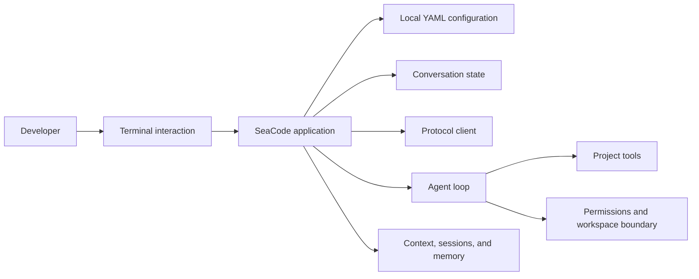

# SeaCode - Product Requirements Document

## Version Information

| Item | Value |
| --- | --- |
| Product | SeaCode |
| Form | Local terminal AI coding agent |
| Users | Individual developers, technical teams, and engineers who need controlled automation |
| v1 goal | An installable, runnable, and verifiable local development workflow |
| Current status | In development; capabilities are delivered by engineering milestone |

## 1. Product Position

SeaCode lets developers collaborate continuously with a model in a local terminal. It starts with recoverable streaming conversations, then progressively enables the agent to inspect projects, change files, run verification, and return traceable results within explicit permission and workspace boundaries.

The problem is not a single answer. A real development task crosses protocol differences, network failures, side effects, growing context, and recoverable sessions, while the developer must remain able to understand what is happening.

## 2. Users and Scenarios

| User | Primary goal |
| --- | --- |
| Developer | Configure an appropriate model, understand code, implement work, fix defects, and verify changes in a terminal. |
| Code reviewer | Inspect task results, tool actions, test output, and remaining risks. |
| Automation user | Run repeatable diagnostics, conversations, and development tasks from a project directory. |
| Team maintainer | Manage reusable workflows, work state, and controlled parallel tasks. |

### First User Journey

1. The user runs `sea` in a project directory.
2. SeaCode reads local YAML. One model profile enters chat directly; several profiles present a selection.
3. The user types a question and presses `Enter`; the answer appears as streaming text.
4. The user follows up and the model can use completed prior turns.
5. When a request fails, the interface shows a redacted error, restores input, and keeps the session usable.

## 3. Capability Map

The complete v1 takes shape in this order:

1. Conversations and model connectivity: profile selection, three explicit protocol paths, streaming text, and recovery from failures.
2. Tools and execution: file access, editing, commands, search, and external tool connections.
3. Orchestration and control: agent loop, stopping conditions, permissions, workspace safety, and human approval.
4. State and composable workflows: context governance, sessions, commands, skills, hooks, subagents, workspaces, and team coordination.

## 4. Functional Requirements

### 4.1 Model Configuration and Conversation

- Discover configuration from `~/.seacode/config.yaml`, project `.seacode/config.yaml`, and project `.seacode/config.local.yaml`; a later file may replace the earlier model profile list.
- Each model profile has `name`, `protocol`, `model`, `base_url`, `api_key`, and optional `thinking`.
- `anthropic` uses Anthropic Messages; `openai` uses OpenAI Responses; `openai-compat` uses OpenAI-compatible Chat Completions.
- The TUI displays the active profile and model in one stable location. Credentials never appear in the UI, logs, sessions, or error text.
- Conversation text streams to the terminal. Only a completed turn becomes logical history for a later model request.
- Authentication, rate limit, network, and response-shape failures must be understandable and recoverable without restarting the application.

### 4.2 Terminal Interaction

- `Enter` submits non-empty input and `Shift+Enter` inserts a newline; sending does not depend on a primary button.
- There is one active turn at a time. While waiting or streaming, repeated submissions are prevented but prior output remains readable.
- The interface stays compact: it does not repeat endpoint, model, or profile information, and it does not replace the conversation with a marketing welcome screen.
- Visual identity uses SeaCode's own name and an original American Shorthair tabby cat image without compromising terminal accessibility or keyboard use.

### 4.3 Later v1 Capabilities

- The agent loop organizes model requests, tool results, and stopping conditions into observable turns.
- File writes and commands obey permission decisions, dangerous-operation protection, and workspace boundaries.
- Long tasks govern context, persist sessions, restore state, and load reusable procedures.
- Isolated tasks and team collaboration preserve inspectable state, messages, and results.

## 5. Non-functional Requirements

| Dimension | Requirement |
| --- | --- |
| Responsiveness | Network waits and tool execution do not freeze the terminal; streamed text keeps updating. |
| Resilience | One provider, tool, or external connection failure does not make the session unrecoverable. |
| Security | Credentials never enter Git, logs, traces, fixtures, or public documentation; side effects are explainable. |
| Testability | Configuration, protocol boundaries, state machines, loops, and persistence can be verified without a real model. |
| Portability | The Python runtime supports common development environments and states platform differences or safe fallbacks clearly. |

## 6. Acceptance Scenarios

1. A user configures two models, starts `sea`, selects one profile, and completes two streaming turns.
2. With any of `anthropic`, `openai`, or `openai-compat`, SeaCode uses the request path declared by the field instead of guessing from the endpoint.
3. If a streaming request fails before its first chunk or part way through, the user input remains visible, incomplete assistant content does not enter logical history, and a following turn can still succeed.
4. In later milestones, the agent completes a full “read a file, modify a file, run tests, explain the result” task with observable permission, tool, and session records.
5. In a clean environment, installation, static checks, and automated tests pass. Real model calls are local manual smoke checks and are never part of CI.

## 7. Current Non-goals

- A graphical IDE, multi-tenant cloud service, or remote source hosting platform.
- Lock-in to one provider or product logic that branches by provider name.
- Unverified automatic refactoring in place of traceable tool calls, permission decisions, and test feedback.
- A large runtime architecture rewrite during v1.

## 8. Future Direction

After v1 is complete and stable, SeaCode will separately evaluate a DeepAgents-based runtime rewrite. Any such evolution must preserve verifiable v1 results for user journeys, protocol boundaries, permissions, sessions, and error recovery.
