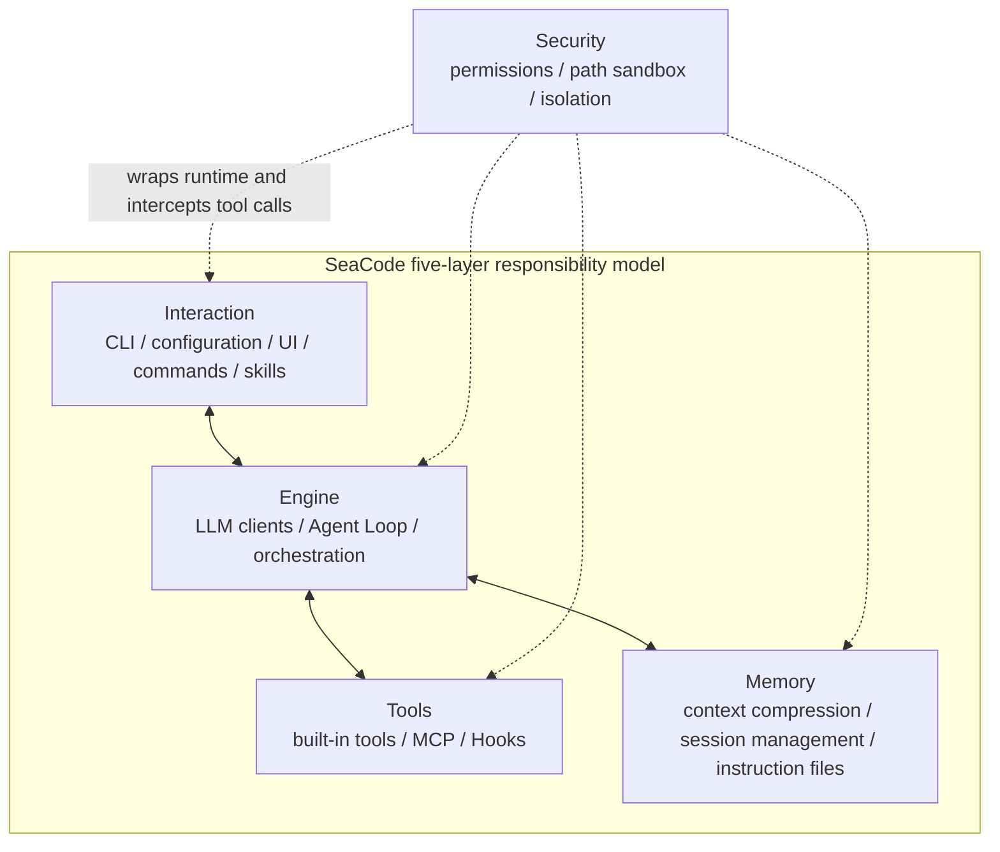

# SeaCode - Product Requirements Document

This is SeaCode's product through-line: it defines the user problem, product value, core capabilities, scope, and acceptance outcomes. It repeats the five-layer model and selected runtime constraints because a product promise must make its boundaries clear; its focus is what users get, not how modules implement it.

## Version Information

| Item | Content |
| --- | --- |
| Product | SeaCode |
| Form | Local terminal AI coding agent runtime |
| Users | Individual developers, engineering teams, and operators who need controlled automation |
| V1 goal | An observable, interruptible, and resumable engineering workflow inside the developer's own project directory |
| Primary entry points | `sea`, `sea -p`, `sea --remote` |

## 1. Product Position

SeaCode connects a model to the developer's own project directory. The Agent can understand code, call tools, modify files, run verification, manage long tasks, and coordinate multiple workers. The model decides what should happen next; SeaCode turns that decision into bounded execution, state, and results.

SeaCode is designed for a continuous engineering workflow rather than a one-shot answer. Every meaningful turn must be observable, cancellable, approvable, recoverable, and informative enough to continue after failure.

## 2. Product Principles

- **The model decides; the runtime executes.** The model can request only registered tools. Files, commands, external connections, and collaboration are runtime capabilities.
- **Tools define the capability boundary.** Tool names, schemas, permission classes, and results define what the Agent can do.
- **Safety comes before side effects.** Permissions, paths, sandboxes, and isolation establish boundaries before a tool runs.
- **Events are the shared language.** The TUI, Prompt CLI, browser entry point, and diagnostics consume the same text, tool, permission, usage, and completion events.
- **State must be recoverable.** Context, sessions, memory, workspaces, and task collaboration all need explicit persistence and recovery semantics.

## 3. Five-Layer Responsibility Model

SeaCode organizes its overall architecture into Interaction, Engine, Tools, Memory, and Security. This is a boundary model, not five parallel directories or a mandatory call chain. Security wraps the other layers and establishes a checkpoint before every tool execution.

| Layer | Responsibility | Typical capabilities |
| --- | --- | --- |
| Interaction | Receives intent, offers direct control, and presents state and results | CLI, configuration, TUI, browser entry point, Slash commands, Skills |
| Engine | Connects models, assembles requests, advances loops, and orchestrates work | Provider clients, prompt pipeline, Agent Loop, Subagents, Teams |
| Tools | Wraps local and external abilities as structured callable interfaces | Core tools, MCP, Hooks |
| Memory | Maintains context, sessions, project instructions, and continuity across turns | Context governance, Sessions, Memory, instruction files |
| Security | Limits side effects, path access, and the blast radius of parallel work | Permissions, Path Sandbox, OS Sandbox, Worktree, FileHistory |

## 4. Users And Scenarios

| User | Primary goal |
| --- | --- |
| Developer | Understand code, implement features, fix defects, and run verification in a project directory. |
| Reviewer | See what the Agent did, why it did it, what happened, and where human input is required. |
| Automation operator | Run repeatable diagnostics, checks, and development tasks with `-p` and structured output. |
| Team maintainer | Manage project instructions, Skills, Hooks, sessions, and controlled parallel work. |

### 4.1 Interactive development

The user runs `sea`, selects a local Provider, enters a task, and watches the streamed response. When the model needs to read or change a project, tool calls, permission results, output, and usage remain visible in the same turn. The user can cancel, deny, or change the permission mode.

### 4.2 Scripted work

The user runs `sea -p "..."` for a non-interactive task and chooses `text`, `json`, or `stream-json` output. This entry point fits local scripts, diagnostics, and repeatable checks outside the TUI. Credentials remain in local configuration only.

### 4.3 Long and parallel tasks

Complex work can use context compaction, session recovery, long-term memory, Subagents, Worktrees, and Agent Teams. Each parallel mode must preserve task state, message ordering, and workspace-change protection.

## 5. V1 Core Capabilities

SeaCode V1 exposes the following 13 user-observable capabilities:

| # | Capability | Requirement summary |
| --- | --- | --- |
| 01 | Multi-Provider conversation | Select protocol and model through an explicit profile with unified streaming, usage, and error events. |
| 02 | Tool system | Provide file, command, and search tools through one schema, registry, and result model. |
| 03 | Agent Loop | Advance work from tool results while handling stopping conditions, cancellation, retries, and errors. |
| 04 | Permissions and sandbox | Check commands, paths, rules, modes, and human approval before side effects. |
| 05 | MCP tool ecosystem | Connect stdio and Streamable HTTP MCP Servers while isolating connection failures. |
| 06 | Context governance | Manage large results, token budgets, summaries, compaction, and recovery boundaries. |
| 07 | Sessions and memory | Persist sessions, load project instructions, recall long-term memory, and recover safely. |
| 08 | Slash command framework | Control state, sessions, permissions, compaction, and workspaces without a model call. |
| 09 | Skill packages | Load reusable workflows from project or user directories with on-demand execution and arguments. |
| 10 | Lifecycle Hooks | Run conditional command, prompt, HTTP, or Agent actions at runtime events. |
| 11 | Subagents and tasks | Execute subtasks in independent contexts and track status, results, cancellation, and traces. |
| 12 | Git Worktree isolation | Give parallel tasks separate workspaces with protected exit, cleanup, snapshots, and rewind. |
| 13 | Agent Teams | Support long-lived multi-Agent work through Leads, teammates, task boards, and mailboxes. |

## 6. Functional Requirements

### 6.1 Models and protocols

- A Provider profile contains `name`, `protocol`, `model`, `base_url`, and `api_key`.
- `protocol: anthropic` uses Anthropic Messages; `protocol: openai` uses OpenAI Responses; `protocol: openai-compat` uses OpenAI-compatible Chat Completions.
- SeaCode does not infer a protocol from a URL or create an upper-layer branch for a named vendor.
- Requests, stream deltas, tool calls, usage, retries, and failures become unified Agent events.
- A failed turn never becomes an incomplete assistant message in later logical history; the user can continue the same session.

### 6.2 Interaction and events

- The TUI is conversation-first; `Enter` submits and `Shift+Enter` inserts a newline.
- One active turn is allowed at a time. Streaming prevents duplicate submission but permits cancellation and inspection of generated content.
- The TUI, Prompt CLI, and Browser Remote consume stable runtime events.
- Slash commands control the local runtime directly instead of turning deterministic local operations into model calls.

### 6.3 Tools and extensions

- Every tool declares a name, description, parameter schema, permission class, and structured result.
- Core file tools, Shell, Glob, and Grep share a registry and execution contract.
- MCP tools isolate connection, discovery, lifecycle, and failure by server and load definitions on demand.
- Skills and Hooks can extend workflows but cannot bypass registration, permission checks, or result feedback.

### 6.4 Memory and recovery

- Large tool results can be stored on disk while the context retains a stable reference or preview.
- As the context approaches its window boundary, old content is compacted while recent task information and recovery hints are retained.
- Sessions are stored as recoverable records; damaged records cannot destroy other sessions.
- Project and user instructions, long-term memory, and current-session content have a clear injection order.

### 6.5 Security and isolation

- Permission checks run before every tool execution; denial returns a structured result instead of crashing the session.
- Dangerous commands remain hard-blocked; path sandboxing handles symbolic links and sensitive configuration paths.
- User, project, and local rule files have explainable precedence and matching behavior.
- Plan, Default, Accept Edits, and Bypass Permissions provide different automation ranges, but none bypass dangerous-operation hard blocks.
- Worktrees and file history protect uncommitted changes, unpushed commits, and recoverable snapshots.

## 7. Non-Functional Requirements

| Dimension | Requirement |
| --- | --- |
| Observability | Text, thinking, tool, permission, usage, retry, compaction, and completion states are consumable as events. |
| Stability | A Provider, tool, MCP Server, Hook, or storage failure must not destroy the entire session. |
| Security | Credentials never enter Git, logs, traces, test fixtures, conversation bodies, or public documentation. |
| Recovery | Cancellation, denial, network failure, compaction, process restart, and workspace cleanup have recovery paths. |
| Testability | Protocol edges, tool results, permission decisions, persistence, and key TUI paths are automatically verifiable. |
| Portability | Windows, macOS, and Linux differences have explicit behavior or safe degradation. |

## 8. Acceptance Scenarios

1. After configuring multiple Providers, the user can select a profile and complete multiple streamed turns.
2. After selecting any `protocol`, the request path, message shape, and tool schema match that protocol.
3. When the model requests a file, command, or external tool, the user can see tool state, permission results, and structured output.
4. The Agent can read files, modify files, run verification, and continue or finish based on results across multiple turns.
5. After large results or long conversations trigger context governance, the session continues and required records remain recoverable.
6. The user can combine commands, Skills, Hooks, Subagents, Worktrees, and Teams for their intended tasks.
7. Dangerous commands, out-of-bounds paths, denied permissions, and changed Worktrees are not silently destroyed.
8. `sea -p` emits text, JSON, or streaming JSON; `sea --remote` provides browser events and control in a trusted network.
9. Clean installation, Ruff, mypy, pytest, and local runtime smoke checks pass; live Provider requests remain local validation only.

## 9. Non-Goals

- A graphical IDE, cloud multi-tenant platform, or hosted code-management service.
- Provider-name-specific upper-layer logic or a dedicated branch for one compatible endpoint.
- Untraceable automatic changes in place of tools, permissions, events, and verification results.
- Allowing the model to bypass tool registration, permissions, path boundaries, or session state.
