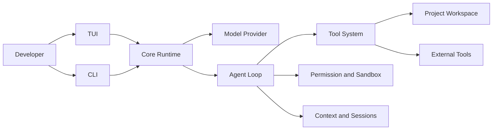

# SeaCode - Product Requirements

## Version Information

| Item | Content |
| --- | --- |
| Product | SeaCode |
| Product form | Local AI coding agent runtime |
| Target users | Individual developers, engineering teams, and operators who need controlled automation |
| First delivery target | An installable, runnable, and verifiable development workflow |
| Document role | Product requirements, behavior boundaries, and acceptance contract |

## 1. Product Positioning

### 1.1 One-Liner

SeaCode runs on the developer's machine and turns natural-language goals into controlled engineering work: it reads information, changes code, runs verification, and returns traceable results within explicit permission and workspace boundaries.

### 1.2 Problems To Solve

- Ordinary chat can suggest code but cannot reliably complete the loop of inspecting code, editing files, running tests, and explaining results.
- Tool calls, model output, and terminal UI are often tightly coupled, making timeouts, failures, and cancellation difficult to recover from.
- Automated writes and command execution have real side effects and need understandable permission modes, rules, and human approval.
- Long tasks encounter growing context, interrupted sessions, oversized output, and interference between parallel work.
- Complex work needs reusable procedures, isolated subtasks, and isolated workspaces instead of one unbounded conversation.

### 1.3 Success Criteria

| Goal | Measure |
| --- | --- |
| Usable | A user can install the runtime, configure a model, and complete a real coding task. |
| Controlled | File writes and commands follow visible permission decisions, with non-bypassable protection for dangerous operations. |
| Recoverable | Network errors, tool failures, context compaction, cancellation, and session restart preserve a way forward. |
| Observable | The TUI shows turns, tool calls, duration, usage, permission prompts, and final results. |
| Extensible | Providers, tools, commands, skills, hooks, and task runners fit behind clear interfaces. |
| Maintainable | Runtime, interface, and external connections have separate tests and stable contracts. |

## 2. Users And Scenarios

### 2.1 User Roles

| Role | Primary goal |
| --- | --- |
| Developer | Understand code, implement features, fix defects, and verify changes. |
| Reviewer | Inspect the reasoning, test evidence, risks, and unfinished work. |
| Automation user | Run repeatable diagnostics and development tasks from a terminal or script. |
| Maintainer | Govern shared rules, skills, sessions, isolated workspaces, and parallel tasks. |

### 2.2 Typical Journey

1. The user starts `sea` in a project directory; the runtime loads configuration and shows workspace and model status.
2. The user describes a concrete task, such as locating and fixing a failing test.
3. The Agent reads the required files, then requests tool calls through the permission policy; the user approves writes or commands when needed.
4. The Agent executes tools, consumes results, and continues until it has a final answer or reaches a safe stopping condition.
5. The user reviews changes, test output, duration, and session state, then continues, compacts context, or resumes a prior session as needed.

## 3. Capability Map

The capabilities are grouped into six areas:

1. **Conversation and model connectivity**: protocol adapters, streaming, multi-turn messages, and unified errors.
2. **Tools and execution**: file operations, commands, search, diffs, and external tool connections.
3. **Orchestration and feedback**: Agent Loop, stopping conditions, cancellation, retries, events, and progress.
4. **Control and safety**: permission modes, rule matching, workspace boundaries, dangerous-command protection, and approval.
5. **Context and state**: prompt assembly, result governance, summaries, sessions, and searchable memory.
6. **Composable workflows**: commands, skills, lifecycle hooks, subagents, isolated workspaces, and team coordination.

## 4. Functional Requirements

### 4.1 Conversation And Providers

- Select a model Provider from configuration and show the active model and endpoint status.
- Expose unified messages, streaming events, tool calls, and usage across protocols.
- Render text deltas quickly; keep thinking content separate from the final answer and never display content that should remain hidden.
- Turn authentication, rate-limit, network, and request-format failures into understandable session events that allow continued work.
- Support custom endpoints while keeping credentials out of the UI, logs, and transcript body.

### 4.2 Tool System

- Every tool provides a name, description, parameter Schema, category, and execution entry point.
- The first built-in set covers reading, writing, editing, command execution, file matching, and content search.
- Tool results contain success or failure state, a readable summary, and required structured fields.
- Large files and long command output have bounded size; full results can be saved for later reading.
- Tool calls, results, and errors appear as distinct events in the interface.

### 4.3 Agent Loop

- Each loop follows “request the model, collect the stream, execute tools, feed results back, request again”.
- Plain-text completion, iteration limit, user cancellation, repeated unknown tools, and Provider errors all stop cleanly.
- Consecutive read-only calls in one response may run concurrently as a group; side-effecting calls run in order, with results fed back in call order.
- Cancellation ends the current turn without closing the TUI or breaking tool/result pairing.
- The event stream decouples runtime and interface and covers text, tool start, tool result, progress, usage, completion, and errors.

### 4.4 Permissions And Safety

- Read-only, file-writing, and command tools use different default decisions.
- Dangerous-command protection takes precedence over other configuration and cannot be disabled by an ordinary permission mode.
- Resolve symbolic links and check workspace boundaries before file execution; sensitive configuration can be protected by deny-write paths.
- Merge user, project, and local rules with explicit precedence.
- When approval is needed, the user can allow once, allow persistently, or deny; a denial returns to the Agent without crashing the process.
- Planning mode exposes safe exploration tools; execution mode opens write and command capabilities.

### 4.5 Context And Sessions

- Build stable instructions, tool definitions, environment information, and conversation history as separate layers.
- Save oversized tool results in full, while keeping a stable preview and a readable path in the message.
- When the context approaches its limit, summarize older messages while retaining recent source text and intact tool pairs.
- Persist sessions in an append-friendly format that can list, resume, clear, and safely handle damaged records.
- Load project instructions and searchable memory at session start with explicit priority and path boundaries.

### 4.6 Composable Workflows

- Slash commands handle local state, mode changes, session operations, and fixed-prompt tasks without unnecessary model calls.
- Skills are editable Markdown capability packages that can run in the main session or as isolated tasks.
- Hooks respond to lifecycle events with conditions and actions; failures are normally recorded without blocking the main flow, except for explicit synchronous interception.
- Subagents support independent context, filtered tools, foreground or background execution, and result notifications.
- Git workspaces can be created, entered, exited, and cleaned up while protecting uncommitted work.
- Team coordination covers tasks, messages, member state, and optional parallel execution backends.

## 5. Permission Matrix

| Mode | Read-only tools | File writes | Commands |
| --- | --- | --- | --- |
| `default` | Allow | Ask | Ask |
| `acceptEdits` | Allow | Allow | Ask |
| `plan` | Allow | Ask | Ask |
| `bypassPermissions` | Allow | Allow | Allow |

Dangerous-command protection, workspace boundaries, and explicit deny rules always take precedence over the mode matrix. `bypassPermissions` changes ordinary approval behavior; it is not a promise to bypass safety limits.

## 6. Non-Functional Requirements

| Concern | Requirement |
| --- | --- |
| Responsiveness | Network waits and tool execution do not freeze the TUI; streaming text continues to update. |
| Resilience | A single tool, Provider, or external connection failure does not remove the session's recovery path. |
| Security | Credentials stay out of logs and output; paths, commands, and permission decisions remain explainable. |
| Testability | Policies, protocol adapters, loop boundaries, and persistence can be tested without a live model. |
| Portability | The Python runtime supports common development environments and provides safe degradation for platform-specific features. |
| Observability | Important events carry stable types, duration, error reasons, and required correlation identifiers. |

## 7. Acceptance Scenarios

1. A new user configures one Provider, starts the TUI, sends multiple messages, and sees streaming output and total duration.
2. The Agent reads a file, changes a file, runs tests, and uses the tool results in its final answer.
3. When a write or command triggers approval, denying it leaves the session usable.
4. An oversized tool result is saved and can be fully retrieved through its path.
5. When the context threshold is reached, the runtime summarizes old content, keeps recent text, and continues the task.
6. After restart, the user can list and resume a prior session.
7. A subtask in an isolated workspace keeps uncommitted changes from being cleaned automatically.
8. CI installs the project, runs static checks, and completes automated tests in a clean environment.

## 8. Non-Goals

- A graphical IDE, remote code-hosting platform, or cloud multi-tenant service is not the core runtime shape.
- The core runtime is not bound to one model vendor or one external tool ecosystem.
- Unverified automatic refactoring does not replace traceable tool calls and test feedback.
- Sandbox behavior is not promised to be identical across every operating system; platform differences must be visible with safe degradation.
- Unlimited parallel tasks, complex distributed scheduling, and long-running autonomy are not first-delivery gates.

## 9. Future Product Directions

- Richer Provider capability discovery, cost reporting, and request diagnostics.
- Visual session timelines, tool details, and task dependencies.
- Finer-grained remote execution, container isolation, and team permissions.
- Indexing, retrieval, and change-impact analysis for large codebases.
