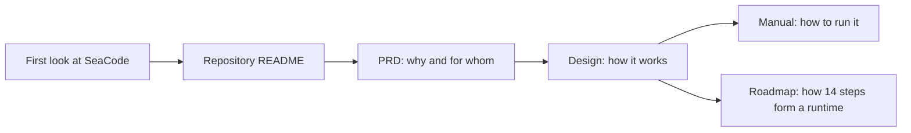
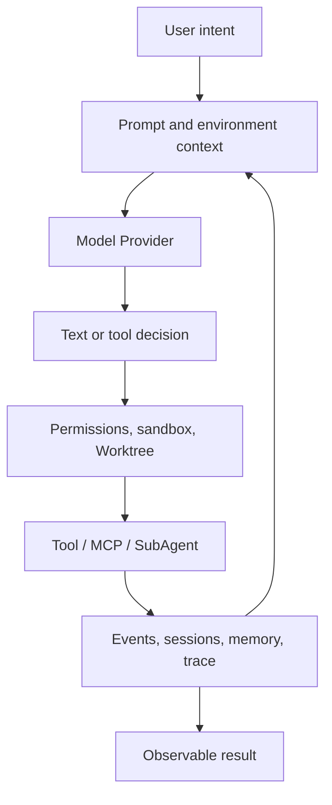

# SeaCode Documentation

[中文文档](../docs-zh/README.md)

SeaCode is a local terminal AI coding agent runtime. It combines models, tools, permissions, context, sessions, and collaboration into an engineering workflow that can be observed, interrupted, and resumed on the developer's machine.

This directory mirrors [`docs-zh/`](../docs-zh/README.md) in structure and product contract. English prose is written for international readers while command names, configuration keys, and protocol values retain their implementation spelling. The documents repeat shared facts where that makes SeaCode easier to understand, but each has a different reading focus; together they explain the product end to end.

## Where To Start

| Document | Best for | Primary reading angle |
| --- | --- | --- |
| [PRD-SeaCode.md](./PRD-SeaCode.md) | Product readers, interviewers, reviewers | Why it exists, who it serves, what it promises, and how user outcomes are accepted; with the shared architecture where useful |
| [Design-SeaCode.md](./Design-SeaCode.md) | Architects, developers, technical reviewers | How it works: five-layer runtime, module boundaries, state flows, failure recovery, and detailed designs for all 14 steps |
| [Manual-SeaCode.md](./Manual-SeaCode.md) | Users and maintainers | How to install, configure, operate, extend, collaborate, and troubleshoot, including operating safety boundaries |
| [project_roadmap.md](./project_roadmap.md) | Engineering leads and contributors | What comes first, why the order exists, how dependencies expand, and what evidence closes each step |

## The SeaCode Product Loop

SeaCode is not centered on a single answer. Each decision enters a bounded execution loop: tool calls have structured inputs and outputs, side effects have approval and isolation, long tasks have context governance, and essential state can be recovered after a process restart.

## Five-Layer Responsibility Model

The five layers are Interaction, Engine, Tools, Memory, and Security. They explain responsibility boundaries; they do not require five parallel source directories or imply a fixed call chain. The Security layer wraps the other layers and intercepts tool execution.

| Layer | Concern | Capabilities |
| --- | --- | --- |
| Interaction | CLI, configuration, UI, commands, and skills; receives intent and presents runtime state | TUI, Prompt CLI, Browser Remote, Slash commands, Skills |
| Engine | LLM clients, Agent Loop, and orchestration; advances model decisions and task state | Provider clients, Prompt pipeline, Agent Loop, SubAgent coordination |
| Tools | Built-in tools, MCP, and Hooks; connects external capabilities through one tool contract | Core tools, MCP, Hooks |
| Memory | Context compression, session management, and instruction files; preserves continuity across turns | Context governance, Sessions, Memory, instruction files |
| Security | Permissions, path sandboxing, and isolation; establishes boundaries before side effects execute | Permissions, path/OS sandbox, Worktree, FileHistory |

## Documentation Conventions

- The public docs describe SeaCode as an independent product: its product contract, design, operation, and public usage.
- `docs-zh/` and `docs-en/` keep the same structure and capability scope. Translation is natural rather than line-by-line.
- Mermaid diagrams are used for architecture, flow, and sequence views. Diagram nodes prefer product concepts over implementation trivia.
- Commands, configuration keys, paths, protocol values, and tool names use code formatting.
- API keys in public examples are always placeholders. Real credentials belong only in untracked local configuration.
