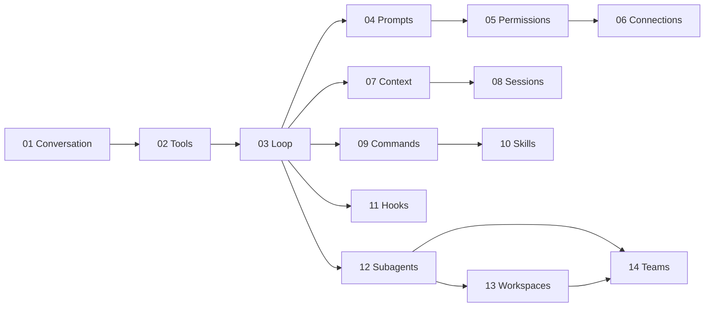

# SeaCode - Engineering Roadmap

## Version Information

| Item | Content |
| --- | --- |
| Product | SeaCode |
| Roadmap scope | From a minimal conversation loop to a collaborative local coding runtime |
| Delivery order | Fourteen bounded engineering milestones |
| Technical baseline | Python 3.12, `uv`, Textual, pytest, Ruff, mypy |
| Document role | Stable engineering map for maintainers and reviewers |

## 1. Engineering Goals

SeaCode is delivered by establishing a runnable loop first, then adding side effects, governance, and parallel execution. Every milestone needs a testable behavior boundary; later capabilities must not weaken the already verified contracts for conversation, tools, permissions, and persistence.

### 1.1 Definition Of Done

- A clean environment installs dependencies and starts `sea`.
- A user can configure a model and complete a multi-turn streaming conversation.
- The Agent can execute tools, process results, request approval, and complete a real development task.
- Context growth, tool failures, network errors, cancellation, and restart recovery have verifiable behavior.
- Key capabilities have automated tests, static checks, and reproducible acceptance evidence.
- TUI, CLI, and Core Runtime communicate through stable interfaces with clear extension boundaries.

## 2. Engineering Layout

```text
SeaCode/
├── src/seacode/
│   ├── agent/          # Loop, events, task state
│   ├── providers/      # Provider adapters
│   ├── tools/          # Tool abstraction and executors
│   ├── policy/         # Permissions and safety policy
│   ├── context/        # Prompts and context governance
│   ├── sessions/       # Sessions and memory
│   ├── extensions/     # Commands, skills, hooks
│   ├── worktree/       # Git workspaces
│   ├── teams/          # Subtasks and teams
│   ├── tui/            # Textual interface
│   └── cli/            # sea entry point
├── tests/
├── pyproject.toml
├── .github/workflows/
├── docs-zh/
└── docs-en/
```

## 3. Fourteen Delivery Milestones

| No. | Milestone | Delivery focus | Primary acceptance |
| --- | --- | --- | --- |
| 01 | Multi-Provider conversation | Configuration, protocol adapters, streaming, TUI, multi-turn history | Stable text exchange, recoverable errors, live and final duration. |
| 02 | Tool system | Tool abstraction, registry, file operations, commands, search | Correct Schema injection, structured results, feed-back of failures. |
| 03 | Agent Loop | ReAct loop, stopping conditions, events, cancellation, grouped execution | Continuous tool use until completion with valid history. |
| 04 | System prompt pipeline | Modular instructions, environment context, dynamic reminders, cache stability | Stable and changing content are separated; mode reminders work by turn. |
| 05 | Permissions and sandbox | Dangerous commands, paths, rules, modes, human approval | Explainable denial, blocked escapes, approval without session loss. |
| 06 | External tool connections | Discovery, stdio/HTTP connections, adaptation, lifecycle | One failed connection does not affect others; existing policy is reused. |
| 07 | Context governance | Large-result storage, stable previews, summaries, emergency recovery | Long tasks survive oversized results and a single context overflow. |
| 08 | Sessions and memory | Recoverable records, project instructions, automatic memory, session management | History resumes, instruction priority is clear, damaged records degrade safely. |
| 09 | Command framework | Registry, aliases, completion, status, and session commands | Local commands are predictable and do not consume model calls. |
| 10 | Skill system | Markdown packages, progressive loading, main and isolated execution | Skills are discoverable, load on demand, accept arguments, and reload. |
| 11 | Lifecycle hooks | Events, conditions, actions, interception, asynchronous execution | Configuration errors are visible; side failures do not block the main flow by default. |
| 12 | Subagents | Role definitions, independent context, foreground/background tasks, notifications | Subtasks run, can be queried and stopped, and cannot expand tools without bounds. |
| 13 | Git workspaces | Create, enter, exit, cleanup, setup, change protection | Changed workspaces are kept and runtime state can be recovered. |
| 14 | Agent teams | Members, tasks, mailboxes, coordination backends, coordinator mode | Agents communicate safely, synchronize state, and produce inspectable work. |

## 4. Milestone Dependencies



Dependencies describe capability prerequisites, not a limit on preparing tests early. Every milestone adds behavior tests before integrating a new module; cross-milestone changes must show that existing events, history, and permission semantics still hold.

## 5. Architecture Evolution

### 5.1 Foundational Runtime

Milestones 01 through 03 establish Core Runtime, Provider adapters, the tool registry, and an event-driven Agent Loop. The result is a complete loop of asking, calling tools, receiving results, requesting again, and answering.

### 5.2 Controlled Runtime

Milestones 04 through 08 address prompt stability, permission safety, external connections, context budgets, sessions, and memory. The goal is a long-running workflow that remains explainable, recoverable, and governable.

### 5.3 Composable Runtime

Milestones 09 through 11 provide commands, Skills, and Hooks. Fixed operations, reusable procedures, and lifecycle automation become extensions with stable surfaces instead of special cases inside the core loop.

### 5.4 Collaborative Runtime

Milestones 12 through 14 add subagents, Git workspaces, and teams. The focus is independent state, narrowed permissions, change protection, reliable messages, and observable task progress.

## 6. Quality Gates

Every milestone should pass:

```bash
uv sync
uv run ruff check src tests
uv run mypy src
uv run pytest tests/ -v
```

Add focused verification according to risk:

| Risk | Focused verification |
| --- | --- |
| Provider differences | Record request shapes and streaming events; verify error classification per protocol. |
| Tool side effects | Use a temporary workspace to verify files, commands, timeouts, and truncation. |
| Permission boundaries | Cover dangerous commands, symbolic links, precedence, and human denial. |
| Persistence | Simulate interruption, damaged lines, recovery, compaction boundaries, and duplicate writes. |
| Parallel tasks | Verify cancellation, locks, message order, and workspace change protection. |
| TUI | Verify narrow terminals, streaming input state, scrollback, and clean exit. |

## 7. Risks And Responses

| Risk | Impact | Response |
| --- | --- | --- |
| Provider behavior differs | Streaming, tool calls, or usage fields diverge | Isolate differences in adapters and keep protocol-level tests and fallback fields. |
| Agent loop runs away | Excess time or cost | Iteration limits, unknown-tool circuit breakers, cancellation, usage, and timeouts. |
| Automated changes exceed scope | Data loss or poor reviewability | Permission modes, workspace boundaries, dangerous-operation protection, and isolation. |
| Context grows too quickly | Failed requests or cache misses | Large-result governance, stable previews, summaries, and recent-text retention. |
| External connection is unavailable | Tool discovery or execution fails | Isolated connections, reconnect behavior, clear errors, and capability degradation. |
| Parallel workspace has changes | Cleanup loses work | Check uncommitted changes and new commits; keep the workspace by default. |
| Terminal differences | TUI layout or key bindings fail | Capability detection, narrow layout, exit cleanup, and CLI diagnostics. |

## 8. Evolution After Completion

- Richer model capability discovery, cost reporting, and latency analysis.
- Visual task dependencies, session timelines, and tool-call details.
- Stronger container and remote-execution isolation.
- Indexing, retrieval, and change-impact analysis for large codebases.
- Team policy management, audit trails, and collaboration reports.
