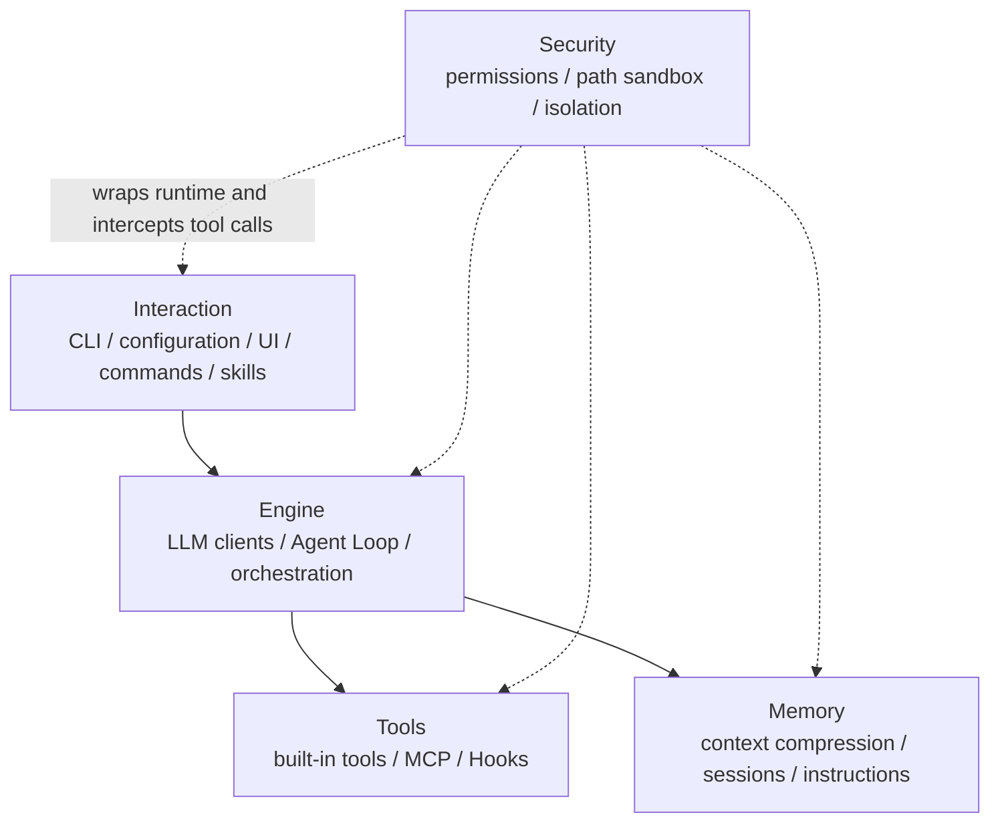
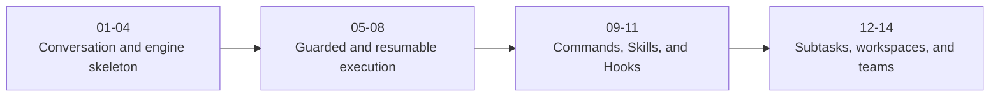
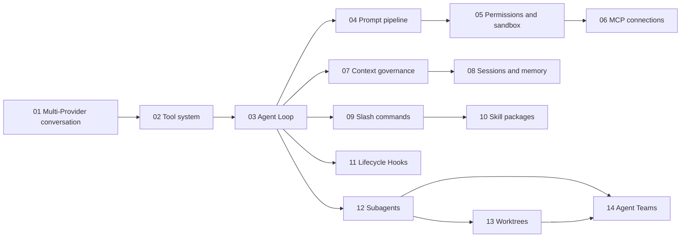

# SeaCode - Engineering Roadmap

## Roadmap Position

SeaCode V1 forms a complete local Agent runtime through 14 ordered and verifiable engineering steps. The sequence establishes a conversational runtime skeleton, then adds tool execution, loop progression, prompts, permissions, context, and sessions before composing commands, extensions, subtasks, workspaces, and team collaboration.

The five responsibility model is the long-term boundary: Interaction, Engine, Tools, Memory, and Security. A step can touch more than one layer, but it does not invent a parallel runtime when a new capability is added.

## How To Read This Roadmap

The Roadmap focuses on capability order, prerequisites, delivery evidence, and later composition. It repeats each step's user-visible result and points to the deeper module, state, and failure design in Design. This overlap keeps engineering progress tied to the product goal; it is not a copy of the full Design document. The PRD explains why the results matter, and the Manual explains how to use them after delivery.

## 1. Five Layers And The Roadmap



## 2. Fourteen Engineering Steps

| Step | Capability | Primary layer | Main modules | Prerequisite | Design location | Observable result |
| --- | --- | --- | --- | --- | --- | --- |
| 01 | Multi-Provider conversation | Interaction + Engine | `config.py`, `client.py`, `conversation.py`, `app.py` | Configuration discovery, logical messages, and basic interaction | 6.1 | Select a profile, complete streamed turns, and recover input after failure. |
| 02 | Tool system | Tools + Engine | `tools/`, `serialization.py` | Step 01 message container and protocol events | 6.2 | Core tools share schemas, registration, execution, and structured results. |
| 03 | Agent Loop | Engine | `agent.py` | Step 01 Provider and Step 02 ToolResult | 6.3 | The model continues from tool results and stops under explicit conditions. |
| 04 | System prompt pipeline | Engine | `prompts.py`, `context/` | Step 03 turn boundaries and event stream | 6.4 | Environment, modes, project rules, and dynamic reminders compose predictably. |
| 05 | Permissions and sandbox | Security | `permissions/`, `sandbox/` | Step 02 tool entry and Step 03 interception point | 6.5 | Dangerous commands, out-of-bounds paths, and unapproved side effects are blocked. |
| 06 | MCP tool connections | Tools | `mcp/`, `tools/` | Step 02 registry/result contract and Step 05 security check | 6.6 | stdio/HTTP Servers are discovered, connected, isolated on failure, and loaded on demand. |
| 07 | Context governance | Memory | `context/`, `agent.py` | Step 03 multi-turn loop and Step 04 prompt boundary | 6.7 | Large results are stored and near-limit conversations compact with recovery boundaries. |
| 08 | Sessions and memory | Memory | `memory/`, `serialization.py` | Step 07 context boundary and persistence foundation | 6.8 | Sessions, project instructions, and long-term memory persist, recall, and recover. |
| 09 | Slash command framework | Interaction | `commands/`, `app.py` | Step 01 interaction control and Step 03 Agent state | 6.9 | Local commands support registration, parsing, completion, and direct state control. |
| 10 | Skill packages | Interaction | `skills/`, `commands/`, `tools/` | Step 02 tool contract, Step 08 instructions/sessions, Step 09 command entry | 6.10 | Project and user Skills are discoverable, executable on demand, parameterized, and reloadable. |
| 11 | Lifecycle Hooks | Tools | `hooks/`, `agent.py` | Step 03 events and Step 05 pre-execution check | 6.11 | Event conditions and actions are observable; `pre_tool_use` can reject a call. |
| 12 | Subagents and tasks | Engine | `agents/`, `tools/` | Step 03 loop and Step 07/08 context and persistence | 6.12 | Subtasks have independent context, status, notifications, cancellation, and traces. |
| 13 | Git Worktree isolation | Security | `worktree/`, `filehistory/` | Step 08 sessions and Step 12 task lifecycle | 6.13 | Parallel tasks use isolated directories; cleanup protects changes and snapshots support rewind. |
| 14 | Agent Teams | Engine | `teams/`, `agent.py`, `tools/` | Step 12 tasks, Step 13 workspaces, and persistence | 6.14 | Leads, teammates, task boards, and Mailboxes support long-lived collaboration. |

## 3. Staged Delivery Logic

The 14 steps are not 14 independent feature switches. They form four delivery groups that progressively compose the runtime:



| Delivery group | Steps | Problem solved | Evidence needed to enter the next group |
| --- | --- | --- | --- |
| Conversation and engine skeleton | 01-04 | The model can converse, call tools, and work in a contextual loop. | Three protocol paths, tool-result pairing, loop stop/recovery, and prompt order are verifiable. |
| Guarded and resumable execution | 05-08 | Side effects have boundaries, and long work or restart does not lose essential state. | Permission denial continues, MCP failure is isolated, compaction preserves messages, and sessions recover. |
| Commands, Skills, and Hooks | 09-11 | Users and projects can shape runtime behavior with deterministic controls and extension rules. | Command state, Skill context, Hook conditions, and pre-execution rejection are observable. |
| Subtasks, workspaces, and teams | 12-14 | Complex work can be split, isolated, parallelized, and continued as collaboration. | Parent/child state, change protection, Mailbox, locks, and Windows fallback are accepted. |

## 4. Dependency Graph



Dependencies express capability prerequisites. Later capabilities do not replace earlier modules; every step inherits the established user paths, events, recovery behavior, and configuration safety semantics.

## 5. Delivered Module Map

| Responsibility layer | Module set | Composition |
| --- | --- | --- |
| Interaction | `__main__.py`, `app.py`, `config.py`, `commands/`, `skills/`, `remote.py` | TUI, script, browser, command, and extensible local-control entry points. |
| Engine | `client.py`, `conversation.py`, `prompts.py`, `agent.py`, `agents/`, `teams/` | Model connection, turn progression, orchestration, and collaboration. |
| Tools | `tools/`, `mcp/`, `hooks/` | Built-in, external, and lifecycle capabilities under shared contracts. |
| Memory | `context/`, `memory/`, `serialization.py` | Context budgets, sessions, instructions, recall, and recovery. |
| Security | `permissions/`, `sandbox/`, `worktree/`, `filehistory/` | Permission, path, and parallel-workspace protection before execution. |

## 6. Quality Gates

Every step covers normal and failure paths and runs the following engineering checks:

```bash
uv sync
uv run ruff check seacode tests
uv run mypy
uv run pytest tests/ -v
```

| Risk | Verification focus |
| --- | --- |
| Provider differences | Request shape, stream events, tool schemas, usage, and error classification. |
| Tool side effects | Files, commands, timeouts, and result sizes in a temporary workspace. |
| Permission boundaries | Dangerous commands, symlinks, rule precedence, mode changes, and human denial. |
| Context and persistence | Large results, compaction boundaries, interruption, damaged records, and duplicate writes. |
| Parallel collaboration | Cancellation, message order, task state, Worktree change protection, and Mailbox. |
| TUI and entry points | Narrow terminals, Enter submission, streaming state, clean exit, Prompt CLI, and Browser Remote. |
| Configuration safety | Credential redaction, ignored configuration, environment expansion, and local rule boundaries. |

Live Provider requests are local smoke tests only. Automated tests use credential-free clients, protocol data, or isolated external-dependency substitutes.

## 7. Complete V1 Shape

The completed V1 shape is an installable, runnable, observable, and resumable local engineering workflow:

- Interaction provides the TUI, non-interactive Prompt CLI, Browser Remote, commands, and Skill entry points.
- Engine provides multi-protocol clients, the Agent Loop, Subagent, and Team orchestration.
- Tools provide core file/command tools, external MCP tools, and lifecycle Hooks.
- Memory provides context governance, sessions, project instructions, long-term memory, and recovery records.
- Security provides permissions, path sandboxing, OS sandbox adapters, Worktrees, and file-history protection.

All entry points share tool, event, memory, and security contracts. Switching an entry point does not require users to relearn the Agent's behavior boundaries.
