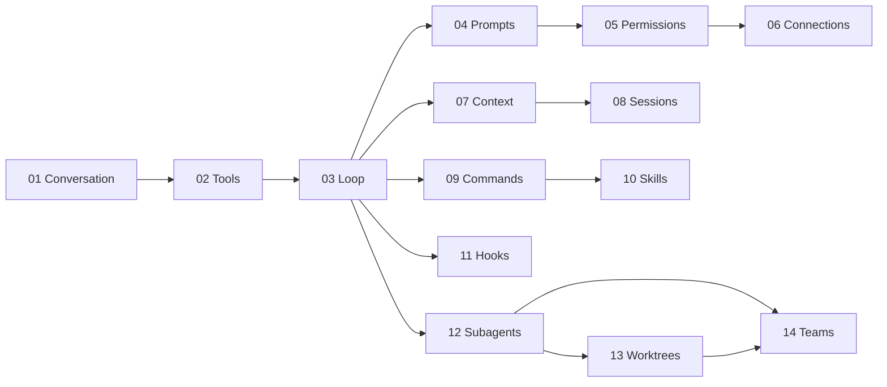

# SeaCode - Engineering Roadmap

## Version Information

| Item | Content |
| --- | --- |
| Product | SeaCode |
| Scope | From multi-Provider conversation to a collaborative local AI coding assistant |
| Delivery | Fourteen ordered, verifiable engineering milestones |
| Technology | Python 3.12, `uv`, Textual, pytest, Ruff, mypy |
| Document role | v1 module ownership, capability order, and quality gates |

## 1. Engineering Principles

SeaCode establishes a runnable conversation loop first, then adds tools, side-effect control, context governance, and collaboration in order. Each milestone adds one bounded capability and must not weaken already accepted configuration, conversation, permission, or recovery behavior.

v1 uses one stable Python package layout. Directories define module ownership; they are not a checklist that every milestone must populate immediately.

## 2. Engineering Layout

```text
SeaCode/
├── .seacode/
│   └── config.yaml.example
├── seacode/
│   ├── __init__.py
│   ├── __main__.py
│   ├── agent.py
│   ├── app.py
│   ├── askuser_dialog.py
│   ├── client.py
│   ├── config.py
│   ├── conversation.py
│   ├── driver.py
│   ├── permission_dialog.py
│   ├── plan_dialog.py
│   ├── prompts.py
│   ├── remote.py
│   ├── serialization.py
│   ├── session_dialog.py
│   ├── styles.tcss
│   ├── teammate_tree.py
│   ├── validator.py
│   ├── web_content.py
│   ├── agents/
│   ├── commands/
│   ├── context/
│   ├── filehistory/
│   ├── hooks/
│   ├── mcp/
│   ├── memory/
│   ├── permissions/
│   ├── sandbox/
│   ├── skills/
│   ├── teams/
│   ├── tools/
│   └── worktree/
├── tests/
├── pyproject.toml
├── uv.lock
├── .github/workflows/
├── docs-zh/
└── docs-en/
```

New functionality first uses these established modules. v1 does not split the same responsibility into extra runtime layers or parallel subpackages. A structural change requires behavior tests and an explicit design reason.

## 3. Fourteen Milestones

| No. | Milestone | Primary modules | Delivery focus | Primary acceptance |
| --- | --- | --- | --- | --- |
| 01 | Multi-Provider conversation | `config.py`, `client.py`, `conversation.py`, `app.py` | Configuration, streaming, TUI, multi-turn history | Stable text exchange, recoverable errors, and current-turn duration. |
| 02 | Tool system | `tools/` | Tool abstraction, registry, file operations, commands, and search | Correct Schema injection, structured results, and failure feedback. |
| 03 | Agent Loop | `agent.py` | Turns, stopping conditions, events, and cancellation | Continuous tool use until completion with valid history. |
| 04 | System prompt pipeline | `prompts.py`, `context/` | Modular instructions, environment facts, and dynamic reminders | Stable and changing content remain separate. |
| 05 | Permissions and sandbox | `permissions/`, `sandbox/` | Dangerous commands, paths, rules, modes, and approval | Explainable denial, blocked escapes, and approval without session loss. |
| 06 | External tool connections | `mcp/` | Discovery, stdio/HTTP connections, and lifecycle | One failed connection does not affect other tools. |
| 07 | Context governance | `context/` | Large-result storage, stable previews, summaries, and recovery | Long tasks handle large results and context limits. |
| 08 | Sessions and memory | `memory/`, `serialization.py`, `filehistory/` | Recoverable records, project instructions, and memory | History resumes and damaged records degrade safely. |
| 09 | Command framework | `commands/` | Registry, aliases, completion, status, and session commands | Local commands are predictable and do not consume model calls. |
| 10 | Skill system | `skills/` | Markdown packages, progressive loading, and isolated execution | Skills are discoverable, load on demand, accept arguments, and reload. |
| 11 | Lifecycle hooks | `hooks/` | Events, conditions, actions, interception, and async execution | Configuration errors are visible and ordinary failures do not block the main flow. |
| 12 | Subagents | `agents/` | Roles, independent context, tasks, and notifications | Subtasks can run, be queried, and stopped with bounded permissions. |
| 13 | Git workspaces | `worktree/` | Create, enter, exit, cleanup, and change protection | Uncommitted changes are not removed automatically. |
| 14 | Agent teams | `teams/` | Members, tasks, mailboxes, and coordination backends | Agents communicate safely and synchronize state. |

## 4. Milestone Dependencies



Dependencies describe capability prerequisites. Each milestone first adds behavior tests for its capability; cross-milestone changes must show that existing user paths have not regressed.

## 5. Quality Gates

Every milestone should pass:

```bash
uv sync
uv run ruff check seacode tests
uv run mypy seacode
uv run pytest tests/ -v
```

| Risk | Focused verification |
| --- | --- |
| Provider differences | Cover request shape, stream events, usage, and error classification. |
| Tool side effects | Verify files, commands, timeouts, and result truncation in a temporary workspace. |
| Permission boundaries | Cover dangerous commands, symbolic links, rule precedence, and human denial. |
| Persistence | Simulate interruption, damaged records, recovery, compaction boundaries, and duplicate writes. |
| Parallel work | Verify cancellation, message order, and workspace change protection. |
| TUI | Verify narrow terminals, Enter submission, streaming input state, scrolling, and clean exit. |

Live Provider requests are local smoke tests only. Automated tests use credential-free clients or recorded protocol data.

## 6. Risks And Responses

| Risk | Impact | Response |
| --- | --- | --- |
| Provider behavior differs | Stream parsing, tool calls, or usage fields diverge | Isolate differences in `client.py` and retain protocol tests. |
| Agent Loop runs away | Time or cost becomes unbounded | Use iteration limits, cancellation, unknown-tool protection, and clear state. |
| Automated changes exceed scope | Data loss or poor reviewability | Use permission modes, path boundaries, dangerous-operation protection, and workspace isolation. |
| Context grows too quickly | Requests fail or history becomes inaccurate | Use large-result governance, stable previews, summaries, and recent text. |
| External connection is unavailable | Tool discovery or execution fails | Isolate one connection, show clear errors, and degrade capability. |
| Terminal differences | Layout or key bindings fail | Test narrow layouts, stable key bindings, and cleanup on exit. |

## 7. Evolution After v1

After v1 is complete, SeaCode can evaluate independent architectural work: richer model diagnostics, task timelines, remote execution isolation, large-codebase indexing, and a runtime rewrite using DeepAgents. Any later rewrite must first preserve the accepted v1 user behavior.
