# SeaCode - 系统设计

## 阅读定位

Design 是四份核心文档中的技术主线。它会重复 PRD 的核心用户路径和 Roadmap 的 14 步名称，但进一步解释这些能力为什么这样组合、由哪些模块承载、如何流转、在哪里失败以及如何验收。PRD 更偏向产品价值与用户承诺，Manual 更偏向实际运行与操作，Roadmap 更偏向推进顺序与依赖；它们共享事实和术语，并不是互相隔离的内容箱。

实现应以本文定义的模块边界、状态转移、接口契约、失败行为和验收不变式为依据。本文描述的是 SeaCode 自己的运行时设计，不要求源码创建与概念层一一对应的目录。五层架构表达职责边界；14 步表达能力如何在这些边界中逐步落位。

## 1. 五层职责架构

SeaCode 的五层是：**交互、引擎、工具、记忆、安全**。它们不是线性流水线。交互层接收意图并呈现状态，引擎层推进模型决策，工具层提供结构化能力，记忆层维护上下文连续性，安全层横向包裹并拦截副作用。

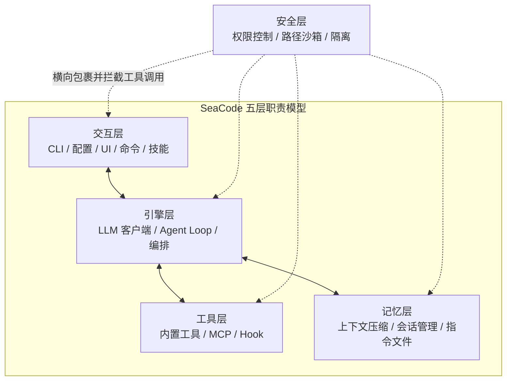

| 层 | 负责 | 不负责 |
| --- | --- | --- |
| 交互层 | CLI、配置、TUI、Browser Remote、Slash Command、Skill 入口和用户可见状态 | 不决定模型下一步，也不直接执行副作用 |
| 引擎层 | Provider 请求、提示词组合、Agent Loop、SubAgent 和 Teams 编排 | 不绕过工具契约直接访问文件、Shell 或网络 |
| 工具层 | 核心工具、MCP 工具、Hook 动作和结构化结果 | 不决定工具是否有权限执行 |
| 记忆层 | 消息历史、上下文预算、会话、指令、长期记忆和恢复 | 不把压缩摘要伪装成未经验证的原始事实 |
| 安全层 | 危险命令、路径、规则、权限模式、HITL 和隔离工作区 | 不改变业务结果，只决定副作用能否发生 |

安全层内部可以有多级防线，但这些是安全层的实现机制，不是另一套总体架构。

## 2. 运行时总模型

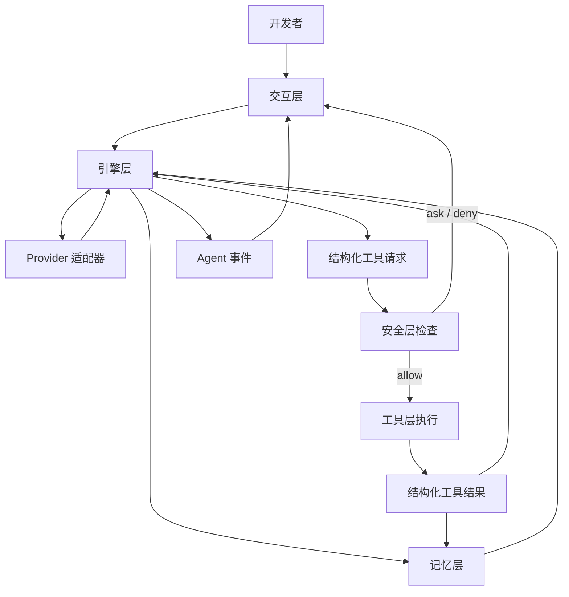

一次回合必须保持四个不变式：

1. 模型只能请求已注册的工具，不能直接获得宿主机能力。
2. 工具调用在执行前经过安全层；`deny` 不执行，`ask` 等待用户决策。
3. 工具结果按调用 ID 和请求顺序回灌，不能破坏 Provider 的消息结构。
4. 未完成的流、失败的动作和被取消的回合不能伪装成成功完成。

## 3. 共享技术契约

### 3.1 Provider 契约

配置中的 `protocol` 是请求路径的显式选择：

| 值 | 适配路径 |
| --- | --- |
| `anthropic` | Anthropic Messages |
| `openai` | OpenAI Responses |
| `openai-compat` | OpenAI-compatible Chat Completions |

`ProviderConfig` 保存 `name`、`protocol`、`model`、`base_url`、`api_key` 及可选的窗口、输出和思考参数。`client.py` 负责把三条 wire path 的流式增量、工具调用、用量、重试和错误归一化为运行时事件；上层不根据 URL 或供应商名称分支。

### 3.2 Tool 契约

每个工具都通过统一的 `Tool` 抽象进入 `ToolRegistry`：

| 字段 | 作用 |
| --- | --- |
| `name` | Provider 和 Agent 识别工具的稳定名称。 |
| `description` | 模型判断何时使用工具的边界说明。 |
| `params_model` | Pydantic 参数模型，生成协议 Schema 并校验输入。 |
| `category` | 参与权限模式、审计和工具过滤的分类。 |
| `is_concurrency_safe` | 标记是否允许与同批只读工具并发。 |
| `execute()` | 异步执行入口，返回 `ToolResult`。 |

工具异常、权限拒绝和外部服务错误都转换为结构化 `ToolResult`，由 Agent 决定下一步，不让异常直接摧毁会话。

### 3.3 Event 契约

| 事件 | 产生者 | 消费者关心的事实 |
| --- | --- | --- |
| `StreamText`、`ThinkingText` | Provider/Agent | 文本和思考增量。 |
| `ToolUseEvent` | Agent | 工具名、调用 ID、参数和开始时间。 |
| `ToolResultEvent` | Tool/Agent | 输出、错误标志、耗时和调用 ID。 |
| `PermissionRequest` | Security/Agent | 工具、原因、风险和等待中的响应 Future。 |
| `RetryEvent`、`ErrorEvent` | Client/Agent | 可恢复重试或最终失败原因。 |
| `UsageEvent` | Client/Context | 输入、输出和上下文窗口用量。 |
| `TurnComplete`、`LoopComplete` | Agent | 回合或完整循环完成及停止原因。 |
| `CompactNotification` | Context | 压缩触发、边界和恢复提示。 |
| `MCPConnectEvent`、`HookEvent` | MCP/Hook | 外部连接和扩展动作状态。 |

交互层只依赖事件契约，不依赖 Provider SDK、工具实现或存储格式。

### 3.4 持久化契约

持久化对象分为四类：当前会话 JSONL、会话元数据、项目/用户指令与长期记忆、文件编辑快照。每类对象都要能区分“当前事实”“派生摘要”和“可重新读取的引用”。恢复时优先保留可验证的原始记录，无法读取的单行记录跳过并记录原因。

## 4. 模块归属与依赖方向

```text
seacode/
├── __main__.py       # CLI 入口
├── app.py            # TUI 与交互状态机
├── client.py         # Provider 协议适配
├── config.py         # 配置发现与合并
├── conversation.py   # 逻辑对话历史
├── prompts.py        # System Prompt 流水线
├── agent.py          # Agent Loop 与事件
├── commands/         # Slash Command
├── skills/           # Skill 加载与执行
├── tools/            # 工具抽象、注册表、核心工具
├── mcp/              # MCP 生命周期和工具包装
├── hooks/            # Hook 事件、条件和执行器
├── context/          # 预算、溢写和压缩
├── memory/           # 会话、指令、召回和自动记忆
├── agents/           # SubAgent 定义、任务和 Trace
├── teams/            # Team、Mailbox、任务板和 spawn 后端
├── permissions/      # 权限模式、危险命令、规则
├── sandbox/          # macOS/Linux OS 沙箱适配
├── worktree/         # Git Worktree 生命周期
└── filehistory/      # 文件快照与 rewind
```

依赖方向保持为：交互调用引擎；引擎请求工具和记忆；安全层包裹工具执行；工具和记忆返回事件或结构化状态。`commands/`、`skills/`、`remote.py` 是交互入口，但它们不能绕过引擎、工具和安全契约。

## 5. 共享回合流程

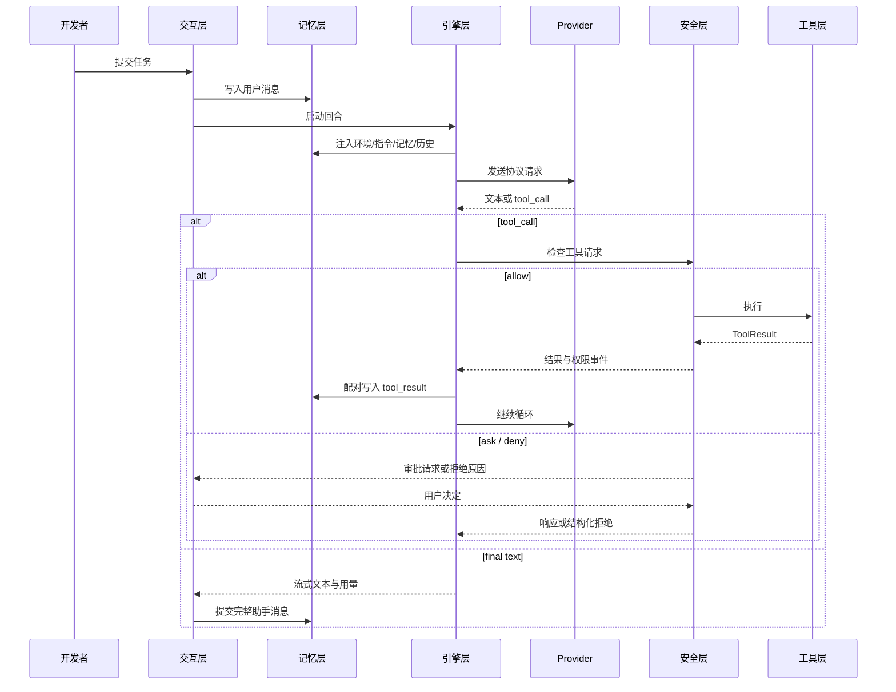

## 6. 十四步详细设计

### 6.1 第 01 步：多 Provider 对话

**设计目标**：先建立一个可靠的“用户输入 → 模型流式回复 → 可继续的会话”闭环，为后续工具回灌和 Agent Loop 提供稳定的对话容器。

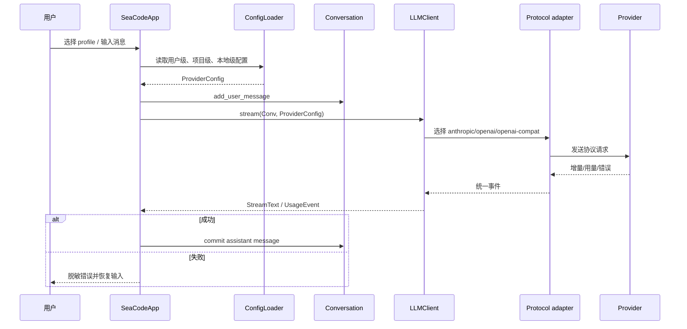

**模块设计**：`config.py` 只负责发现、解析和校验；`client.py` 只负责协议差异、流事件和错误分类；`conversation.py` 保存逻辑消息，不把某家 SDK 的消息类型泄漏到 UI；`app.py` 负责选择 profile、渲染事件和控制输入状态。

**关键不变式**：协议由 `protocol` 显式选择；失败或取消时未完成的助手消息不进入逻辑历史；同一 TUI 实例同一时间只有一个活动回合；密钥不进入事件、日志和消息正文。

**验收设计**：三条协议路径分别验证请求形状和流式事件；覆盖首字节前失败、中途断流、无效响应和多轮恢复；验证 `Enter`/`Shift+Enter`、重复提交阻止和错误后输入恢复。

### 6.2 第 02 步：工具系统

**设计目标**：把模型能做的事情收敛为有 Schema、有权限分类、有结构化结果的工具，而不是让模型拼接不可审计的命令文本。

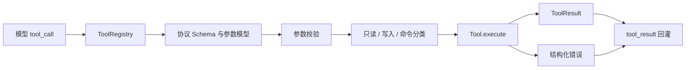

**模块设计**：核心工具覆盖 `ReadFile`、`WriteFile`、`EditFile`、`Bash`、`Glob` 和 `Grep`。注册表负责名称查找、协议 Schema、启用集合和并发分组；文件编辑要求先读文件并比较状态，防止基于过期内容覆盖外部修改。

**并发边界**：只有 `is_concurrency_safe` 且没有写入依赖的工具可以放入同一只读批次；写文件、编辑文件和 Shell 始终保持独立执行。工具执行失败不抛出到 UI，而返回 `is_error=True` 的结果。

**验收设计**：逐工具验证参数错误、路径错误、超时和正常结果；验证多工具调用的 ID 配对、只读并发、写入串行、过期文件拒绝和结果截断；验证工具注册表生成 Anthropic 与 OpenAI 两种 Schema。

### 6.3 第 03 步：Agent Loop

**设计目标**：把一次工具回合扩展为可持续的任务循环，让模型根据真实结果决定继续、修正或收尾。

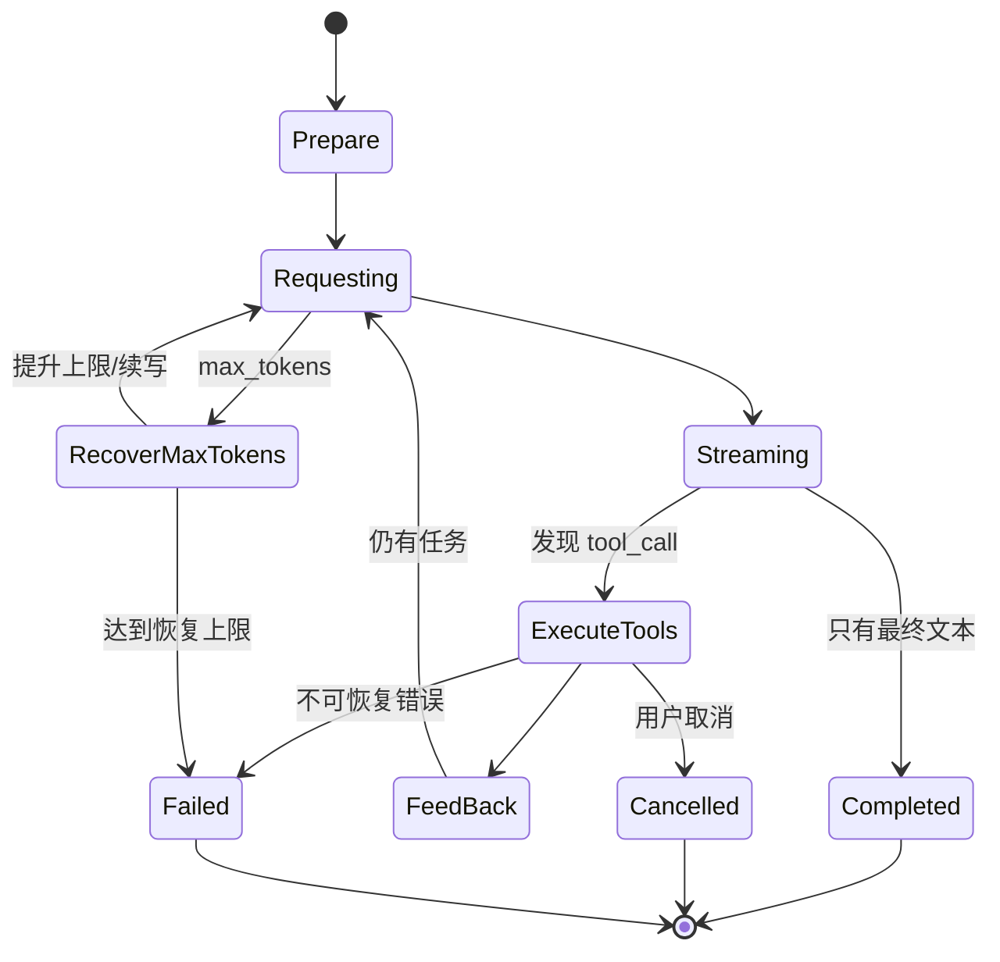

**模块设计**：`Agent.run()` 以异步事件流暴露循环；每轮开始注入环境、指令、记忆和 Hook；模型流结束后提取工具调用，交给工具注册表和安全层；结果按调用 ID 回灌。停止原因包括自然完成、最大步数、连续未知工具、Plan 完成、用户取消和不可恢复错误。

**恢复策略**：`max_tokens` 触发受限的上限提升和续写；未知工具受连续次数保护；工具错误继续作为结果回灌；取消设置事件并阻止下一轮重新发起；最终完成只提交已经闭合的消息。

**验收设计**：用两轮以上真实工具调用验证循环；覆盖多个并行只读调用、工具错误后修正、未知工具、取消竞态、token 恢复和自然完成；事件顺序必须能被 TUI、Prompt CLI 和 Browser Remote 同时消费。

### 6.4 第 04 步：System Prompt 流水线

**设计目标**：把模型行为所需的稳定规则、动态环境事实和模式提醒分开组装，使每轮请求都知道当前项目和运行边界，又不会把 UI 逻辑散落在 Agent 中。

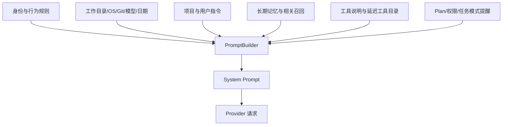

**模块设计**：`PromptSection` 描述名称、优先级和内容来源；`detect_environment()` 生成工作目录、平台、Shell、Git 分支等事实；`build_system_prompt()` 只拼装段落，不执行工具。稳定段落和每轮动态段落分离，便于测试和压缩后重新注入。

**边界**：Prompt 只能声明规则，不能代替权限检查；项目指令可以影响模型偏好，但不能授予未注册工具或绕过安全层；Plan Mode 提醒与安全模式真实状态必须一致。

**验收设计**：固定输入得到稳定顺序；不同 OS、Git 状态、Provider、权限模式和 Skill 组合得到可解释差异；验证压缩后环境和指令再次出现；验证密钥、绝对敏感路径和内部运行信息不被拼入提示词。

### 6.5 第 05 步：权限与沙箱

**设计目标**：将“模型想做什么”和“系统允许做什么”彻底分开，在每个副作用发生前做纵深判断。

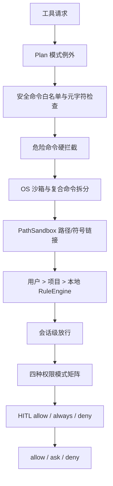

**模块设计**：`PermissionChecker` 是唯一执行前入口；`DangerousCommandDetector` 负责不可绕过的危险模式；`PathSandbox` 解析符号链接并保护项目外路径和敏感配置；`RuleEngine` 读取三层规则；`PermissionMode` 决定默认 ask/allow；UI 通过 `PermissionRequest` 提供人工确认。

**平台策略**：应用层权限在所有平台有效；macOS 使用 Seatbelt、Linux 使用 bubblewrap；Windows 没有同等 OS 沙箱时降级到应用层检查，不把降级伪装成内核隔离。

**验收设计**：验证危险命令在所有模式下硬拒绝；验证符号链接逃逸、非存在路径祖先解析、规则优先级、会话放行、Plan 模式和 HITL 三种响应；拒绝必须形成结构化 ToolResult，进程和会话继续。

### 6.6 第 06 步：MCP 工具连接

**设计目标**：让外部工具以可插拔方式进入工具层，同时隔离连接、能力发现和生命周期故障。

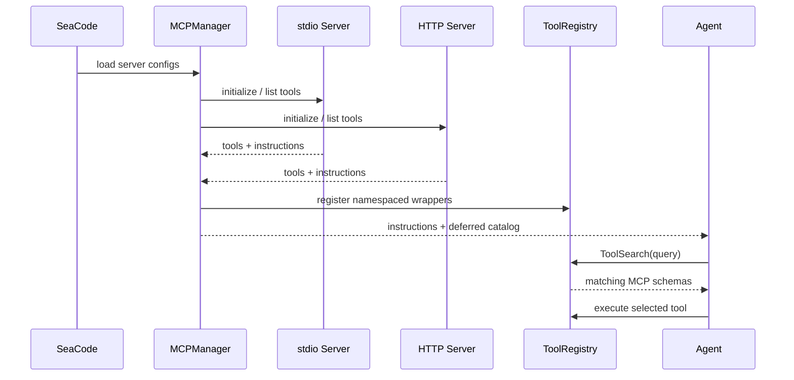

**模块设计**：`MCPClient` 负责单 Server 的 stdio 或 Streamable HTTP 连接、关闭、重连和消息转换；`MCPManager` 逐 Server 初始化并隔离失败；`MCPToolWrapper` 用 `mcp__server__tool` 命名空间注册；`ToolSearch` 延迟加载大型 Schema。

**边界**：MCP 工具和内置工具共享 Tool 契约，但仍经过安全层；服务器 instructions 只能作为提示词输入，不能直接改变权限；单 Server 失败产生连接事件，不阻断主循环。

**验收设计**：分别覆盖 stdio、HTTP、初始化失败、工具列表失败、运行中断线、重连、同名隔离和延迟发现；验证 MCP 工具结果能按正常 ToolResult 回灌。

### 6.7 第 07 步：上下文治理

**设计目标**：控制 token 成本和上下文质量，保证长任务不会因大工具输出或压缩操作破坏消息协议。

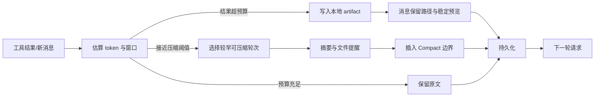

**模块设计**：`ContextManager` 维护窗口、输出上限、结果预算和压缩阈值；大结果溢写后保留可重新读取路径；压缩只处理安全边界前的旧轮次，不能拆开 `tool_use`/`tool_result`；压缩完成重新注入环境、指令、记忆和工具目录。

**熔断策略**：自动压缩失败或重复触发时限制重试，保留当前历史和可诊断通知；手动 `/compact` 走同一管理器，不复制另一套逻辑。

**验收设计**：覆盖大文本、二进制/图片摘要、连续工具结果、窗口临界值、压缩失败、取消和恢复；验证消息配对、文件引用可重读、用量事件和压缩通知顺序。

### 6.8 第 08 步：会话与记忆

**设计目标**：把当前工作、稳定项目规则和跨会话经验分成不同生命周期，支持重启、切换和损坏降级。

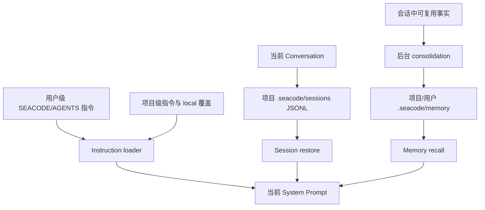

**模块设计**：`SessionManager` 创建、列举、恢复和删除会话；JSONL 每行可独立读取，元数据记录标题、时间和摘要；`load_instructions()` 按用户、项目目录链和 local 文件加载并解析 `@include`；`MemoryManager` 负责索引、相关召回、写入和清理。

**状态切换**：`/clear` 创建新会话并重建 FileHistory；`/session resume` 替换当前会话和对话历史；恢复时重建工具调用/结果配对并跳过损坏行；长期记忆不覆盖当前用户明确指令。

**验收设计**：覆盖新建、恢复、删除、损坏 JSONL、压缩边界、指令优先级、相关记忆召回、后台记忆写入和进程重启；验证会话切换不会复用旧会话的文件快照或工具状态。

### 6.9 第 09 步：Slash Command 框架

**设计目标**：为确定性的本地控制操作提供绕过 Agent Loop 的快速路径，减少不必要的模型调用和状态歧义。

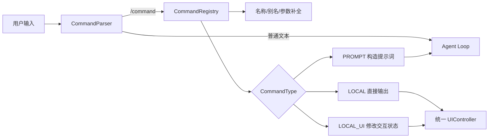

**模块设计**：命令定义包含名称、别名、用法、描述、执行类型和异步 handler；注册中心负责内置命令、Skill 动态命令和用户命令加载；handler 只依赖 `CommandContext` 和 `UIController`，不直接耦合整个 TUI。

**边界**：`/permission`、`/sandbox` 等命令可以改变运行状态，但不能直接执行被禁止的动作；`/review` 等 Prompt 类型命令可以进入 Agent Loop，并明确消耗模型回合；流式期间可执行的本地命令必须保持状态一致。

**验收设计**：验证大小写、别名、未知命令、补全、参数错误、用户命令覆盖规则和 Skill 热重载；验证 `/clear`、`/session`、`/rewind` 等状态命令不会残留旧 Agent 或 FileHistory。

### 6.10 第 10 步：Skill 技能包

**设计目标**：将可复用的工程 SOP 变成运行时可发现、可按需加载、可隔离执行的能力包，而不是继续增加硬编码命令。

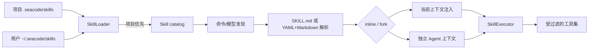

**格式与加载**：支持 `SKILL.md` frontmatter，或 `skill.yaml` + `prompt.md`；元数据描述名称、用途、模式、上下文范围和模型覆盖；项目级内容覆盖用户级同名内容；解析失败保留旧缓存并产生可观察错误。

**执行边界**：`inline` 共享主会话但不突破当前权限；`fork` 使用独立上下文，结果以结构化文本回传；`$ARGUMENTS` 只替换 Skill 参数，不作为任意提示词注入工具；Skill 声明的工具仍经过 ToolRegistry 和 Security。

**验收设计**：验证发现、项目覆盖、参数、多种 context 范围、inline/fork、热重载、安装失败和缓存回退；验证 Skill 不能调用未注册工具或绕过权限模式。

### 6.11 第 11 步：生命周期 Hook

**设计目标**：在固定生命周期节点提供可配置自动化，让项目规则、审计和外部通知不必侵入 Agent 主循环。

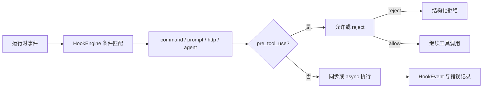

**事件与条件**：支持 session、turn、message、tool、startup、shutdown、compact、permission 和 file change 等事件；条件支持 `==`、`!=`、正则匹配以及 `&&`/`||` 组合；`once` 防止初始化动作重复触发。

**失败语义**：配置解析失败在加载边界报告；普通 Hook 动作失败记录事件并按配置继续主流程；`pre_tool_use` 是唯一能同步拒绝工具的关键路径，拒绝原因必须进入 ToolResult。

**验收设计**：覆盖条件匹配、动作参数展开、命令退出码、HTTP 超时、Prompt/Agent 动作、once、异步执行和 pre-tool 拒绝；验证 Hook 不会泄露密钥或阻塞非相关回合。

### 6.12 第 12 步：SubAgent 与任务管理

**设计目标**：为复杂任务提供独立上下文、受控工具集合和可追踪的后台执行，而不是把所有子任务消息堆进主会话。

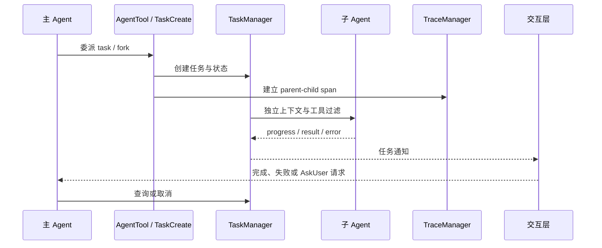

**上下文与工具**：子 Agent 拥有独立 Conversation 和 System Prompt，可使用指定模型和工具；工具过滤先移除 Agent/对话控制工具，再应用定义层 allow/deny；MCP 工具按外部能力规则保留。Fork 可以复制父上下文，但不共享可变会话对象。

**任务状态**：任务至少区分 pending、running、completed、failed、cancelled；结果、错误和耗时持久化到 Trace；后台任务取消必须向子 Agent 传播，并阻止完成后的重复回灌。

**验收设计**：验证前台、后台、fork、verification、AskUser、查询、取消、未知工具和子 Agent 失败；验证父子 trace、通知顺序、工具过滤和主会话恢复。

### 6.13 第 13 步：Git Worktree 隔离

**设计目标**：让并行 Agent 获得独立的文件系统工作面，同时用 Git 语义和快照保护用户已有工作。

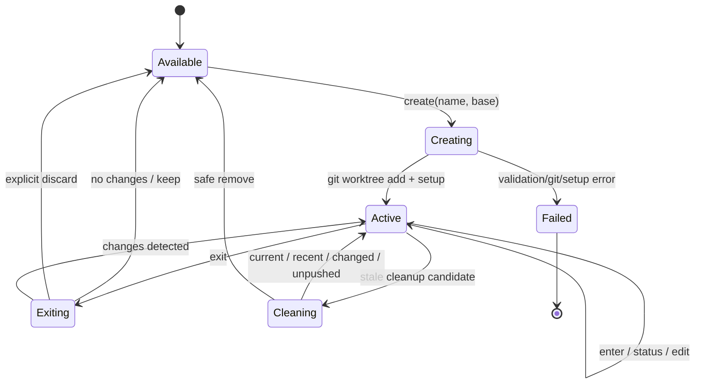

**模块设计**：`WorktreeManager` 负责 create/enter/exit/cleanup/restore；`setup.py` 处理本地配置、Git hooks、忽略目录和 symlink 的 best-effort 初始化；`changes.py` 对未提交修改、HEAD、未推送提交和损坏 worktree 采用 fail-closed；`FileHistory` 为编辑和 `/rewind` 提供快照。

**安全边界**：自动清理只处理符合临时命名规则且通过全部保护检查的目录；当前会话、近期 worktree、不可读取 HEAD、有变更或未推送提交的 worktree 不删除；退出时检测结果必须让用户知道下一步。

**验收设计**：覆盖名称校验、创建失败、进入/退出恢复、初始化失败降级、未提交/未推送保护、后台清理过滤、并发锁、会话恢复和三种 rewind 范围。

### 6.14 第 14 步：Agent Teams

**设计目标**：在 SubAgent 的一次性委派之上建立长期成员、共享任务和消息通道，使协作状态可持久化、可观察、可恢复。

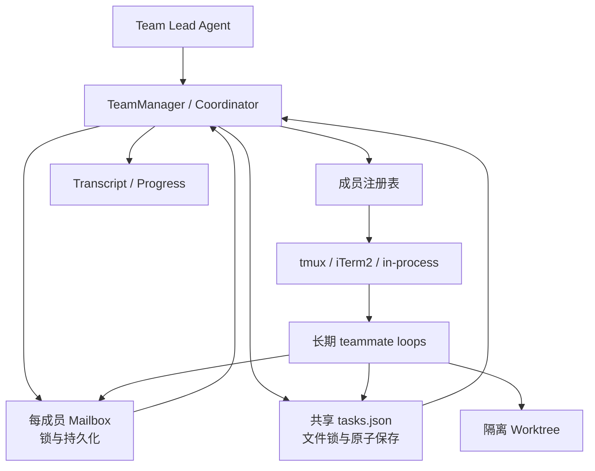

**状态模型**：`AgentTeam` 保存团队身份、Lead、成员和生命周期；`TaskManager` 共享任务的领取、依赖和状态；`Mailbox` 通过文件锁和原子写入提供跨进程消息；Transcript 与 progress tree 为 TUI 和恢复提供可观察历史。

**成员后端**：tmux 和 iTerm2 负责外部窗口；in-process 是 Windows 和非交互环境的稳定降级。teammate 循环从自己的 Mailbox 消费消息，完成或空闲时向 Lead 投递通知；消息类型必须区分用户指令、任务通知、进度和系统事件。

**Coordinator Mode**：开启后 Lead 只保留团队协调、任务查询、消息和结果综合所需的工具，代码操作由 teammate 完成；这是工具过滤和提示词边界的组合，不是新的权限模式。

**验收设计**：覆盖建队、成员注册、任务认领/更新、SendMessage、暂停/唤醒、Lead 邮箱、三种 spawn backend、Windows fallback、文件锁冲突、teammate 失败和 Coordinator 工具收敛。

## 7. 跨步骤失败边界

| 故障 | 统一处理 |
| --- | --- |
| Provider 鉴权、限流、断流 | 发出脱敏错误/重试事件，保留用户输入，不提交不完整助手消息。 |
| 工具参数或执行错误 | 返回结构化 ToolResult，Agent 可根据结果修正。 |
| 权限拒绝或用户取消 | 结束当前调用，回灌原因，保持会话和 UI 可继续。 |
| MCP 单 Server 失败 | 隔离该 Server 的生命周期和工具，主循环继续。 |
| 上下文压缩失败 | 熔断重复尝试，保留原始历史和诊断通知。 |
| 会话记录损坏 | 跳过损坏行，恢复可读内容和调用/结果配对。 |
| Worktree 有变更 | 清理和退出默认保护；丢弃需要显式选择。 |
| 子 Agent/teammate 失败 | 父任务收到失败状态和原因，不把失败伪装为完成。 |

## 8. 实现与验收原则

- 每一步先实现本文对应的模块和状态契约，再通过 Roadmap 规定的依赖进入下一步。
- 共享事件、ToolResult、Conversation 和权限边界优先保持兼容；局部优化不能改变已定义的用户路径。
- 测试必须覆盖正常结果、拒绝、取消、异常、恢复和并发边界，而不是只验证 happy path。
- 公开文档只表达 SeaCode 的产品、设计和运行契约，不记录一次性开发过程或外部学习材料。
