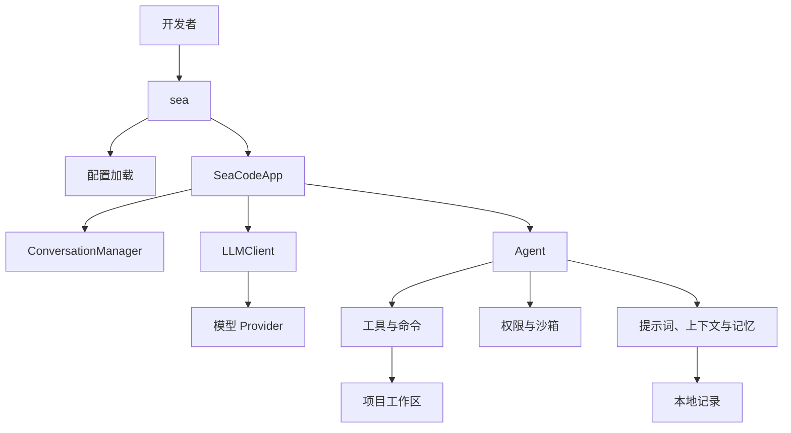
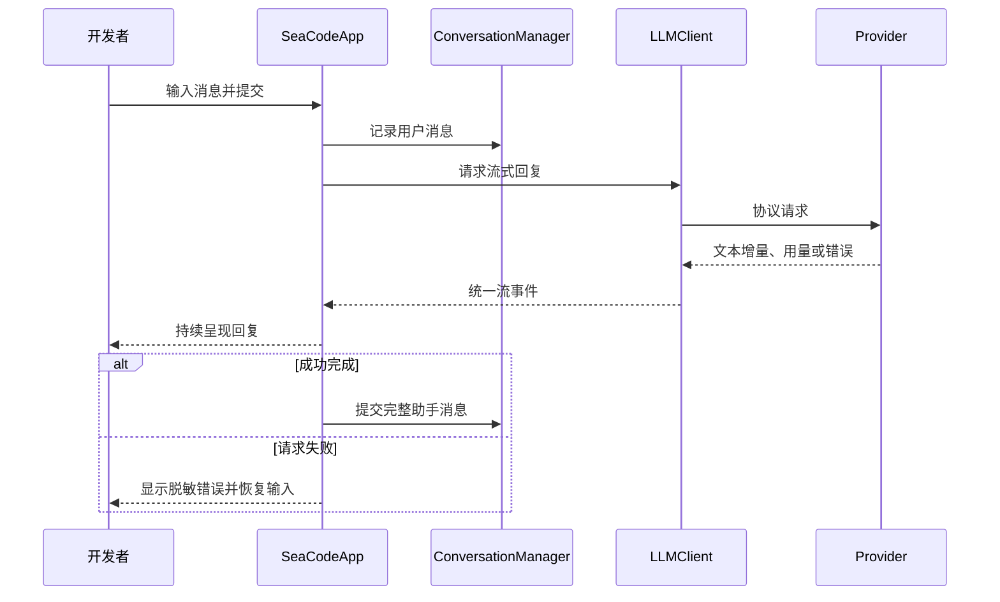

# SeaCode - 设计文档

## 1. 设计范围

SeaCode 是运行在开发者本机的终端 AI 编程助手。v1 采用单个 Python 进程：`sea` 负责启动、读取配置并进入 Textual 界面；功能随路线逐步加入同一个明确的模块树。

本设计记录 v1 的稳定模块归属和行为边界。它不把 TUI、CLI 或运行时描述为独立 daemon，也不以预设的分层框架替代实际代码职责。

## 2. 运行模型



第 01 步只启用配置、对话、客户端和 TUI。工具、Agent Loop、权限、持久化和协作能力在后续步骤进入图中的既定模块；尚未实现的能力不能出现在启动路径或界面中。

## 3. 模块结构

```text
SeaCode/
├── .seacode/
│   └── config.yaml.example
├── seacode/
│   ├── __init__.py
│   ├── __main__.py
│   ├── agent.py
│   ├── app.py
│   ├── askuser_dialog.py
│   ├── client.py
│   ├── config.py
│   ├── conversation.py
│   ├── driver.py
│   ├── permission_dialog.py
│   ├── plan_dialog.py
│   ├── prompts.py
│   ├── remote.py
│   ├── serialization.py
│   ├── session_dialog.py
│   ├── styles.tcss
│   ├── teammate_tree.py
│   ├── validator.py
│   ├── web_content.py
│   ├── agents/
│   ├── commands/
│   ├── context/
│   ├── filehistory/
│   ├── hooks/
│   ├── mcp/
│   ├── memory/
│   ├── permissions/
│   ├── sandbox/
│   ├── skills/
│   ├── teams/
│   ├── tools/
│   └── worktree/
├── tests/
├── pyproject.toml
├── uv.lock
└── .github/workflows/
```

| 模块 | 职责 |
| --- | --- |
| `__main__.py` | 命令行入口、配置加载和应用启动。 |
| `app.py` | Textual 界面、输入、对话呈现、选择器和屏幕状态。 |
| `client.py` | 模型协议、流式请求、统一事件、用量和错误分类。 |
| `config.py` | 用户级、项目级和 local YAML 配置的发现、解析与校验。 |
| `conversation.py` | 逻辑消息历史及其序列化前状态。 |
| `agent.py` | 模型回合、工具调用、停止条件和 Agent 事件。 |
| `tools/` | 内置工具、注册表、参数校验和执行入口。 |
| `permissions/`、`sandbox/` | 权限模式、规则、危险命令与路径边界。 |
| `context/`、`memory/`、`filehistory/` | 系统提示词、上下文治理、会话记忆和文件状态。 |
| `commands/`、`skills/`、`hooks/` | 本地命令、Markdown 能力包和生命周期扩展。 |
| `agents/`、`teams/`、`worktree/` | 子任务、团队协作与 Git 隔离工作区。 |

目录表示长期职责，不表示每个版本都已实现全部文件。新增能力首先落入这里的既定模块；需要改变模块归属时必须先证明现有边界不足以承载行为。

## 4. 核心流程

### 4.1 对话回合



错误和未完成片段可以保留在屏幕记录中，但不能作为完整助手消息进入下一次模型请求。界面一次只运行一个活动回合，流式期间拒绝重复提交，结束后恢复可输入状态。

### 4.2 工具回合

后续 Agent Loop 将在一次模型回复中识别工具调用、请求权限、执行已批准工具并将结构化结果回灌模型。工具调用与结果使用稳定标识配对；取消、拒绝和失败都以可解释的结果结束当前调用，不让界面失去恢复路径。

## 5. Provider 与配置

SeaCode 支持两个协议家族和三条明确路径：

| `protocol` | 协议路径 | 用途 |
| --- | --- | --- |
| `anthropic` | Messages API | Anthropic 原生或兼容端点。 |
| `openai` | Responses API | OpenAI 原生端点。 |
| `openai-compat` | Chat Completions API | 明确兼容该格式的端点。 |

配置按以下顺序加载：

1. `~/.seacode/config.yaml`
2. `<项目目录>/.seacode/config.yaml`
3. `<项目目录>/.seacode/config.local.yaml`

后层可替换前层 Provider 列表。profile 使用 `name`、`protocol`、`model`、`base_url`、`api_key` 和可选 `thinking` 字段。真实 key 只存在于未跟踪的本地配置；它不得出现在界面、日志、测试数据或会话正文中。

## 6. TUI 设计约束

- 对话是主界面，状态信息只在一个稳定位置显示一次。
- `Enter` 提交，`Shift+Enter` 换行；多行编辑不依赖 Send 按钮。
- 流式时先追加原始文本，完成后再定型 Markdown，避免不断重排。
- 配置错误在启动前以脱敏文本报告；请求错误保留当前界面并恢复输入。
- SeaCode 使用自己的名称、文案、视觉样式和原创美短虎斑猫标识；品牌资源不得挤压对话区或改变交互路径。

## 7. 安全与故障边界

| 场景 | 行为 |
| --- | --- |
| 配置缺失或无效 | 启动失败，报告可修复且不含凭据的错误。 |
| Provider 鉴权、限流、网络或协议错误 | 分类为可理解的界面事件，当前会话保持可继续。 |
| 工具参数、执行或权限失败 | 形成结构化结果，供 Agent 调整，而不是让进程崩溃。 |
| 上下文或存储异常 | 在相应步骤按可恢复规则处理，保留可观察原因。 |
| 工作区存在未提交修改 | 清理动作默认保留工作区与变更，避免丢失用户成果。 |

## 8. 设计原则

- 先保持用户可观察行为，再进行局部优化。
- 模块职责清晰，但不为抽象而增加中间层。
- 配置、协议、会话、界面和副作用各有明确归属。
- 每个新能力以测试和失败恢复作为交付的一部分。
- 平台或 Provider 差异必须可解释、可验证，并提供安全降级。
