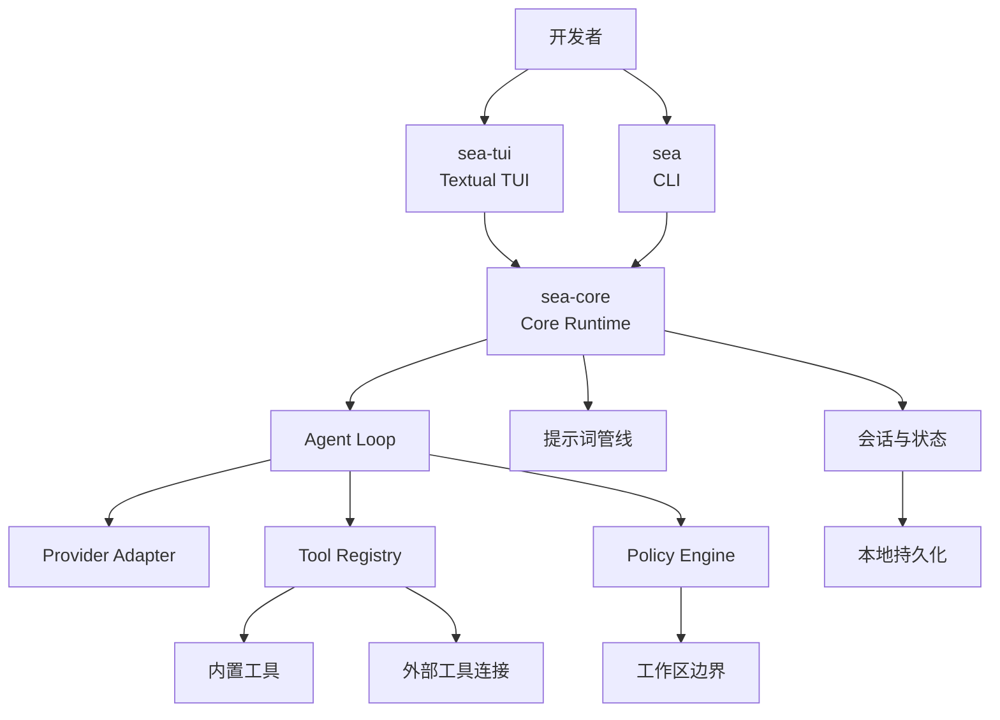
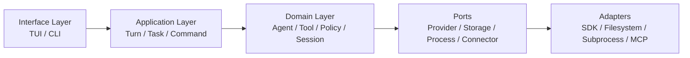
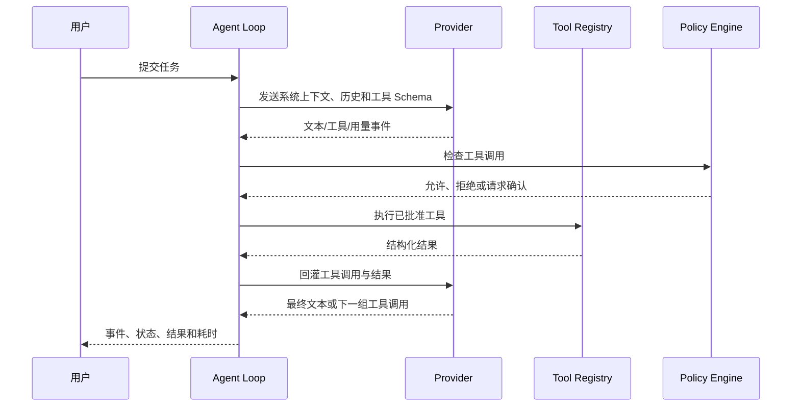
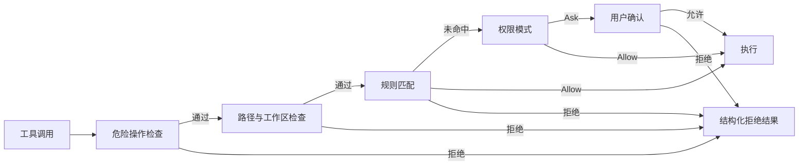

# SeaCode - 设计文档

## 1. 设计目标

SeaCode 的核心设计是把模型推理、工具副作用、用户界面和持久化状态放在清晰的边界内。运行时应该能够解释“为什么执行了这个工具”“工具结果如何影响下一轮”“发生失败后还能怎样继续”。

## 2. 系统架构



### 2.1 组件职责

| 组件 | 职责 | 不负责 |
| --- | --- | --- |
| `sea-core` | 生命周期、Agent Loop、事件、状态协调和运行时装配。 | 终端布局细节。 |
| `sea-tui` | 输入、流式输出、工具行、权限对话框、状态栏和滚动历史。 | 直接构造 Provider 请求或执行未经策略检查的工具。 |
| `sea` | 启动、诊断、脚本入口和非交互命令。 | 持有长期会话状态。 |
| Provider Adapter | 将不同模型协议转换为统一消息和事件。 | 工具权限和工作区策略。 |
| Tool Registry | 注册工具、导出 Schema、按名称查找和执行入口。 | 决定工具是否有权执行。 |
| Policy Engine | 危险命令、路径边界、规则、权限模式和人工确认。 | 直接运行工具。 |
| Session Store | 追加会话记录、恢复状态、压缩边界和运行元数据。 | 解释业务任务。 |

## 3. 分层与依赖



依赖方向从界面流向应用和领域，再通过端口连接外部系统。领域层不直接依赖终端控件、模型 SDK 或特定操作系统 API。

### 3.1 目标目录

```text
SeaCode/
├── src/seacode/
│   ├── agent/          # Agent Loop、事件和任务状态
│   ├── providers/      # 模型协议适配
│   ├── tools/          # 工具抽象、注册和内置工具
│   ├── policy/         # 权限、规则和路径保护
│   ├── context/        # 提示词、结果治理和上下文压缩
│   ├── sessions/       # 会话记录与记忆
│   ├── extensions/     # 命令、技能和 Hook
│   ├── worktree/       # Git 隔离工作区
│   ├── teams/          # 子任务与团队协作
│   ├── tui/            # Textual 界面
│   └── cli/            # sea 命令入口
├── tests/
├── pyproject.toml
└── .github/workflows/
```

## 4. 核心模型

### 4.1 一轮 Agent 工作

一轮工作由用户输入、模型事件、工具调用和最终结果组成。工具调用必须携带稳定的调用标识，工具结果必须引用该标识，确保重试、取消、恢复和审计时可以配对。



### 4.2 事件模型

界面只消费事件，不需要知道循环实现细节是第几次请求。事件至少包括：

- 文本增量和思考状态；
- 工具开始、工具完成、结果摘要和错误；
- 当前迭代、输入/输出用量和缓存信息；
- 权限询问、拒绝、取消、压缩和会话恢复；
- 回合完成、循环完成和不可恢复错误。

事件应包含会话、回合和工具调用关联信息，但不包含 API 密钥或未经脱敏的敏感配置。

## 5. Provider 适配

Provider 层对上提供统一接口：配置模型、发送消息、声明工具、消费流式事件和读取用量。适配器负责协议差异，包括：

- 系统提示词与消息角色的序列化；
- 工具 Schema 和工具结果的协议格式；
- 文本、思考、工具调用分片的解析；
- 鉴权、限流、网络和上下文错误的分类；
- 可选的提示词缓存标记和上下文窗口探测。

Agent Loop 不应根据 Provider 名称分支。新增 Provider 只需要实现适配器契约，并补充协议级测试。

## 6. 工具与策略

### 6.1 工具边界

工具分为只读、文件写入和命令执行三类。每个工具的执行入口只负责参数校验和实际工作；是否可以执行由 Policy Engine 在入口之前决定。

### 6.2 策略顺序



危险操作和明确拒绝优先；所有拒绝都转化为工具结果回传给模型，并在界面中保留原因。路径检查会解析符号链接，针对新文件检查最近的已存在祖先目录，避免路径不存在时产生错误判断。

## 7. 上下文与持久化

### 7.1 请求组装

请求由稳定部分和变化部分组成：

1. 稳定系统指令和工具描述。
2. 当前项目环境、工作区状态和运行信息。
3. 会话历史、工具调用结果和动态提醒。

稳定部分应保持字节级一致，变化部分不得污染缓存或历史角色关系。补充提醒通过独立的系统上下文通道注入，不伪装成用户问题。

### 7.2 输出治理

工具结果超过单条或单轮预算时，运行时保存完整内容，只把固定预览放入消息。预览包含原始大小、保存位置和重新读取方式。一次决策完成后，后续回合复用相同预览，避免历史漂移。

### 7.3 会话模型

会话记录采用可追加格式保存用户消息、助手消息、工具调用、工具结果和压缩边界。恢复时校验消息链；遇到损坏行、未配对调用或超限记录，按可恢复规则跳过或重建，不把异常直接传播到 TUI。

## 8. 扩展系统

| 扩展 | 入口 | 隔离方式 |
| --- | --- | --- |
| 命令 | `/help`、`/status`、`/plan` 等 | 本地执行或注入固定提示词 |
| Skill | Markdown 能力包 | 主会话或独立任务 |
| Hook | 生命周期事件 | 同步拦截或异步动作 |
| 外部工具连接 | 工具发现与适配 | 独立连接生命周期 |
| 子 Agent | 任务工具 | 独立消息、权限和用量状态 |
| Worktree | Git 工作区管理 | 独立目录和分支 |
| Team | 成员、任务和消息 | 进程内或终端后端 |

扩展通过稳定的注册和事件接口接入，不直接修改 Agent Loop 的核心停止条件。

## 9. 关键故障边界

| 故障 | 处理 |
| --- | --- |
| Provider 请求失败 | 发送错误事件，保留会话，允许再次提交。 |
| 工具参数或执行失败 | 生成结构化结果回灌，不让单个工具终止循环。 |
| 工具超时 | 终止当前工具，记录超时，按循环策略继续或停止。 |
| 用户取消 | 取消当前任务，补齐未完成调用结果，回到空闲状态。 |
| 权限拒绝 | 结果包含拒绝原因，模型可以调整方案。 |
| 外部工具连接失败 | 隔离到单个连接，保留其它工具和主会话。 |
| 上下文过长 | 先治理大结果，再摘要旧消息并保留近期原文。 |
| 工作区有未提交变更 | 清理动作失败关闭，保留目录和分支供用户检查。 |

## 10. 设计原则

- 先让行为可验证，再增加自动化程度。
- 让副作用经过明确的工具和策略边界。
- 把事件作为运行时与界面之间的契约。
- 把持久化格式视为产品接口，升级时提供兼容处理。
- 让增强能力可以降级，不让外部服务成为核心事实来源。
- 用小而清晰的端口隔离 SDK、终端、文件系统和进程管理。
