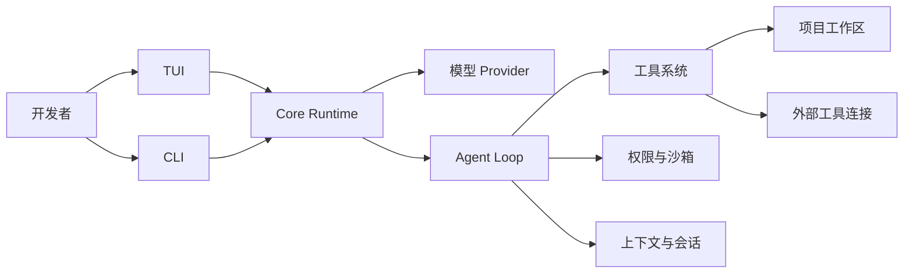

# SeaCode - 产品需求文档

## 版本信息

| 项目 | 内容 |
| --- | --- |
| 产品 | SeaCode |
| 产品形态 | 本地 AI 编程 Agent 运行时 |
| 目标用户 | 个人开发者、技术团队和需要可控自动化的工程工作者 |
| 首个交付目标 | 可安装、可运行、可验证的完整开发工作流 |
| 文档定位 | 产品需求、行为边界和验收契约 |

## 1. 产品定位

### 1.1 一句话

SeaCode 是一个在开发者本机运行的 AI 编程工作台：用户用自然语言描述目标，Agent 在明确的权限和工作区边界内读取信息、修改代码、执行验证并返回可追踪的结果。

### 1.2 要解决的问题

- 普通聊天只能给出建议，不能可靠地完成“检查代码、修改文件、运行测试、解释结果”的连续工作。
- 工具调用、模型输出和终端界面常常彼此耦合，发生超时、失败或取消时难以恢复。
- 自动化写入和命令执行具有真实副作用，需要可理解的权限模式、规则和人工确认。
- 长任务会遇到上下文增长、会话中断、输出过大和并行任务互相干扰等问题。
- 复杂任务需要可复用的操作流程、独立子任务和隔离工作区，而不是把所有状态堆在一段对话里。

### 1.3 成功标准

| 目标 | 衡量标准 |
| --- | --- |
| 可用 | 用户能安装运行时，配置一个模型后完成一次真实编码任务。 |
| 可控 | 文件写入和命令执行遵循可见的权限决策，危险操作有不可绕过的保护。 |
| 可恢复 | 网络错误、工具失败、上下文压缩、取消和重新进入会话不会破坏已有状态。 |
| 可观察 | TUI 能展示当前回合、工具调用、耗时、用量、权限询问和最终结果。 |
| 可扩展 | 新工具、协议适配器、命令、技能、Hook 和任务执行器能在清晰边界内加入。 |
| 可维护 | 核心运行时、界面和外部连接有独立测试与稳定的接口契约。 |

## 2. 用户与场景

### 2.1 用户角色

| 角色 | 主要目标 |
| --- | --- |
| 开发者 | 快速理解代码、实现功能、修复缺陷和验证变更。 |
| 代码评审者 | 查看修改依据、测试结果、风险和未完成事项。 |
| 自动化使用者 | 在脚本或终端中执行可重复的诊断与开发任务。 |
| 团队维护者 | 管理共享规则、技能、会话、隔离工作区和并行任务。 |

### 2.2 典型用户旅程

1. 用户在项目目录启动 `sea`，运行时读取配置并显示当前工作区与模型状态。
2. 用户提出一个具体任务，例如定位失败测试并修复它。
3. Agent 先读取必要文件，再按权限策略请求工具调用；用户在需要时确认写入或命令。
4. Agent 执行工具、消费结果、继续循环，直到得到最终答复或达到安全停止条件。
5. 用户查看修改、测试输出、耗时和会话记录；必要时继续追问、压缩上下文或恢复历史会话。

## 3. 能力地图

核心能力分为六组：

1. **对话与模型连接**：多协议适配、流式响应、多轮消息和统一错误模型。
2. **工具与执行**：文件读写、编辑、命令、检索、差异查看和外部工具连接。
3. **编排与反馈**：Agent Loop、停止条件、取消、重试、事件流和进度展示。
4. **控制与安全**：权限模式、规则匹配、项目路径边界、危险命令保护和人工确认。
5. **上下文与状态**：提示词组装、结果治理、摘要压缩、会话存档和可检索记忆。
6. **可组合工作流**：命令、技能、生命周期 Hook、子 Agent、隔离工作区和团队协作。

## 4. 功能需求

### 4.1 对话与 Provider

- 支持从配置中选择模型 Provider，并展示活动模型与端点状态。
- 对不同协议提供统一的消息、流式事件、工具调用和用量接口。
- 文本增量应尽快展示；思考内容与最终答复分离，不泄露不应展示的内容。
- 模型鉴权、限流、网络和请求格式错误应转化为可理解的会话事件，允许用户继续处理。
- Provider 配置必须支持自定义端点，凭据不得出现在界面、日志或会话正文中。

### 4.2 工具系统

- 每个工具必须提供名称、用途描述、参数 Schema、类别和执行入口。
- 第一组内置工具覆盖读文件、写文件、编辑文件、运行命令、文件匹配和内容搜索。
- 工具执行结果必须包含成功或失败状态、可读摘要和必要的结构化字段。
- 大文件和长命令输出必须受大小限制，必要时保存为可重读的结果文件。
- 工具调用、结果和错误应在界面中以可区分的事件呈现。

### 4.3 Agent Loop

- 每次循环按“请求模型 → 收集流 → 执行工具 → 回灌结果 → 再请求”推进。
- 纯文本完成、达到迭代上限、用户取消、未知工具连续失败和 Provider 错误都必须能停止循环。
- 同一回复中的只读调用可以批量并发；有副作用的调用按顺序执行，结果仍按调用顺序回灌。
- 取消只能结束当前回合，不应让 TUI 退出或破坏工具调用与结果的配对关系。
- 事件流应让运行时与界面解耦，至少覆盖文本、工具开始、工具结果、进度、用量、完成和错误。

### 4.4 权限与安全

- 只读、文件写入和命令执行使用不同的默认决策。
- 危险命令保护优先于其它配置，不能被普通权限模式关闭。
- 文件路径在执行前解析符号链接并检查工作区边界；敏感配置可以加入禁写路径。
- 允许用户级、项目级和本地级规则按优先级合并。
- 需要确认时，用户可以选择允许本次、持续允许或拒绝；拒绝结果回传给 Agent，不直接导致进程崩溃。
- 计划模式只允许安全的探索工具，执行模式再开放写入和命令能力。

### 4.5 上下文与会话

- 稳定提示词、工具定义、环境信息和对话历史分层构造，避免变化内容破坏缓存与可复现性。
- 超大工具结果应先保存完整内容，再在消息中保留稳定预览和重读路径。
- 接近模型上下文上限时，系统自动生成摘要并保留近期原文；工具调用与结果不能被切开。
- 会话以可追加格式持久化，能够列出、恢复、清空和安全处理损坏记录。
- 项目指令和可检索记忆在会话开始时按优先级加载，并有明确的路径边界。

### 4.6 可组合工作流

- Slash 命令用于本地状态、模式切换、会话操作和固定提示词任务，不应无谓消耗模型调用。
- Skill 以可编辑的 Markdown 能力包表达，可按需加载，并支持主会话执行或隔离任务执行。
- Hook 通过事件、条件和动作响应生命周期；失败默认记录并放行主流程，明确的拦截 Hook 除外。
- 子 Agent 支持独立上下文、工具过滤、前台或后台执行和结果通知。
- Git 工作区可以创建、进入、退出和清理，并在发现未提交变更时保护用户成果。
- 团队协作支持任务、消息、成员状态和可选的并行执行后端。

## 5. 权限矩阵

| 模式 | 只读工具 | 文件写入 | 命令执行 |
| --- | --- | --- | --- |
| `default` | 允许 | 询问 | 询问 |
| `acceptEdits` | 允许 | 允许 | 询问 |
| `plan` | 允许 | 询问 | 询问 |
| `bypassPermissions` | 允许 | 允许 | 允许 |

危险命令保护、路径边界和显式拒绝规则始终优先于模式矩阵。`bypassPermissions` 只改变常规询问，不代表绕过安全底线。

## 6. 非功能需求

| 维度 | 要求 |
| --- | --- |
| 响应性 | 网络等待和工具执行不冻结 TUI，流式文本能持续更新。 |
| 稳定性 | 单个工具、Provider 或外部连接失败不应让整个会话失去恢复机会。 |
| 安全性 | 凭据不落盘到日志或输出；路径、命令和权限决策可解释。 |
| 可测试性 | 核心策略、协议适配、循环边界和持久化格式都能在无真实模型时测试。 |
| 可移植性 | Python 运行时支持常见开发环境，并对平台相关能力提供降级路径。 |
| 可观察性 | 关键事件带有稳定类型、耗时、错误原因和必要的关联标识。 |

## 7. 验收场景

1. 新用户配置一个 Provider 后，可以启动 TUI、发送多轮消息并看到流式回复与总耗时。
2. Agent 能读取一个文件、修改一个文件、运行测试并把工具结果用于最终答复。
3. 写文件或命令执行触发权限询问时，用户拒绝后会话仍可继续。
4. 一个超大工具结果被保存后，模型可以通过读取路径重新获取完整内容。
5. 会话达到上下文阈值后能摘要、保留近期原文，并继续完成任务。
6. 用户关闭并重新启动运行时后，可以列出并恢复之前的会话。
7. 子任务在隔离工作区运行时，未提交变更不会被自动清理。
8. CI 在干净环境中完成安装、静态检查和自动化测试。

## 8. 当前非目标

- 不把图形化 IDE、远程代码托管平台或云端多租户服务作为核心运行形态。
- 不在核心运行时中绑定单一模型供应商或单一外部工具生态。
- 不用未经验证的自动重构替代可追踪的工具调用和测试反馈。
- 不承诺对所有操作系统的沙箱能力完全等价；平台差异必须显式显示并提供安全降级。
- 不将无限并行任务、复杂分布式调度或长期自治作为首个交付门槛。

## 9. 后续产品方向

- 更丰富的 Provider 能力探测、成本统计和请求诊断。
- 可视化会话时间线、工具详情和任务依赖。
- 更精细的远程执行、容器隔离和团队权限管理。
- 面向大型代码库的索引、检索和变更影响分析。
