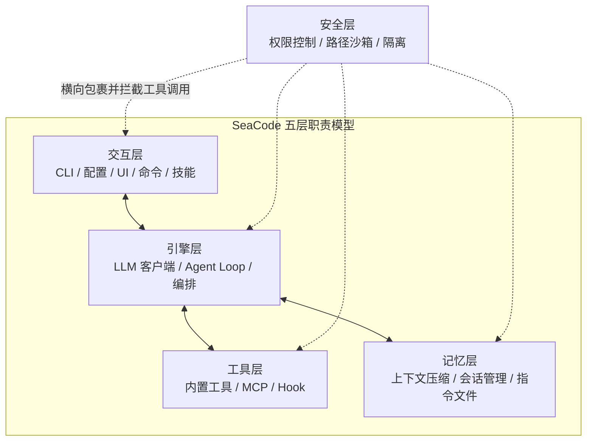

# SeaCode - 产品需求文档

本文是 SeaCode 的产品主线：它说明用户问题、产品价值、核心能力、范围和验收结果。它会复述五层架构和部分运行约束，因为产品承诺必须讲清楚边界；但这里关注的是用户能得到什么，而不是模块如何实现。

## 版本信息

| 项目 | 内容 |
| --- | --- |
| 产品 | SeaCode |
| 产品形态 | 本地终端 AI 编程 Agent 运行时 |
| 目标用户 | 个人开发者、技术团队和需要可控自动化的工程工作者 |
| V1 目标 | 在开发者自己的项目目录中完成可观察、可干预、可恢复的工程任务闭环 |
| 核心入口 | `sea`、`sea -p`、`sea --remote` |

## 1. 产品定位

SeaCode 将模型接入开发者自己的项目目录，让 Agent 能够理解代码、调用工具、修改文件、运行验证、管理长任务并协调多个执行者。模型负责根据上下文判断下一步，SeaCode 负责把判断转换为有边界的执行、状态和结果。

SeaCode 面向的不是一次性问答，而是连续的工程工作流。一个完整回合必须能够被观察、被取消、被审批、被恢复，并在失败后保留足够信息继续工作。

## 2. 产品原则

- **模型负责判断，运行时负责执行。** 模型只能请求已经注册的工具；文件、命令、外部连接和协作能力由运行时提供。
- **工具是能力边界。** 工具的名称、Schema、权限分类和结果决定 Agent 可以做什么。
- **安全先于副作用。** 权限、路径、沙箱和隔离在工具真正执行前建立边界。
- **事件是共同语言。** TUI、Prompt CLI、浏览器入口和诊断记录消费同一类文本、工具、权限、用量和完成事件。
- **状态必须可恢复。** 上下文、会话、记忆、工作区和任务协作都需要明确的持久化与恢复语义。

## 3. 五层职责模型

SeaCode 的总体架构按五类职责组织：交互、引擎、工具、记忆、安全。这是边界模型，不是五个平行目录，也不是强制调用链。安全层横向包裹其它层，并在每次工具执行前建立检查点。

| 层 | 负责什么 | 典型能力 |
| --- | --- | --- |
| 交互层 | 接收用户意图、提供直接控制、呈现状态和结果 | CLI、配置、TUI、浏览器入口、Slash Command、Skill |
| 引擎层 | 连接模型、组装请求、推进循环和编排任务 | Provider client、Prompt pipeline、Agent Loop、SubAgent、Teams |
| 工具层 | 把本地和外部能力包装成结构化可调用接口 | 核心工具、MCP、Hook |
| 记忆层 | 维护上下文、会话、项目指令和跨回合连续性 | 上下文治理、Sessions、Memory、instruction files |
| 安全层 | 限制副作用、路径访问和并行工作区的影响范围 | Permissions、Path Sandbox、OS Sandbox、Worktree、FileHistory |

## 4. 目标用户与场景

| 用户 | 主要目标 |
| --- | --- |
| 开发者 | 在自己的项目目录中理解代码、实现功能、修复缺陷并运行验证。 |
| 代码评审者 | 查看 Agent 做了什么、为什么做、结果是什么以及是否需要人工介入。 |
| 自动化使用者 | 用 `-p` 和结构化输出执行可重复的诊断、检查和开发任务。 |
| 团队维护者 | 管理项目指令、Skills、Hooks、会话和受控的并行任务。 |

### 4.1 交互式开发

用户运行 `sea`，选择本地 Provider，输入任务并观察流式回复。模型需要读取或修改项目时，工具调用、权限结果、输出和用量都在同一回合中可见；用户可以取消、拒绝或改变权限模式。

### 4.2 脚本化任务

用户运行 `sea -p "..."` 执行一次非交互任务，并选择 `text`、`json` 或 `stream-json` 输出。该入口适合 CI 外部的本地脚本、诊断和可重复检查；真实凭据仍只放在本地配置中。

### 4.3 长任务与并行任务

复杂任务可以使用上下文压缩、会话恢复、长期记忆、SubAgent、Worktree 和 Agent Teams。每种并行方式都必须保留任务状态、消息顺序和工作区变更保护。

## 5. V1 核心能力

SeaCode V1 由以下 13 项用户可观察能力组成：

| # | 能力 | 需求摘要 |
| --- | --- | --- |
| 01 | 多 Provider 对话 | 用显式 profile 选择协议和模型，统一流式输出、用量和错误事件。 |
| 02 | 工具系统 | 以统一 Schema、注册表和结果模型提供文件、命令、搜索等核心工具。 |
| 03 | Agent Loop | 根据工具结果连续推进任务，处理停止条件、取消、重试和异常。 |
| 04 | 权限与沙箱 | 在副作用前检查命令、路径、规则、权限模式和人工确认。 |
| 05 | MCP 工具生态 | 连接 stdio 与 Streamable HTTP MCP Server，并隔离连接故障。 |
| 06 | 上下文治理 | 管理大工具结果、token 预算、摘要压缩和恢复边界。 |
| 07 | 会话与记忆 | 持久化会话、加载项目指令、召回长期记忆并安全恢复。 |
| 08 | Slash 命令框架 | 通过本地命令直接控制状态、会话、权限、压缩和工作区。 |
| 09 | Skill 技能包 | 从项目级或用户级目录加载可复用流程，支持按需执行和参数。 |
| 10 | 生命周期 Hook | 在运行时事件上执行条件化 command、prompt、HTTP 或 Agent 动作。 |
| 11 | SubAgent 与任务 | 用独立上下文执行子任务，追踪状态、结果、取消和调用链。 |
| 12 | Git Worktree 隔离 | 为并行任务提供独立工作区，退出、清理、快照和回滚都有保护。 |
| 13 | Agent Teams | 通过 Lead、teammate、任务板和邮箱支持长期多 Agent 协作。 |

## 6. 功能需求

### 6.1 模型与协议

- Provider profile 必须包含 `name`、`protocol`、`model`、`base_url` 和 `api_key`。
- `protocol: anthropic` 使用 Anthropic Messages；`protocol: openai` 使用 OpenAI Responses；`protocol: openai-compat` 使用 OpenAI-compatible Chat Completions。
- SeaCode 不根据 URL 猜测协议，也不为具体供应商建立上层专属分支。
- 请求、流式增量、工具调用、用量、重试和错误统一转换为 Agent 事件。
- 失败回合不能把不完整的助手消息写入后续逻辑历史，用户可以在同一会话继续。

### 6.2 交互与事件

- TUI 以对话为主界面，`Enter` 提交，`Shift+Enter` 换行。
- 同一时间只有一个活动回合；流式期间禁止重复提交，但允许取消和查看已产生内容。
- TUI、Prompt CLI 和 Browser Remote 都能消费稳定的运行事件。
- Slash Command 直接控制本地运行时，不把可确定的本地操作转化为一次模型请求。

### 6.3 工具与扩展

- 工具必须声明名称、描述、参数 Schema、权限分类和结构化结果。
- 核心文件工具、Shell、Glob 和 Grep 共享注册表和执行协议。
- MCP 工具按 Server 隔离连接、发现、生命周期和故障；按需加载定义。
- Skill 和 Hook 可以扩展流程，但不能绕过工具注册、权限检查和结果回灌。

### 6.4 记忆与恢复

- 大工具结果可以落盘并在上下文中保留稳定引用或预览。
- 上下文接近窗口边界时自动压缩旧内容，保留近期任务所需信息和恢复提示。
- 会话以可恢复记录保存，异常或损坏记录不能破坏其它会话。
- 项目和用户级指令、长期记忆和当前会话必须有清晰的注入顺序。

### 6.5 安全与隔离

- 权限检查发生在每次工具执行之前；拒绝以结构化结果回灌，不让会话崩溃。
- 危险命令保持硬拦截；路径沙箱需要处理符号链接和敏感配置路径。
- 用户级、项目级和本地级规则支持可解释的优先级和匹配。
- Plan、Default、Accept Edits 和 Bypass Permissions 四种模式提供不同自动化范围，但不绕过危险操作硬拦截。
- Worktree 和文件历史保护未提交变更、未推送提交以及可恢复快照。

## 7. 非功能需求

| 维度 | 要求 |
| --- | --- |
| 可观察性 | 文本、思考、工具、权限、用量、重试、压缩和完成状态都有可消费事件。 |
| 稳定性 | Provider、工具、MCP Server、Hook 或存储的单点故障不应摧毁整个会话。 |
| 安全性 | 凭据不进入 Git、日志、trace、测试 fixture、会话正文或公开文档。 |
| 可恢复性 | 取消、拒绝、网络失败、上下文压缩、进程重启和工作区清理都有恢复路径。 |
| 可测试性 | 协议边界、工具结果、权限决策、状态持久化和 TUI 关键路径可自动验证。 |
| 可移植性 | Windows、macOS 和 Linux 对平台差异给出明确行为或安全降级。 |

## 8. 验收场景

1. 用户配置多个 Provider 后，能够选择 profile 并完成连续的流式多轮对话。
2. 用户指定任一 `protocol` 后，请求路径、消息格式和工具 Schema 与协议保持一致。
3. 模型提出文件、命令或外部工具调用时，用户能够看到工具状态、权限结果和结构化输出。
4. Agent 能在多个回合中读取文件、修改文件、运行验证并根据结果继续或收尾。
5. 长工具结果和长对话触发上下文治理后，会话仍可继续，必要记录可恢复。
6. 用户可以使用命令、Skill、Hook、SubAgent、Worktree 和 Team 完成对应的组合任务。
7. 危险命令、越界路径、拒绝的权限和有变更的 Worktree 都不会被静默破坏。
8. `sea -p` 能输出文本、JSON 或流式 JSON；`sea --remote` 能在受信任网络中提供浏览器事件和控制入口。
9. 干净环境安装、Ruff、mypy、pytest 和本地运行 smoke 均通过；真实 Provider 请求只在本地验证。

## 9. 非目标

- 图形化 IDE、云端多租户平台或云端代码托管服务。
- 通过供应商名称硬编码产品逻辑，或把某一个兼容端点设计成专属上层分支。
- 用不可追踪的自动修改替代工具、权限、事件和验证结果。
- 让模型直接绕过工具注册、权限层、路径边界或会话状态。
