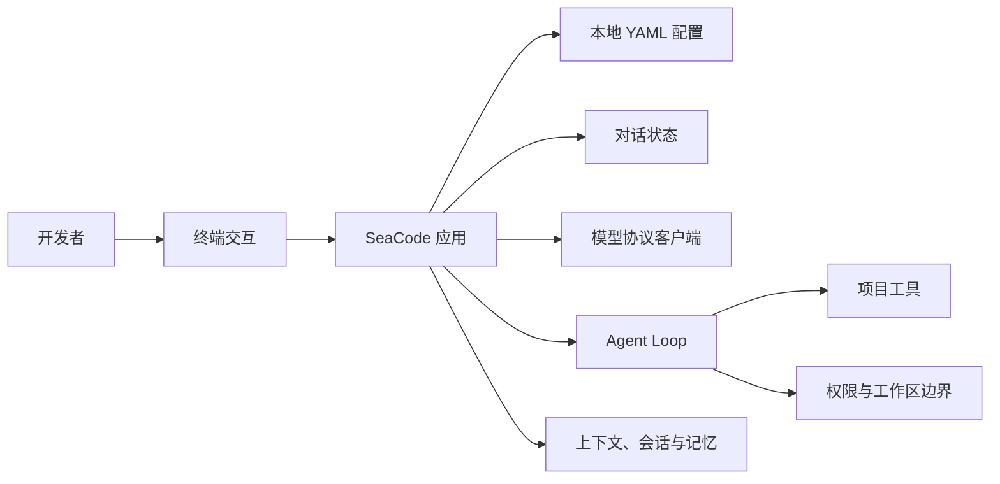

# SeaCode - 产品需求文档

## 版本信息

| 项目 | 内容 |
| --- | --- |
| 产品 | SeaCode |
| 产品形态 | 本地终端 AI 编程 Agent |
| 目标用户 | 个人开发者、技术团队和需要可控自动化的工程工作者 |
| v1 目标 | 可安装、可运行、可验证的本地开发工作流 |
| 当前状态 | 开发中；各能力按工程里程碑交付 |

## 1. 产品定位

SeaCode 让开发者在本地终端中与模型连续协作：先完成可恢复的流式对话，再逐步让 Agent 在明确的权限和工作区边界内读取项目、修改文件、执行验证并返回可追踪的结果。

它解决的不是单次问答，而是一个真实开发任务中常见的连续状态问题：模型协议不同、网络会失败、操作会有副作用、上下文会增长、会话需要恢复，且用户必须能理解正在发生什么。

## 2. 用户与场景

| 用户 | 主要目标 |
| --- | --- |
| 开发者 | 配置合适的模型，在终端中理解代码、实现功能、修复缺陷并验证变更。 |
| 代码评审者 | 查看任务结果、工具操作、测试输出和残余风险。 |
| 自动化使用者 | 在项目目录中执行可重复的诊断、对话和开发任务。 |
| 团队维护者 | 管理可复用流程、工作状态和受控的并行任务。 |

### 首个用户旅程

1. 用户在项目目录运行 `sea`。
2. SeaCode 读取本地 YAML，只有一个模型配置时直接进入对话，多个配置时让用户选择。
3. 用户输入问题并按 `Enter`；回复以流式文本持续显示。
4. 用户继续追问，模型能使用之前已完成的对话。
5. 某次请求失败时，界面给出脱敏错误，恢复输入，用户仍可在同一会话继续。

## 3. 能力地图

能力按以下顺序形成完整 v1：

1. 对话与模型连接：多配置选择、三条明确的协议请求路径、流式文本和失败恢复。
2. 工具与执行：文件、编辑、命令、检索与外部工具连接。
3. 编排与控制：Agent Loop、停止条件、权限、路径安全与人工确认。
4. 状态与组合：上下文治理、会话、命令、Skills、Hooks、子 Agent、工作区和团队协作。

## 4. 功能需求

### 4.1 模型配置与对话

- 从 `~/.seacode/config.yaml`、项目 `.seacode/config.yaml` 和项目 `.seacode/config.local.yaml` 发现配置，后层可替换前层的模型配置列表。
- 每个模型配置包含 `name`、`protocol`、`model`、`base_url`、`api_key` 和可选的 `thinking`。
- `anthropic` 使用 Anthropic Messages；`openai` 使用 OpenAI Responses；`openai-compat` 使用 OpenAI-compatible Chat Completions。
- TUI 在一个稳定位置显示当前配置和模型；密钥不会显示在界面、日志、会话或错误文本中。
- 对话以流式文本显示，成功回合才写入后续模型可见的历史。
- 鉴权、限流、网络和响应格式错误必须可理解且可恢复，不能要求用户重启应用。

### 4.2 终端交互

- `Enter` 提交非空输入，`Shift+Enter` 插入换行；发送不依赖主要按钮。
- 同一时间只有一个活动回合。等待和流式期间禁止重复提交，但允许阅读已输出内容。
- 界面保持紧凑：不重复展示端点、模型或配置，不以能力营销欢迎页取代对话。
- 视觉识别使用 SeaCode 自己的名称与原创美短虎斑猫形象，不影响终端可访问性和键盘操作。

### 4.3 后续 v1 能力

- Agent Loop 能将模型请求、工具结果和停止条件组织为可观察回合。
- 文件写入和命令执行遵守权限决策、危险操作保护与工作区边界。
- 长任务可治理上下文、保存会话、恢复状态并加载可复用流程。
- 隔离任务与团队协作保持可检查的状态、消息和结果。

## 5. 非功能需求

| 维度 | 要求 |
| --- | --- |
| 响应性 | 网络等待和工具执行不冻结终端；流式文本持续更新。 |
| 稳定性 | 一个 Provider、工具或外部连接失败不应使会话失去恢复机会。 |
| 安全性 | 密钥不进入 Git、日志、trace、测试 fixture 或公开文档；有副作用的操作可解释。 |
| 可测试性 | 配置、协议边界、状态机、循环和持久化能够在无真实模型时自动验证。 |
| 可移植性 | Python 运行时支持常见开发环境，对平台差异提供明确提示或安全降级。 |

## 6. 验收场景

1. 用户配置两个模型后启动 `sea`，选择其中一个配置，完成两轮流式对话。
2. 用户配置 `anthropic`、`openai` 或 `openai-compat` 中任一协议时，SeaCode 使用与该字段一致的请求路径，而不是根据端点猜测。
3. 流式请求在首字节前或中途失败后，用户输入仍保留为可见记录，未完成的助手内容不进入逻辑历史，下一轮仍可成功完成。
4. 后续里程碑中，Agent 能完成“读取文件、修改文件、运行测试、说明结果”的完整任务，并让权限、工具结果和会话记录可观察。
5. 在干净环境中，安装、静态检查和自动化测试均通过；真实模型调用只作为本地人工 smoke，不进入 CI。

## 7. 当前非目标

- 图形化 IDE、云端多租户服务或远程代码托管平台。
- 单一供应商锁定或按供应商名称硬编码上层产品逻辑。
- 用未经验证的自动重构替代可追踪的工具调用、权限判断和测试反馈。
- 在 v1 过程中大幅重写运行时架构。

## 8. 后续方向

v1 完整交付并稳定后，SeaCode 将单独评估基于 DeepAgents 的运行时重写。任何此类演进都必须保留 v1 用户路径、协议边界、权限、会话和错误恢复的可验证结果。
