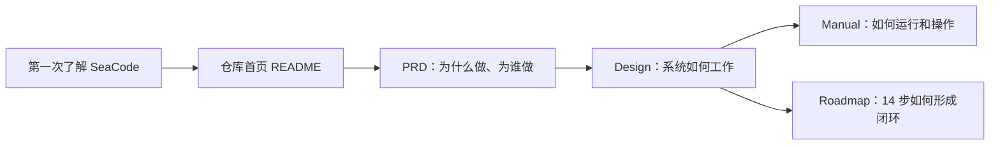
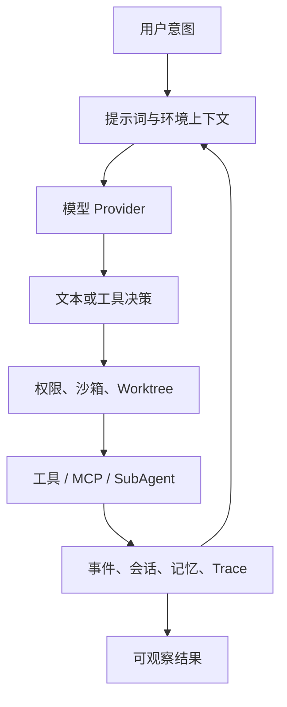

# SeaCode 文档

[English documentation](../docs-en/README.md)

SeaCode 是一个运行在开发者本机的终端 AI 编程 Agent 运行时。它把模型、工具、权限、上下文、会话和协作组织成一个可以观察、可以干预、可以恢复的本地工程工作流。

本目录与 [`docs-en/`](../docs-en/README.md) 保持章节和产品契约对应。中文文档强调概念、架构和用户路径；关键命令、配置字段和协议名称保留代码中的原文。各份文档会在关键位置适量重复共同事实，但阅读重点不同，合起来解释完整的 SeaCode。

## 从哪里开始

| 文档 | 适合读者 | 主要阅读角度 |
| --- | --- | --- |
| [PRD-SeaCode.md](./PRD-SeaCode.md) | 产品读者、面试官、评审者 | 为什么做、为谁做、承诺什么，以及如何从用户结果验收；必要时解释共同架构背景 |
| [Design-SeaCode.md](./Design-SeaCode.md) | 架构师、开发者、技术评审者 | 如何实现：五层运行时、模块边界、状态流、失败恢复和 14 步详细设计 |
| [Manual-SeaCode.md](./Manual-SeaCode.md) | 使用者、维护者 | 如何安装、配置、操作、扩展、协作和排障，并说明运行中的安全边界 |
| [project_roadmap.md](./project_roadmap.md) | 工程负责人、贡献者 | 先做什么、为什么按此顺序、依赖如何展开，以及每步用什么证据交付 |

## SeaCode 的产品闭环

SeaCode 的核心不是单次回答，而是把每次决策放进一个有边界的执行循环：工具调用有结构化输入和输出，副作用有审批和隔离，长任务有上下文治理，进程重启后仍能恢复必要状态。

## 五层职责模型

五层是帮助读者理解职责边界的概念模型：交互、引擎、工具、记忆、安全。它不是要求源码增加五个平行目录，也不是固定调用链。安全层横向包裹其它层，并在工具调用执行前进行拦截。

| 层 | 关注点 | 对应能力 |
| --- | --- | --- |
| 交互层 | CLI、配置、UI、命令与技能；接收意图并呈现运行状态 | TUI、Prompt CLI、Browser Remote、Slash commands、Skills |
| 引擎层 | LLM 客户端、Agent Loop 与编排；推进模型决策和任务状态 | Provider client、Prompt pipeline、Agent Loop、SubAgent 协作 |
| 工具层 | 内置工具、MCP 与 Hook；把外部能力接入统一工具契约 | Core tools、MCP、Hooks |
| 记忆层 | 上下文压缩、会话管理与指令文件；维护跨回合连续性 | Context governance、Sessions、Memory、instruction files |
| 安全层 | 权限控制、路径沙箱与隔离；在执行副作用前建立边界 | Permissions、Path/OS Sandbox、Worktree、FileHistory |

## 文档约定

- 文档只讨论 SeaCode 作为独立产品的定位、设计、运行和公开使用方式。
- `docs-zh/` 与 `docs-en/` 保持相同的章节结构和功能范围，翻译采用自然表达而非逐句直译。
- Mermaid 图示用于架构图、流程图和时序图；图中的节点名称优先使用产品概念，避免把内部实现细节当作用户必须理解的 API。
- 命令、配置键、路径、协议值和工具名使用代码格式。
- 公开示例中的 API key 始终是占位符；真实密钥只放在未跟踪的本地配置中。
