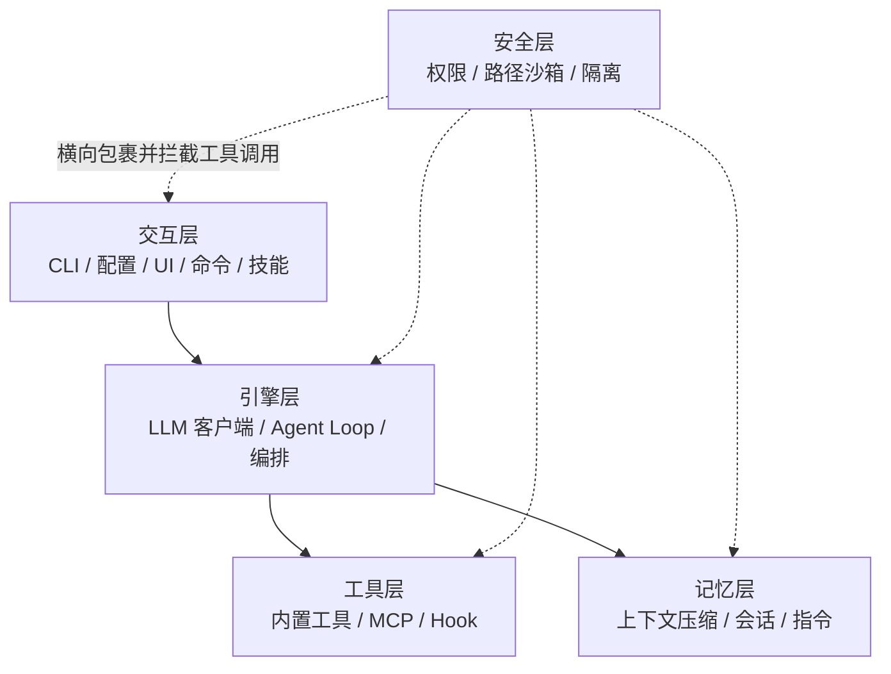
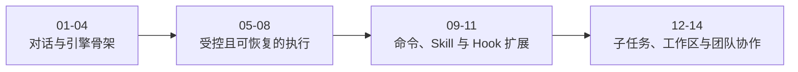
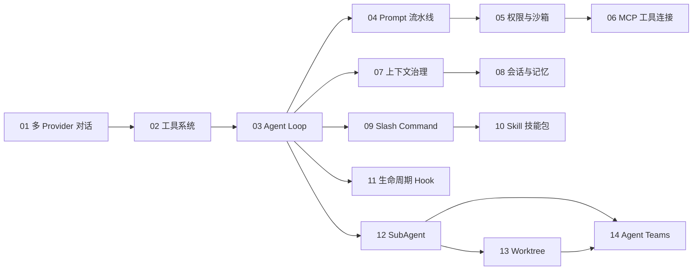

# SeaCode - 工程路线图

## 路线定位

SeaCode V1 用 14 个有序、可验证的工程步骤构成完整的本地 Agent 运行时。路线先建立可对话的运行骨架，再把工具执行、循环推进、提示词、权限、上下文和会话逐层接入，最后组合命令、扩展、子任务、工作区和团队协作。

五层职责模型是路线的长期边界：交互、引擎、工具、记忆、安全。一个步骤可能同时触及多个层，但不会因为增加新能力而重新发明一套平行运行时。

## 如何阅读这份路线图

Roadmap 关注能力的先后关系、前置条件、交付证据和后续组合方式。它会复述每一步的用户可见结果，也会指向 Design 中更细的模块、状态和失败设计；这类重复是为了让工程推进不脱离产品目标，而不是复制 Design 的全部内容。PRD 负责说明为什么这些结果有价值，Manual 负责说明交付后如何使用。

## 1. 五层与路线



## 2. 十四个工程步骤

| 步骤 | 能力 | 主要层 | 主要模块 | 前置条件 | Design 落点 | 可观察结果 |
| --- | --- | --- | --- | --- | --- | --- |
| 01 | 多 Provider 对话 | 交互 + 引擎 | `config.py`、`client.py`、`conversation.py`、`app.py` | 配置发现、逻辑消息和基础交互 | 6.1 | 选择 profile，完成流式多轮对话，失败后恢复输入。 |
| 02 | 工具系统 | 工具 + 引擎 | `tools/`、`serialization.py` | 01 的消息容器和协议事件 | 6.2 | 核心工具具备统一 Schema、注册、执行和结构化结果。 |
| 03 | Agent Loop | 引擎 | `agent.py` | 01 的 Provider，02 的 ToolResult | 6.3 | 模型可依据工具结果连续工作，并在明确条件下停止。 |
| 04 | System Prompt 流水线 | 引擎 | `prompts.py`、`context/` | 03 的回合边界和事件流 | 6.4 | 环境、模式、项目规则和动态提醒按稳定顺序组合。 |
| 05 | 权限与沙箱 | 安全 | `permissions/`、`sandbox/` | 02 的统一工具入口，03 的循环拦截点 | 6.5 | 危险命令、越界路径和未经批准的副作用被拦截。 |
| 06 | MCP 工具连接 | 工具 | `mcp/`、`tools/` | 02 的注册/结果契约，05 的安全检查 | 6.6 | stdio/HTTP Server 可发现、连接、隔离故障并按需加载工具。 |
| 07 | 上下文治理 | 记忆 | `context/`、`agent.py` | 03 的多轮循环和 04 的提示词边界 | 6.7 | 大结果落盘，窗口接近上限时压缩并保留恢复边界。 |
| 08 | 会话与记忆 | 记忆 | `memory/`、`serialization.py` | 07 的上下文边界和持久化基础 | 6.8 | 会话、项目指令和长期记忆可以持久化、召回和恢复。 |
| 09 | Slash Command 框架 | 交互 | `commands/`、`app.py` | 01 的交互控制，03 的 Agent 状态 | 6.9 | 本地命令支持注册、解析、补全和直接状态控制。 |
| 10 | Skill 技能包 | 交互 | `skills/`、`commands/`、`tools/` | 02 的工具契约，08 的指令/会话，09 的命令入口 | 6.10 | 项目级与用户级 Skill 可发现、按需执行、传参和热重载。 |
| 11 | 生命周期 Hook | 工具 | `hooks/`、`agent.py` | 03 的事件，05 的执行前检查 | 6.11 | 事件条件和动作扩展可观察，`pre_tool_use` 可拒绝调用。 |
| 12 | SubAgent 与任务 | 引擎 | `agents/`、`tools/` | 03 的循环，07/08 的上下文和持久化 | 6.12 | 子任务有独立上下文、状态、通知、取消和调用链。 |
| 13 | Git Worktree 隔离 | 安全 | `worktree/`、`filehistory/` | 08 的会话，12 的任务生命周期 | 6.13 | 并行任务隔离目录，清理保护变更，快照支持回滚。 |
| 14 | Agent Teams | 引擎 | `teams/`、`agent.py`、`tools/` | 12 的任务，13 的工作区隔离和持久化 | 6.14 | Lead、teammate、任务板和 Mailbox 支持长期协作。 |

## 3. 分段交付逻辑

14 步不是 14 个互相独立的功能开关，而是四段逐渐组合的交付路径：



| 交付段 | 包含步骤 | 这一段要解决的问题 | 进入下一段的证据 |
| --- | --- | --- | --- |
| 对话与引擎骨架 | 01-04 | 模型能稳定对话、调用工具并在有上下文的循环中工作 | 三条协议路径、工具结果配对、循环停止/恢复和提示词顺序可验证。 |
| 受控且可恢复的执行 | 05-08 | 副作用有边界，长任务和进程重启不丢失关键状态 | 权限拒绝可继续、MCP 故障隔离、压缩不破坏消息、会话可恢复。 |
| 命令、Skill 与 Hook 扩展 | 09-11 | 用户和项目可以用确定性控制与扩展规则塑造运行时 | 命令状态、Skill 上下文、Hook 条件和执行前拒绝都可观察。 |
| 子任务、工作区与团队协作 | 12-14 | 复杂任务可以拆分、隔离、并行并长期协作 | 父子状态、变更保护、Mailbox、锁和 Windows 降级路径均可验收。 |

## 4. 依赖关系



依赖关系表达能力前提，不表示后续能力会替换前面的模块。每一步都继承已经建立的用户路径、事件、错误恢复和配置安全语义。

## 5. 交付后的模块地图

| 职责层 | 模块集合 | 组合方式 |
| --- | --- | --- |
| 交互 | `__main__.py`、`app.py`、`config.py`、`commands/`、`skills/`、`remote.py` | 提供 TUI、脚本、浏览器和可扩展的本地控制入口。 |
| 引擎 | `client.py`、`conversation.py`、`prompts.py`、`agent.py`、`agents/`、`teams/` | 连接模型，推进回合，管理编排和协作。 |
| 工具 | `tools/`、`mcp/`、`hooks/` | 将内置、外部和生命周期能力统一为工具/事件契约。 |
| 记忆 | `context/`、`memory/`、`serialization.py` | 预算上下文，保存会话，加载指令并召回记忆。 |
| 安全 | `permissions/`、`sandbox/`、`worktree/`、`filehistory/` | 在执行前限制权限、路径和并行工作区影响范围。 |

## 6. 质量门禁

每个步骤都需要覆盖正常路径和失败路径，并通过以下工程检查：

```bash
uv sync
uv run ruff check seacode tests
uv run mypy
uv run pytest tests/ -v
```

| 风险 | 验证重点 |
| --- | --- |
| Provider 差异 | 请求格式、流事件、工具 Schema、用量和错误分类。 |
| 工具副作用 | 临时工作区中的文件、命令、超时和结果大小。 |
| 权限边界 | 危险命令、符号链接、规则优先级、模式切换和人工拒绝。 |
| 上下文与持久化 | 大结果、压缩边界、进程中断、损坏记录和重复写入。 |
| 并行协作 | 取消、消息顺序、任务状态、Worktree 变更保护和 Mailbox。 |
| TUI 与入口 | 窄终端、Enter 提交、流式状态、退出清理、Prompt CLI 和 Browser Remote。 |
| 配置安全 | 密钥脱敏、未跟踪配置、环境变量展开和本地规则边界。 |

真实 Provider 请求只作为本地 smoke；自动化测试使用无凭据客户端、协议数据或隔离的外部依赖替身。

## 7. V1 完整形态

V1 的完成形态是一套可安装、可运行、可观察、可恢复的本地工程工作流：

- 交互层提供 TUI、非交互 Prompt CLI、Browser Remote、命令和 Skill 入口。
- 引擎层提供多协议客户端、Agent Loop、SubAgent 和 Teams 编排。
- 工具层提供核心文件/命令工具、MCP 外部工具和生命周期 Hook。
- 记忆层提供上下文治理、会话、项目指令、长期记忆和恢复记录。
- 安全层提供权限、路径沙箱、OS 沙箱适配、Worktree 与文件历史保护。

所有入口共享工具、事件、记忆和安全契约；用户不需要为了切换入口而重新理解 Agent 的行为边界。
