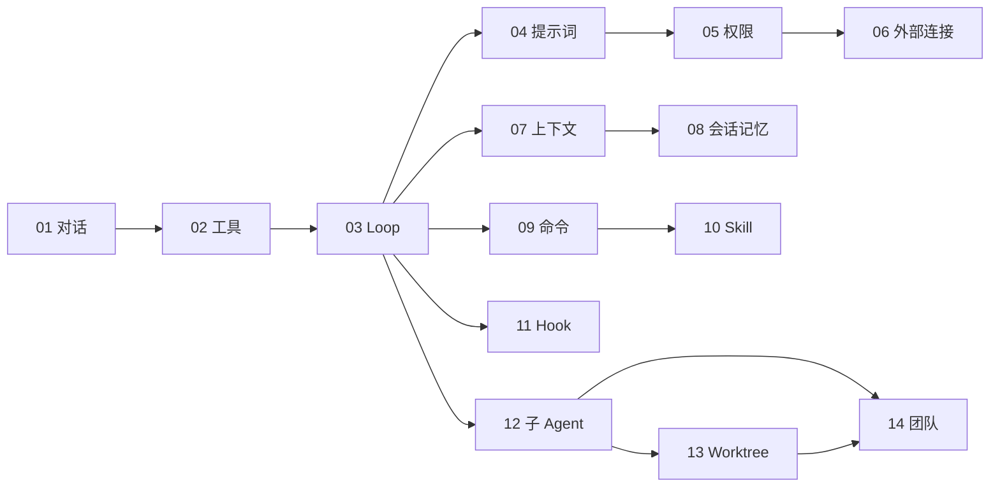

# SeaCode - 工程路线图

## 版本信息

| 项目 | 内容 |
| --- | --- |
| 产品 | SeaCode |
| 范围 | 从多 Provider 对话到本地协作式 AI 编程助手 |
| 交付方式 | 14 个顺序、可验证的工程里程碑 |
| 技术栈 | Python 3.12、`uv`、Textual、pytest、Ruff、mypy |
| 文档定位 | v1 的模块归属、能力顺序和质量门槛 |

## 1. 工程原则

SeaCode 先完成可运行的对话闭环，再按顺序增加工具、副作用控制、上下文治理和协作能力。每个里程碑只增加明确能力，不能破坏已经验收的配置、会话、权限或恢复行为。

v1 使用一个稳定的 Python 包结构。目录是模块职责契约，而不是每一步都必须立即填满的清单。

## 2. 工程目录

```text
SeaCode/
├── .seacode/
│   └── config.yaml.example
├── seacode/
│   ├── __init__.py
│   ├── __main__.py
│   ├── agent.py
│   ├── app.py
│   ├── askuser_dialog.py
│   ├── client.py
│   ├── config.py
│   ├── conversation.py
│   ├── driver.py
│   ├── permission_dialog.py
│   ├── plan_dialog.py
│   ├── prompts.py
│   ├── remote.py
│   ├── serialization.py
│   ├── session_dialog.py
│   ├── styles.tcss
│   ├── teammate_tree.py
│   ├── validator.py
│   ├── web_content.py
│   ├── agents/
│   ├── commands/
│   ├── context/
│   ├── filehistory/
│   ├── hooks/
│   ├── mcp/
│   ├── memory/
│   ├── permissions/
│   ├── sandbox/
│   ├── skills/
│   ├── teams/
│   ├── tools/
│   └── worktree/
├── tests/
├── pyproject.toml
├── uv.lock
├── .github/workflows/
├── docs-zh/
└── docs-en/
```

新增功能首先使用上面的既定模块。v1 不将同一职责拆到额外的运行时层或平行子包；结构调整必须伴随行为测试和明确设计理由。

## 3. 十四个里程碑

| 编号 | 里程碑 | 主要模块 | 交付重点 | 主要验收 |
| --- | --- | --- | --- | --- |
| 01 | 多 Provider 对话 | `config.py`、`client.py`、`conversation.py`、`app.py` | 配置、流式响应、TUI、多轮历史 | 文本稳定收发，错误不退出，显示本轮耗时。 |
| 02 | 工具系统 | `tools/` | 工具抽象、注册、读写编辑、命令与检索 | Schema 正确注入，结果结构化，失败可回灌。 |
| 03 | Agent Loop | `agent.py` | 回合循环、停止条件、事件与取消 | 可连续使用工具直到完成，并保持历史合法。 |
| 04 | 系统提示词管线 | `prompts.py`、`context/` | 模块化指令、环境信息和动态提醒 | 稳定内容与变化内容分离。 |
| 05 | 权限与沙箱 | `permissions/`、`sandbox/` | 危险命令、路径、规则、模式和确认 | 拒绝可解释，越界受阻，询问不破坏会话。 |
| 06 | 外部工具连接 | `mcp/` | 配置发现、stdio/HTTP 连接和生命周期 | 单个连接失败不影响其它工具。 |
| 07 | 上下文治理 | `context/` | 大结果保存、稳定预览、摘要和恢复 | 长任务可处理大结果与上下文超限。 |
| 08 | 会话与记忆 | `memory/`、`serialization.py`、`filehistory/` | 可恢复记录、项目指令和记忆 | 可恢复历史，损坏记录安全降级。 |
| 09 | 命令框架 | `commands/` | 注册、别名、补全、状态和会话命令 | 本地命令可预测且不消耗模型调用。 |
| 10 | Skill 系统 | `skills/` | Markdown 能力包、渐进加载和独立执行 | 可发现、按需加载、传参和重载。 |
| 11 | 生命周期 Hook | `hooks/` | 事件、条件、动作、拦截与异步执行 | 配置错误可定位，普通失败不阻断主流程。 |
| 12 | 子 Agent | `agents/` | 角色、独立上下文、任务和通知 | 子任务可执行、查询、停止且权限受限。 |
| 13 | Git 隔离工作区 | `worktree/` | 创建、进入、退出、清理和变更保护 | 未提交变更不会被自动清理。 |
| 14 | Agent 团队 | `teams/` | 成员、任务、邮箱和协调后端 | 多个 Agent 可安全通信并同步状态。 |

## 4. 里程碑依赖



依赖表达能力前提。每步先补足当前能力的行为测试，再接入新模块；跨步骤修改必须证明既有用户路径没有退化。

## 5. 质量门槛

每个里程碑至少通过：

```bash
uv sync
uv run ruff check seacode tests
uv run mypy seacode
uv run pytest tests/ -v
```

| 风险 | 专项验证 |
| --- | --- |
| Provider 协议差异 | 覆盖请求结构、流事件、用量和错误分类。 |
| 工具副作用 | 在临时工作区验证文件、命令、超时和结果截断。 |
| 权限边界 | 覆盖危险命令、符号链接、规则优先级和人工拒绝。 |
| 持久化 | 模拟中断、损坏记录、恢复、压缩边界和重复写入。 |
| 并行任务 | 验证取消、消息顺序和工作区变更保护。 |
| TUI | 验证窄终端、Enter 提交、流式输入状态、滚动和退出清理。 |

真实 Provider 请求只用于本地 smoke；自动化测试使用无密钥的假客户端或录制协议数据。

## 6. 风险与应对

| 风险 | 影响 | 应对 |
| --- | --- | --- |
| Provider 行为不一致 | 流解析、工具调用或用量字段不一致 | 在 `client.py` 中隔离差异并保留协议测试。 |
| Agent Loop 失控 | 时间或费用不可控 | 迭代上限、取消、未知工具保护和清晰状态。 |
| 自动修改超出预期 | 数据丢失或难审查 | 权限模式、路径边界、危险操作保护和工作区隔离。 |
| 上下文增长过快 | 请求失败或历史失真 | 大结果治理、稳定预览、摘要和近期原文保留。 |
| 外部连接不可用 | 工具发现或调用失败 | 隔离单个连接、清晰错误和能力降级。 |
| 终端差异 | 布局或按键异常 | 窄屏测试、稳定按键绑定和退出清理。 |

## 7. 后续演进

v1 完成后，再评估独立的架构演进：更丰富的模型诊断、可视化任务时间线、远程执行隔离、大型代码库索引，以及基于 DeepAgents 的运行时重写。任何后续重写必须先保持 v1 已验收的用户行为。
