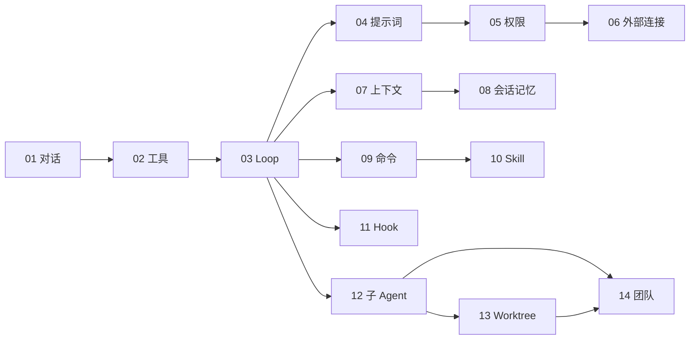

# SeaCode - 工程路线图

## 版本信息

| 项目 | 内容 |
| --- | --- |
| 产品 | SeaCode |
| 路线范围 | 从最小对话闭环到可协作的本地编程运行时 |
| 交付顺序 | 14 个有明确边界的工程里程碑 |
| 技术基线 | Python 3.12、`uv`、Textual、pytest、Ruff、mypy |
| 文档定位 | 维护者和评审者使用的稳定工程地图 |

## 1. 工程目标

SeaCode 的交付顺序遵循“先建立可运行闭环，再逐步增加副作用、治理能力和并行能力”。每个里程碑都应拥有可测试的行为边界；后续能力不能以破坏前面已经验证的会话、工具、权限和持久化契约为代价。

### 1.1 完成标准

- 干净环境可以安装依赖并启动 `sea`。
- 用户可以配置一个模型，完成多轮流式对话。
- Agent 可以执行工具、处理结果、请求确认并完成真实开发任务。
- 上下文过长、工具失败、网络错误、取消和重启恢复都有可验证的行为。
- 关键能力拥有自动化测试、静态检查和可复现的验收记录。
- TUI、CLI 与 Core Runtime 使用稳定接口协作，扩展能力有独立边界。

## 2. 工程目录

```text
SeaCode/
├── src/seacode/
│   ├── agent/          # Loop、事件、任务状态
│   ├── providers/      # Provider 适配器
│   ├── tools/          # 工具抽象与执行器
│   ├── policy/         # 权限与安全策略
│   ├── context/        # 提示词与上下文治理
│   ├── sessions/       # 会话与记忆
│   ├── extensions/     # 命令、Skill、Hook
│   ├── worktree/       # Git 隔离工作区
│   ├── teams/          # 子任务与团队
│   ├── tui/            # Textual 界面
│   └── cli/            # sea 入口
├── tests/
├── pyproject.toml
├── .github/workflows/
├── docs-zh/
└── docs-en/
```

## 3. 14 个交付里程碑

| 编号 | 里程碑 | 交付重点 | 主要验收 |
| --- | --- | --- | --- |
| 01 | 多 Provider 对话 | 配置、协议适配、流式响应、TUI、多轮历史 | 能稳定收发文本，错误不退出，显示实时与总耗时。 |
| 02 | 工具系统 | 工具抽象、注册中心、读写编辑、命令、检索 | 工具 Schema 正确注入，结果结构化，失败可回灌。 |
| 03 | Agent Loop | ReAct 循环、停止条件、事件流、取消、批量执行 | 能连续使用工具直到完成，并保持历史合法。 |
| 04 | 系统提示词管线 | 模块化指令、环境信息、动态提醒、缓存稳定性 | 稳定内容和动态内容分离，模式提醒按回合生效。 |
| 05 | 权限与沙箱 | 危险命令、路径边界、规则、模式、人工确认 | 拒绝可解释，越界受阻，权限询问不破坏会话。 |
| 06 | 外部工具连接 | 配置发现、stdio/HTTP 连接、工具适配、生命周期 | 一个连接失败不影响其它工具，外部工具复用现有权限。 |
| 07 | 上下文治理 | 大结果保存、稳定预览、自动摘要、紧急恢复 | 长任务不会因单个大结果或一次超限直接失败。 |
| 08 | 会话与记忆 | 可恢复记录、项目指令、自动记忆、会话管理 | 能恢复历史，指令有优先级，损坏记录可降级处理。 |
| 09 | 命令框架 | 注册中心、别名、补全、状态和会话命令 | 本地命令不消耗模型调用，冲突在启动期发现。 |
| 10 | Skill 系统 | Markdown 能力包、渐进加载、主会话与独立执行 | Skill 可发现、可按需加载、可传递参数并热更新。 |
| 11 | 生命周期 Hook | 事件、条件、动作、拦截、异步执行 | Hook 配置错误可定位，主流程默认不被旁路失败阻断。 |
| 12 | 子 Agent | 角色定义、独立上下文、前后台任务、结果通知 | 子任务可执行、可查询、可停止，工具权限不会无限扩张。 |
| 13 | Git 隔离工作区 | 创建、进入、退出、清理、初始化和变更保护 | 有变更的工作区不会被自动删除，运行状态可恢复。 |
| 14 | Agent 团队 | 成员、任务、邮箱、协作后端和协调模式 | 多个 Agent 能安全通信、同步状态并完成可检查的协作任务。 |

## 4. 里程碑依赖



依赖关系表达能力前提，不限制实现时的测试准备。每个里程碑都应先补齐行为测试，再接入新模块；跨里程碑改动需要证明既有事件、历史和权限语义没有退化。

## 5. 技术架构演进

### 5.1 基础运行时

第 01 到第 03 个里程碑建立 Core Runtime、Provider、工具注册中心和事件驱动的 Agent Loop。此时系统已经可以完成一个完整的“提问、调用工具、得到结果、继续请求、输出答复”闭环。

### 5.2 可控运行时

第 04 到第 08 个里程碑处理提示词稳定性、权限安全、外部连接、上下文预算、会话和记忆。目标是让长时间运行的任务可解释、可恢复、可治理。

### 5.3 可组合运行时

第 09 到第 11 个里程碑提供命令、Skill 和 Hook。它们把固定操作、可复用流程和生命周期自动化从核心 Loop 中分离出来，形成稳定的扩展面。

### 5.4 协作运行时

第 12 到第 14 个里程碑引入子 Agent、Git 隔离工作区和团队协作。重点是独立状态、权限收窄、变更保护、消息可靠投递和任务可观察性。

## 6. 质量门槛

每个里程碑至少通过以下检查：

```bash
uv sync
uv run ruff check src tests
uv run mypy src
uv run pytest tests/ -v
```

根据功能风险增加专项验证：

| 风险 | 专项验证 |
| --- | --- |
| Provider 协议差异 | 录制请求结构和流式事件，分别验证错误分类。 |
| 工具副作用 | 使用临时工作区验证文件、命令、超时和结果截断。 |
| 权限边界 | 覆盖危险命令、符号链接、规则优先级和人工拒绝。 |
| 持久化 | 模拟中断、损坏行、恢复、压缩边界和重复写入。 |
| 并行任务 | 验证取消、锁、消息顺序、工作区变更保护。 |
| TUI | 验证窄终端、流式期间输入状态、滚动和退出清理。 |

## 7. 风险与应对

| 风险 | 影响 | 应对 |
| --- | --- | --- |
| Provider 行为不一致 | 流式解析、工具调用或用量字段出现差异 | Provider 适配器隔离差异，保留协议级测试和降级字段。 |
| Agent 循环失控 | 消耗过多时间或费用 | 迭代上限、未知工具熔断、取消、用量展示和超时。 |
| 自动修改超出预期 | 数据损失或难以审查 | 权限模式、路径边界、危险操作保护和工作区隔离。 |
| 上下文增长过快 | 请求失败或缓存失效 | 大结果治理、稳定预览、摘要和近期原文保留。 |
| 外部连接不可用 | 工具发现或调用失败 | 连接隔离、重连策略、清晰错误和可选能力降级。 |
| 并行工作区有变更 | 清理丢失成果 | 删除前检查未提交变更和新增提交，默认保留。 |
| 终端环境差异 | TUI 显示或快捷键异常 | 终端能力探测、窄屏布局、退出清理和 CLI 诊断入口。 |

## 8. 完成后的演进方向

- 更丰富的模型能力探测、成本和延迟分析。
- 可视化任务依赖、会话时间线和工具调用详情。
- 更强的容器和远程执行隔离。
- 大型代码库索引、检索和变更影响分析。
- 面向团队的策略管理、审计和协作报告。
